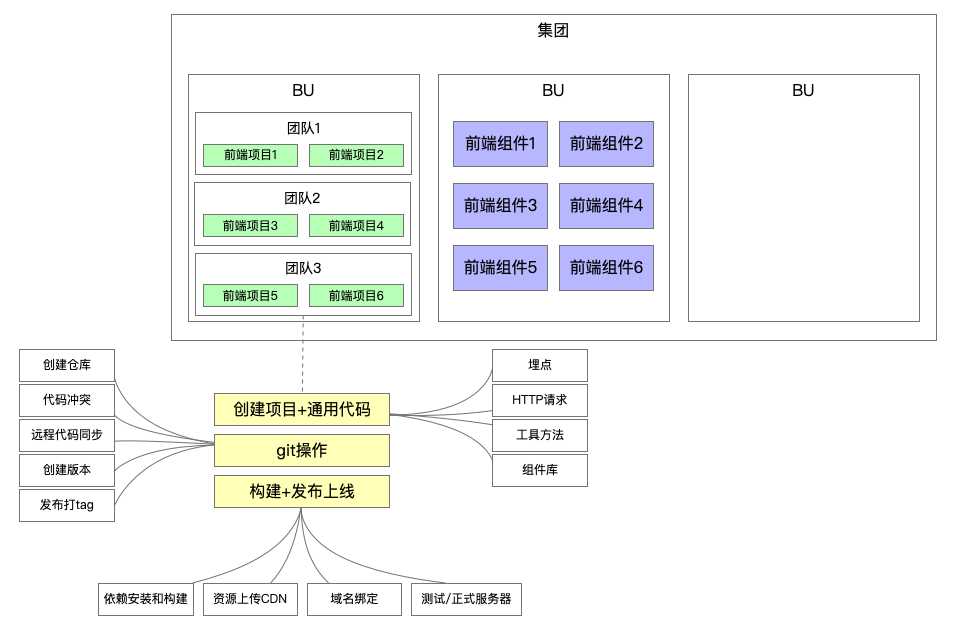
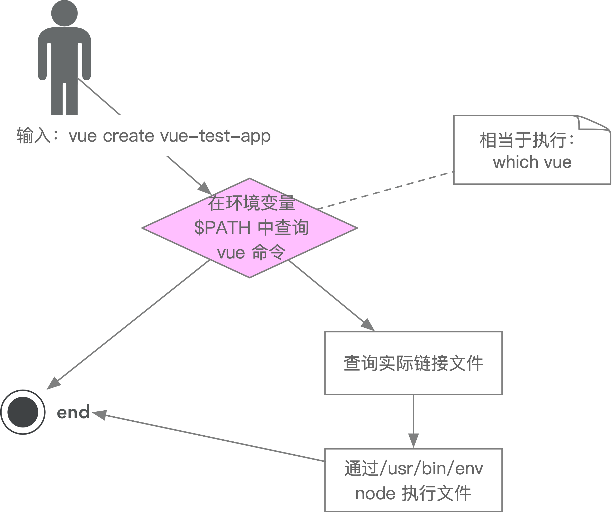

## 一. 脚手架的价值
* 自动化：项目重复代码拷贝/git操作/发布上线操作
* 标准化：项目创建/git flow/发布流程/回滚流程
* 数据和：研发过程系统化/数据化/可量化
* 总之，提升前端研发效能

***

## 二. 脚手架简介及原理
#### 简介
> 命令示例：vue create vue-test-app --force -r https://registry.npm.taobao.org
* 主命令：vue
* command: create
* command param: vue-test-app
* option: --force 覆盖安装包 (可简写为-f, option param 默认为true)
* option: -r (简写，等于--registry)
* option param: https://registry.npm.taobao.org
* 可用vue create --help查看各个命令及简写情况

#### 脚手架执行原理

1. 在终端输入 vue create vue-test-app
2. 终端解析出vue命令，在环境变量中找到vue命令（通过which vue命令可查; which vue 命令在 git bash 中可用）
3. 终端根据vue命令，连接到实际vue.js (which vue后的路径下node_modules/@vue/cli/bin/vue.js)
4. vue.js解析command/options，执行command
5. 执行完毕，退出

#### 脚手架实现原理的三个问题
> 1. 全局安装@vue/cli后(npm install -g @vue/cli)，新增的命令为何是‘vue’？
>> @vue/cli的安装路径（which vue后的路径下node_modules/@vue/cli/）下的package.json文件中配置项'bin',指定了命令的名称与对应执行的文件。
> 2. 全局安装@vue/cli时发生了什么？
>> 首先会把@vue/cli的包下载到指定路径（全局默认路径 C:\Users\pc\AppData\Roaming\npm, 可配置）的node_modules目录下，其次解析package.json中'bin'的配置项，根据该配置项的内容生产软链接，即某命令执行什么文件。（本机与视频呈现的不同，bin目录下没有软链接，只有vue.js一个文件，而更像是在bin同目录下的node_modules目录下）。
> 3. 执行vue命令时发生了什么？为什么vue指向了一个js文件，就可以通过vue命令直接执行它？
>> 首先通过环境变量找到vue命令，通过软链接找到vue.js, 解析vue.js中的第一句‘#!/usr/bin/env node’（在环境变量中找node命令）， 通过node执行vue.js。

#### 脚手架原理进阶
> 1. 为什么说脚手架本质是操作系统的客户端？它和PC上安装的应用/软件什么区别？
>> node是操作系统的客户端（node.exe）。 并无区别，唯一区别是node没有图形化图标界面。
> 2. 如何为node脚手架命令创建别名?
>> 软链接嵌套。使用ln -s命令（Linux命令，详情自查）。
>> 3. 

*** 

#### 脚手架开发流程
1. 开发流程
* 创建npm项目
* 创建脚手架入口文件，最上方添加： #!/usr/bin/env node
* 配置package.json的bin属性
* 编写脚手架代码
* 将脚手架发布到npm

2. 使用流程
* 安装脚手架 npm install -g your-own-cli
* 使用脚手架 your-own-cli

#### 脚手架开发难点
* 分包，将复杂的系统分拆若干个模块。
* 命令注册 vue create/ vue add / vue invoke
* 参数解析(vue command [options] <params>)： 
    options全称： --version/--help
    options简写： -v/-h
    带params的options： --path /Usrs/Desktop/vue-test

#### 自建简易脚手架流程
* 注册https://www.npmjs.com
* 新建npm项目（npm init）
* 在package.json中配置“bin”配置项，如"bin": {"imooc-test": "bin/index.js"}（注意package.json中name和version配置项）。
* npm login登录
* npm publish发布，成功后在npm官网可查看发布的package
* 安装 npm install -g 包名
* 安装成功后可使用

#### 脚手架本地link标准流程
不需要通过publish发布到线上，而是直接在本地调试。
##### 1. 如果你有一个工程A
* cd A
* npm link

##### 2. 如果你有两个工程，要在A工程中依赖B工程
* cd B
* npm link
* cd A
* npm link B
* 如有需要配置A工程package.json中的dependencies

##### 3. 取消本地的链接
* cd B
* npm unlink
* cd A
* 如果link存在：npm unlink B;如果link不存在，删除A工程下的node_mudules中的B库文件
* npm install -S A

##### 4. 理解npm link/unlink
* npm link B: 将当前项目（比如工程A）中node_mudules下指定的库文件链接到node全局node_modules下的库文件。
* npm link: 将当前项目链接到node全局node_modules中作为一个库文件，并解析bin配置创建可执行文件。
* npm unlink: 将当前项目从node全局node_modules中移除。
* npm unlink B: 从当前项目（比如工程A)的库文件中移除依赖B。

#### 脚手架命令注册与参数解析原理
* 获取命令：const command = require('process').argv[2]
* 获取参数: const optionsAndParams = require('process').argv.slice(3)
* 获取解析命令及参数的库：require('B')
* 调用相应命令的执行方法并传入参数： require('B')\[command\](options & params).

## 三. 脚手架框架搭建

#### Lerna简介
* Lerna是一个优化基于git+npm的多package项目管理工具
* 优势：大幅减少重复操作；提升操作的标准化；以效能为核心。

#### Lerna开发脚手架流程

> ###### 脚手架项目初始化
1. npm init
2. npm install -g lerna
3. lerna init

> ###### Lerna一般命令（https://github.com/lerna/lerna#readme）
1. leran create packageName
2. lerna add dependencyName package(向package包安装依赖)
3. lerna clean(情况依赖)
4. lerna bootstrap(重装依赖)
5. lerna link(相互依赖)
6. lerna run (执行npm命令)

> ###### 上线发布命令
1. lerna version
2. lerna changed
3. lerna diff
4. lerna publish(注意私有配置publishConfig)