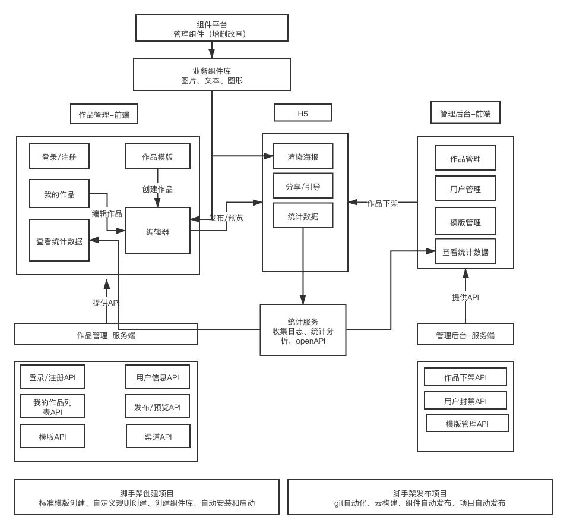
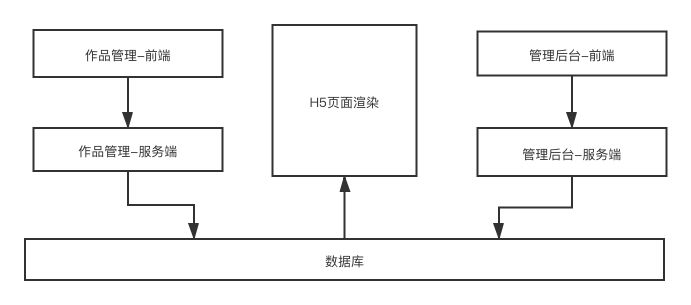

# 《整体技术方案设计 V1.0》

## 需求

完成幕客乐高产品需求

## 范围

整体设计、架构设计

## 模块设计

作品管理-b端、管理后台-admin端、作品H5页面-c端

模块的关系图以及主要功能描述


## 作品的数据结构

使用vnode规范定义数据结构
```javascript
{
    work: {
        title: '作品',
        settings: {},   // 页面配置项
        props: {},      // 页面属性
        // 组件图层的顺序按数组下标排序
        components: [
            {
                id: 1,
                name: '文本1',
                tag: 'text',
                attrs: {},  // 组件属性
                children: ['文本内容']
            },
            {
                id: 2,
                name: '图片2',
                tag: 'image',
                attrs: {},  // 组件属性
                children: null
            }
        ]
    },
    activeComponentId: 1    // 当前选中的组件
}
```
数据流转图


## 扩展性保证

- 通过组件库进行组件的扩展
- 通过数据结构保留字段，对页面的配置和页面的属性进行扩展

## 开发提效

- 通过脚手架自动创建和发布
- 通过组件库设计可复用组件

## 运维保障

- 线上服务和运维服务
- 安全
- 监控和报警
- 服务扩展性：基于云服务，随时可以扩展机器和配置