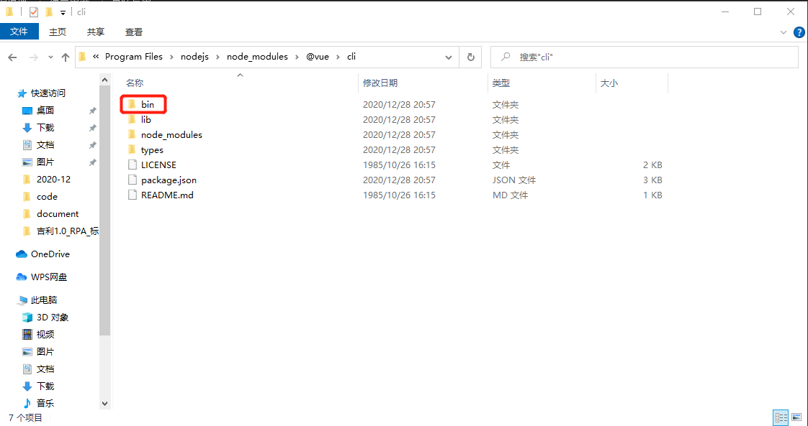
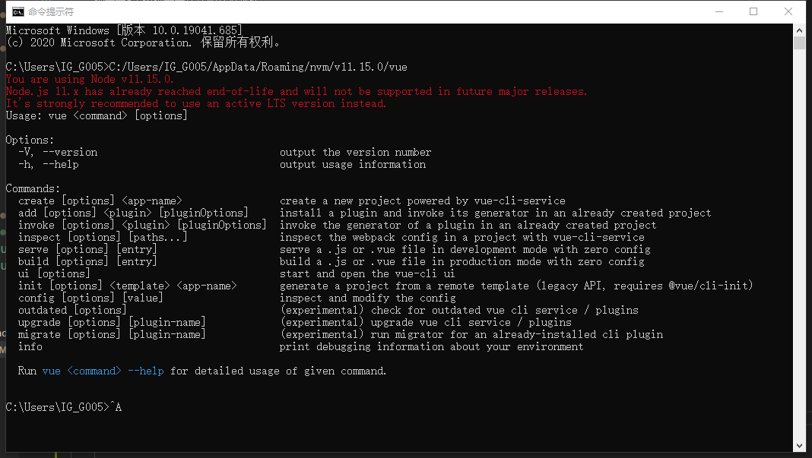
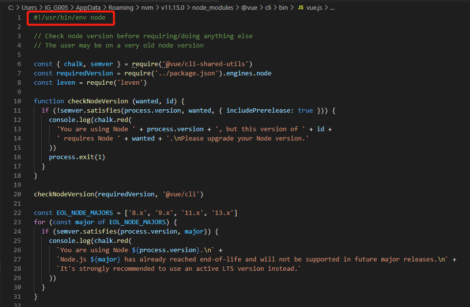

# 脚手架架构设计和框架搭建

## 标题
    脚手架框架设计和框架搭建

## 收获
    脚手架实现原理
    lerna的常见用法
    架构设计机器和架构图绘制方法

## 主要内容
    学习如何以架构师的角度思考基础架构问题
    多package项目管理痛点和解决方案，居于lerna脚手架框架搭建
    imooc-cli脚手架需求分析和架构设计，架构设计图

## 附赠内容

    脚手架调试技巧
    lerna源码分析
    node的module模块分析
    yargs使用方法
    剖析lerna架构设计

## 关键词

    脚手架-掌握脚手架原理和开发流程
    lerna-解决多package项目管理痛点
    架构设计-学习大厂基础架构设计思路

## 学习方法

    架构三部曲：掌握原理 -> 独立思考 -> 总结反思
    深度剖析优秀开源项目，由表及里，由深入浅
    视角切换，多切换到架构师视角，从全局思考问题

## 站在前端研发的视角，分析开发脚手架的必要性

    研发效能：提升前端研发效能

## 脚手架核心价值

    将研发过程：
    自动化：项目重复代码拷贝/git操作/发布上线操作
    标准化：项目创建/git flow/发布流程/回滚流程
    数据化：研发过程系统化，数据化，使的研发过程可量化

# 脚手架的实现原理
    1.为什么全局安装 @vue/cli 后台添加的命令为 vue？
        npm indtall -g @vue/cli

        查看安装目录

        1.1 操作系统注册 vue 命令
            在 C:\Program Files\nodejs 目录下的 vue 文件中注册 vue 命令到环境变量
            
            直接执行 C:/Users/IG_G005/AppData/Roaming/nvm/v11.15.0/vue 文件命令和 vue 命令是等价的

                执行vue命令会在环境变量中找到 vue 命令是否被注册
                vue 命令通过 软链接 在指向 C:\Users\IG_G005\AppData\Roaming\nvm\v11.15.0\node_modules\@vue\cli\bin\vue.js 这个文件  
        
        1.2 为什么 C:\Users\IG_G005\AppData\Roaming\nvm\v11.15.0\node_modules\@vue\cli\bin\vue.js 文件可以被node解析器执行
            #!/usr/bin/env node
            

            主要是这个句话，声明使用node环境执行该脚本文件

    2.全局安装 @vue/cli 时发生了什么
        在node安装目录的主目录， bin目录下创建一个软链接，软链接指向的是bin目录指向的实际文件