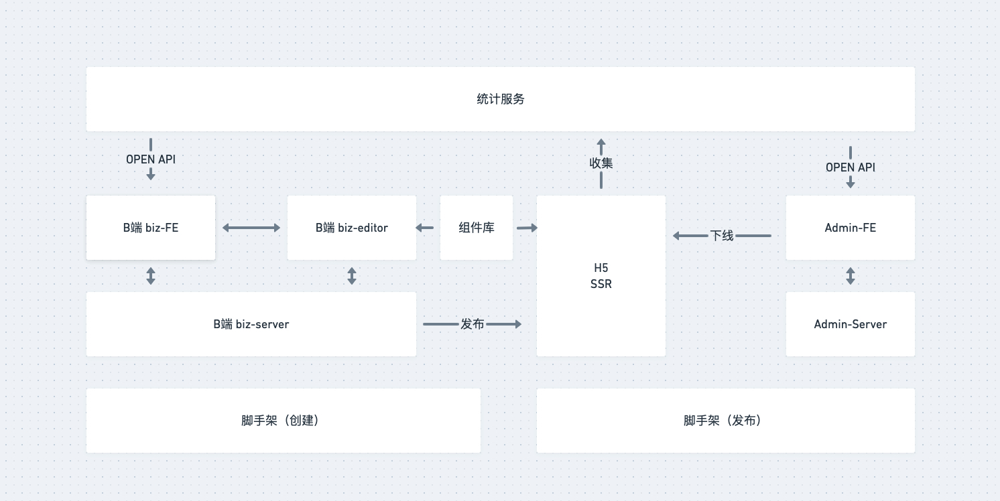

# 技术方案设计文档
## 需求背景

[慕课乐高 - UI设计和需求](https://www.yuque.com/books/share/af79538c-09eb-4ddd-bfb7-599816c233bf)

## 范围
从需求来看，范围包括这几个方面
- B端和编辑器
  - biz-editor-FE
  - biz-editor-server
- C端
  - H5（从性能的角度考虑做SSR）
- 管理后台，做前端分析
  - admin-FE
  - admin-server
- 独立的组件库
  - `npm`包的形式，供编辑器端和H5端使用；
- 统计服务

## 模块设计




## 核心数据结构设计
基本思路：
- 每个组件尽量符合`vnode`规范
- 用数组来组织数据（有序）
- 尽量使用引用关系，不用冗余

```javascript
{
  'project one': {
    title: '',
    setting: {/*可能需要的配置项*/},
    props: {/*页面body的一些设置*/},
    components: [
      {
        id: 'xxx1',
        name: 'xxx1',
        tag: 'image',
        attrs: {
          fontSize: '14px'
        },
        children: []
      },
      {
        id: 'xxx2',
        name: 'xxx2',
        tag: 'text',
        attrs: {
          fontSize: '14px'
        },
        children: null
      },
    ]
  }
  //当前选中的组件id
  activeComponentId: 'xxx'
}
```

## 扩展性保证
- 扩展组件
- 扩展编辑功能，如锁定，隐藏等
- 扩展页面信息，如增加多语言或者主题色
- 扩展其他功能，如大数据分析等
  

## 研发提效
- 脚手架：创建/发布
- 组件平台


## 运维保障
- 线上服务和运维服务
- 安全
- 监控和报警
- 服务扩展性：基于云服务，可以随时扩展机器和配置


