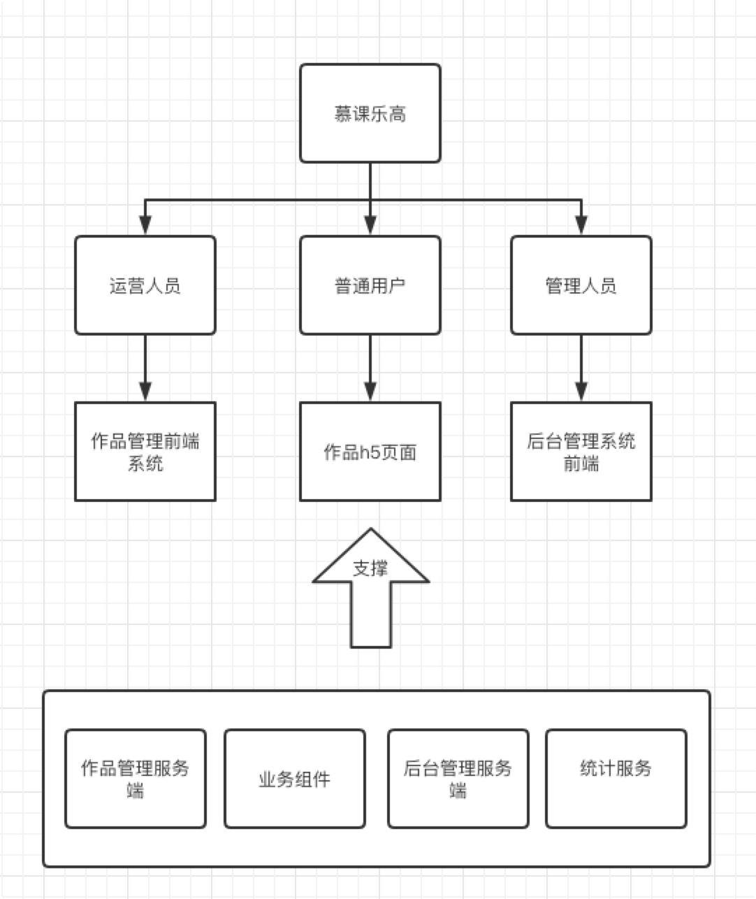
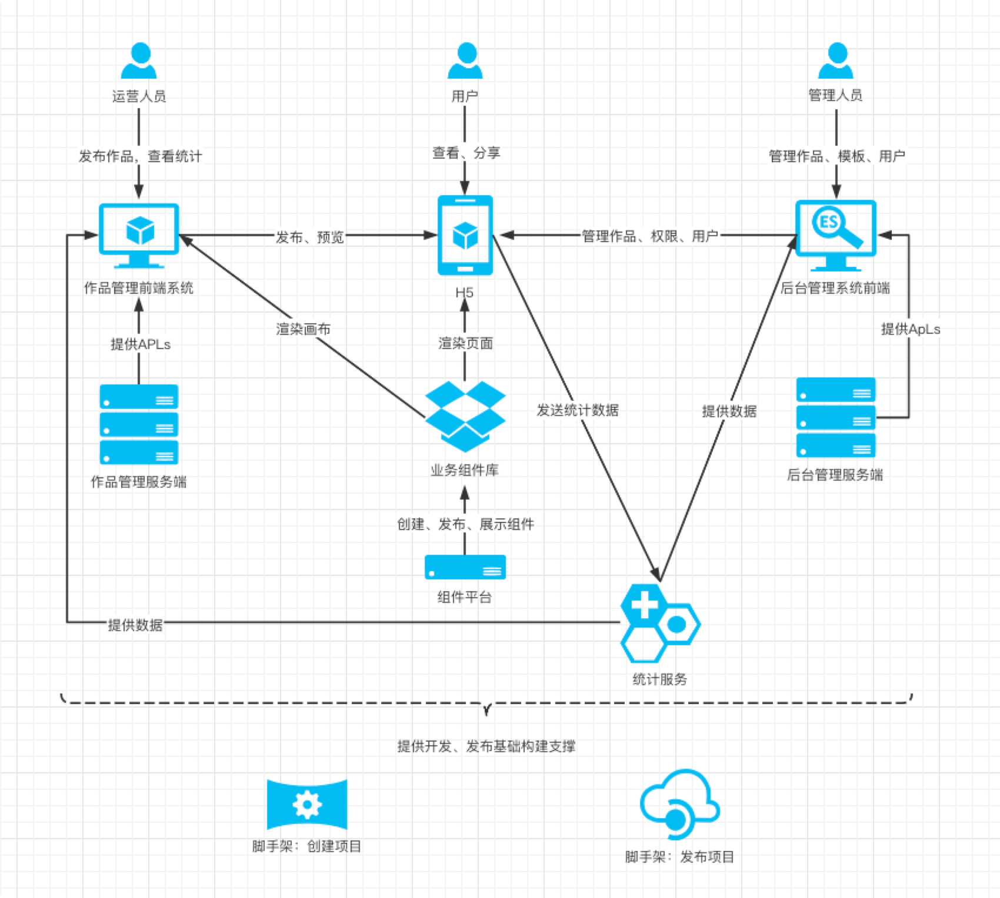
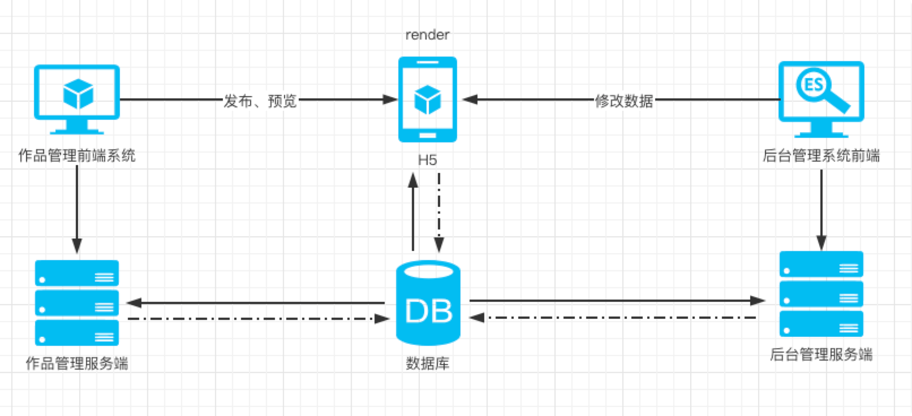

---

1. 需求背景

- [需求文档](https://www.yuque.com/books/share/af79538c-09eb-4ddd-bfb7-599816c233bf)

1. 范围

- 运营人员

- 普通用户

- 后台管理员



1. 模块设计

- 模块拆分和关系图



1. 核心数据结构设计

- 数据结构

```JSON
{
    // 作品
    work: {
        title: '作品标题',
        setting: { /* 一些可能的配置项，用不到就先预留 */ },
        props: { /* 页面 body 的一些设置，如背景色 */ },
        components: [
            // components 要用数组，有序结构
            // 单个 node 要符合常见的 vnode 格式
            {
                id: 'xxx', // 每个组件都有 id ，不重复
                name: '文本1',
                tag: 'text',
                attrs: { fontSize: '20px' },
                children: [
                    '文本1' // 文本内容，有时候放在 children ，有时候放在 attrs 或者 props ，没有标准，看实际情况来确定
                ]
            },
            {
                id: 'yyy',
                name: '图片1',
                tag: 'image',
                attrs: { src: 'xxx.png', width: '100px' },
                children: null
            }
        ]
    },
    // 画布当前选中的组件
    activeComponentId: 'xxx'
}

```

- 数据流转关系图



1. 扩展性保证

- 扩展组件

- 扩展功能

- 数据结构扩展

- 引导讨论扩展性

1. 研发提效

- 复用性

- 易用性

- 例：脚手架、组件平台

1. 运维保障

- 线上服务和运维服务（采购第三方服务）

- 安全

- 监控和报警（自研）

- 服务扩展性

