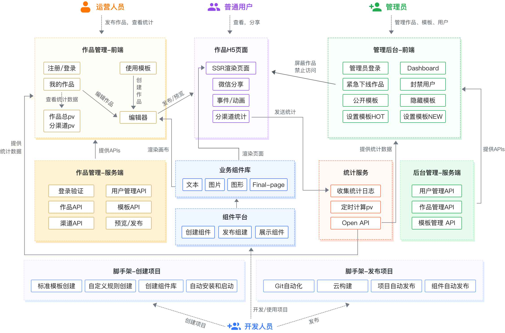

## 需求分析

#### 如何进行分析

- 以架构师的思维分析需求，不能只停留在表面实现需求，要考虑怎么实现能给业务带来增长

- 全局思维、整体思维、闭环思维，不能只考虑自己，要全局考虑整个团队，要做到有输出、有输入、有结果

#### 产品分析


## 架构设计



#### 数据结构示例

```json
{
        work: {
            title: '作品标题',
            setting: {}, // 一些可能的配置项 扩展性保证
            props: {}, // 页面的一些设置 扩展性保证
            components: [
            {
                id: '1',
                name: '文本1',
                tag: 'text',
                attrs: {
                    fontSize: '20px'
                },
                children: ['文本1']
            },
            {
                id: '2',
                name: '图片1',
                tag: 'image',
                attrs: {
                    src: 'xxx.png',
                    width: '120px'
                },
                children: null
            }
        ]
    }
}
```

## 扩展性保证

- 扩展组件
- 扩展编辑器功能，如锁定、隐藏
- 扩展页面信息，如增加多语言
- 扩展其他功能，如大数据计算

## 研发提效

- 脚手架：创建、发布
- 组件平台： 减少编写重复代码的时间，对业务组件进行抽象，积累业务组件

## 运维保障

- 线上服务和运维服务
- 安全
- 监控和报警
- 服务扩展性：基于云服务，可以随时扩展机器配置