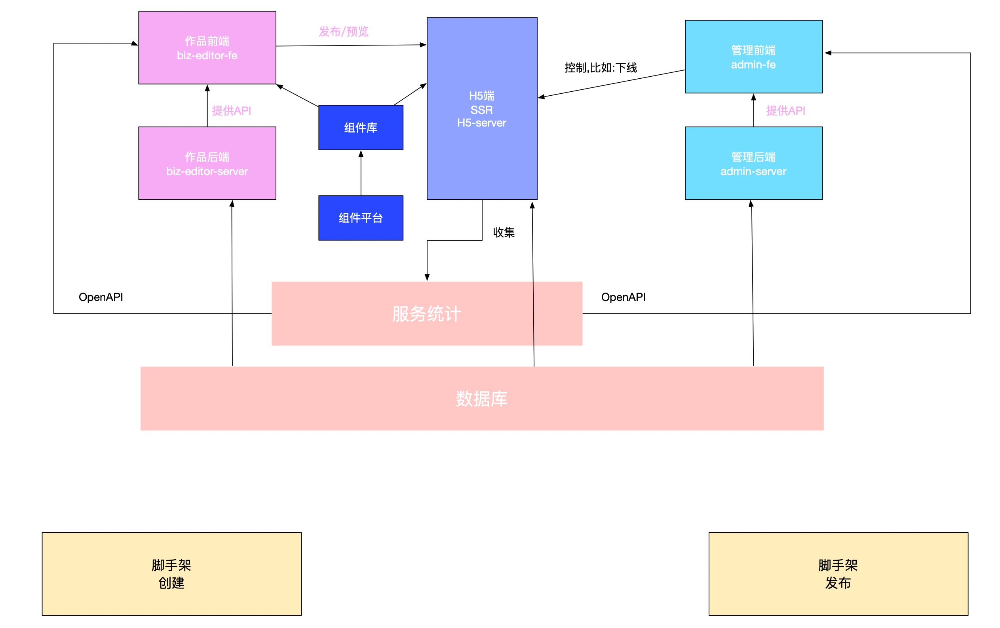
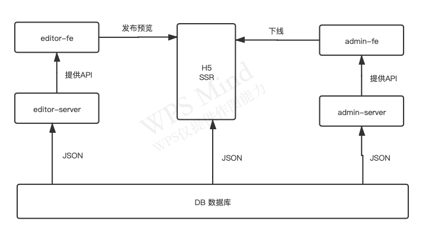

# 慕课乐高架构方案设计文档

## 需求

https://www/yuque.com/imooc-lego/zlz87z

## 范围
从需求上看，我们需要:B端和编译器，H5，管理系统

#### B端和编译器
做前后端分离：
- biz-editor-fe
- biz-editor-server

#### H5适合做SSR，因为要考虑性能
- H5-server

#### 管理后台
- admin-fe
- admin-server

## 模块设计



## 核心数据结构

### 数据结构思路
- 每个组件尽量符合vnode规范
- 用数组来组织数据，有序
- 尽量使用引用关系，不要冗余

### 数据结构示例
```js
{
    // 作品
    work: {
        title: '作品标题',
        setting: { /* 一些可能的配置项，用不到就先预留 */ },
        props: { /* 页面 body 的一些设置，如背景色 */ },
        components: [
            // components 要用数组，有序结构

            // 单个 node 要符合常见的 vnode 格式
            {
                id: 'xxx', // 每个组件都有 id ，不重复
                name: '文本1',
                tag: 'text',
                attrs: { fontSize: '20px' },
                children: [
                    '文本1' // 文本内容，有时候放在 children ，有时候放在 attrs 或者 props ，没有标准，看实际情况来确定
                ]
            },
            {
                id: 'yyy',
                name: '图片1',
                tag: 'image',
                attrs: { src: 'xxx.png', width: '100px' },
                children: null
            },
        ]
    },

    // 画布当前选中的组件
    activeComponentId: 'xxx'
}

```

### 数据关系图



核心:B端，C端，管理后台，公用一个数据库

- 创建作品:初始化一个JSOn数据
- 保存作品:修改JSON数据
- 发布作品:修改一个标记，仅此而已
- C端浏览作品:获取JSON数据，SSR渲染页面
- 屏蔽作品：修改一个标记，C端来判断

## 扩展性保证
- 扩展组件
- 扩展编辑器功能，如锁定，隐藏
- 扩展页面信息，如增加多语言
- 扩展其他功能，如大数据分析和计算等

## 开发提效
- 脚手架:创建发布
- 组件平台

## 运维保障
- 线上服务和运维服务
- 安全
- 监控和报警
- 服务扩展性:基于云服务，可以随时扩展机器和配置
