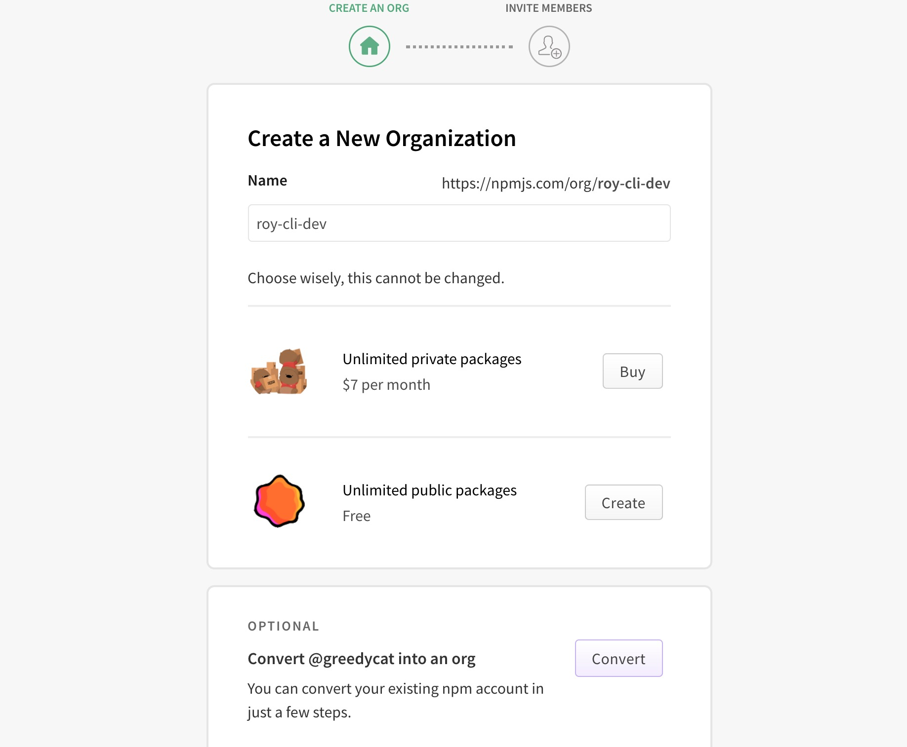
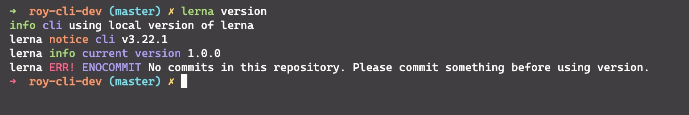
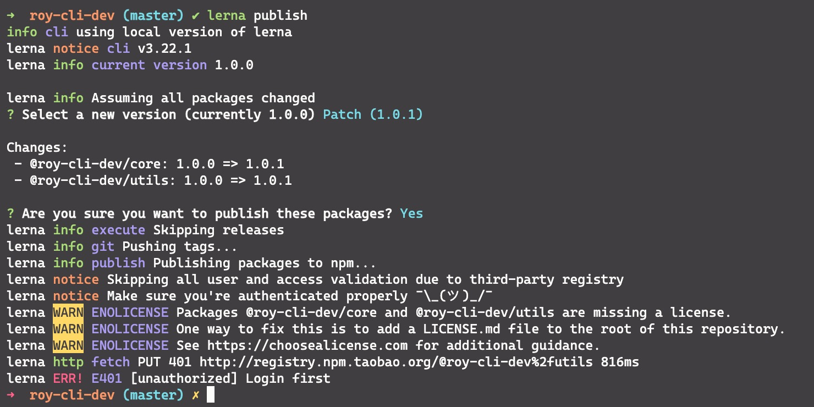
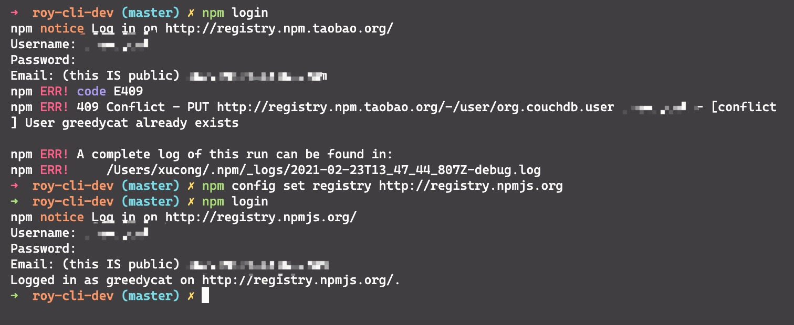
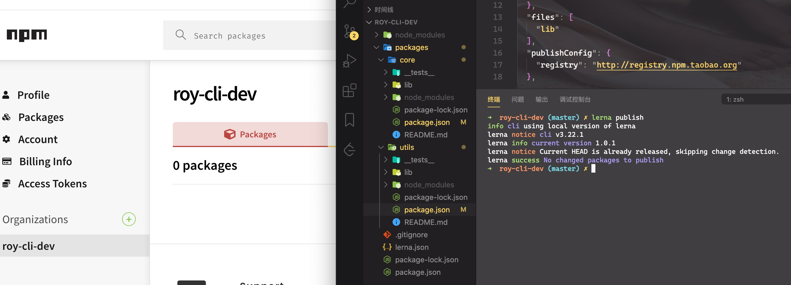
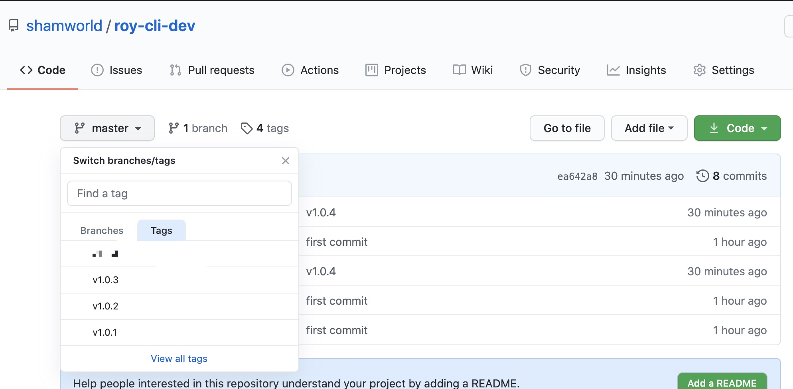
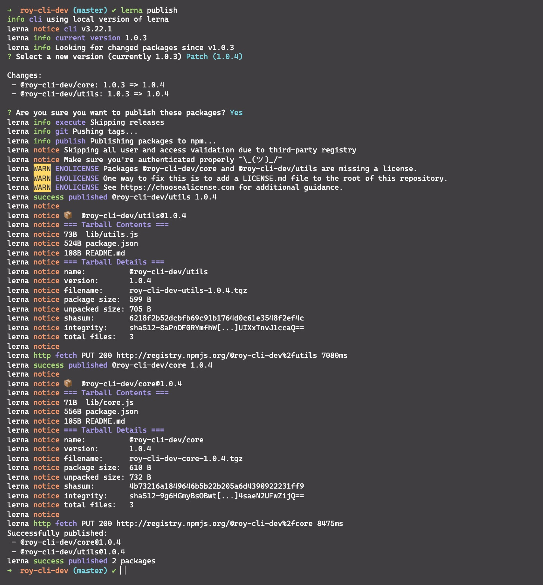

# 脚手架架构设计和框架搭建

## 站在前端研发的视角，分析开发脚手架的必要性

### 研发性能
开发脚手架的核心目标是: **提升前端研发效能**

### 脚手架核心价值
将研发过程:
- 自动化:项目重复代码拷贝/git操作/发布上线操作
- 标准化:项目创建/git flow/发布流程/回滚流程
- 数据化:研发过程系统化、数据化、使得研发过程可量化

### 和自动化构建工具区别
问题:jenkins,travis等自动化构建工具已经比较成熟了，为什么还需要自研脚手架？
- 不满足需求:jenkins,travis通常在git hooks 中触发，需要在服务端执行，无法覆盖研发人员本地得功能，如:创建项目自动化，本地git操作自动化等
- 定制复杂:jenkins,travis定制过程需要开发插件，过程比较复杂，需要使用java语言，对前端同学不够友好

## 从使用角度理解什么是脚手架？

### 脚手架简介

脚手架本质是一个操作系统得客户端，它通过命令行执行，比如:
```
vue create vue-test-app
```

上面这条命令由3个部分组成:
- 主命令:vue
- command:create
- command的param:vue-test-app

它表示创建一个vue项目，项目得名称为`vue-test-app`,以上是最简单得脚手架命令，但实际场景往往更加复杂，比如：

当前目录已经有文件了，我们需要覆盖当前目录下得文件，强制进行安装vue项目，此时我们可以输入:

```
vue create vue-test-app --force
```

这里得`--force`叫做option，用来辅助脚手架确认在特定场景下用户得选择，可以理解为配置

### 脚手架的执行原理


脚手架的执行原理如下:
- 在终端输入 `vue create vue-test-app`
- 终端解析出 `vue` 命令
- 终端在环境变量中找到 `vue` 命令
- 终端根据 `vue` 命令链接到实际文件 `vue.js`
- 终端利用 `node` 执行 `vue.js`
- `vue.js` 解析 command / options
- `vue.js` 执行 command
- 执行完毕，退出执行

## 从应用得角度看如何开发一个脚手架

>这里以 `vue-cli` 为例

- 开发`npm`项目，该项目中应包含一个`bin/vue.js`文件，并将这个项目发布到`npm`
- 将 `npm` 项目安装到`node`的`lib/node_modules`
- 在 `node` 的 `bin` 目录下配置 `vue` 软链接指向 `lib/node_modules/@vue/cli/bin/vue.js`

这样我们在执行`vue`命令的时候就可以找到`vue.js`进行执行

## 脚手架实现的原理

首先来看几个问题:
- 为什么全局安装`@vue/cli`后会添加得命令为`vue`?

那是因为在package.json中，通过`bin`来配置的是`vue`,指向了`bin/vue.js`

- 全局安装`@vue/cli`时发生了什么？

首先npm会把当前的包下载到`node`下面的`node_modules`这个目录里面,如果是全局安装的，它可能存在`/usr/lib`这个目录下面。当这个包完全下载完成后，它回去解析package.json中的`bin`这个目录,如果说发现`bin`下面有`vue`的配置，它就会在`node`的`bin`目录下。(说白了就是:把对应的依赖下载到指定的`node_modules`目录下面，然后去配置一个`bin`的软连接)

- 执行`vue`命令时发生了什么？为什么`vue`指向一个`js`文件，我们却可以正好直接通过`vue`命令去执行它？

操作系统会根据`which vue`找到`bin`命令有没有被注册。

这是因为我在js目录上方添加一个环境变量
```
#!/usr/bin/env node
```

- 两种写法的区别
```
#!/usr/bin/env node;
#!/usr/bin/node
```
    - 第一种是在环境变量中查找node
    - 第二种是直接执行`/usr/bin`目录下的的`node`

## 脚手架的开发流程

### 脚手架开发流程详情

#### 开发流程

[脚手架开发流程](https://github.com/Royxc/my_blog/blob/master/docs/note/modular/%E6%90%AD%E5%BB%BA%E8%87%AA%E5%B7%B1%E7%9A%84%E8%84%9A%E6%89%8B%E6%9E%B6.md)

### 脚手架开发难点
- 分包:将复杂的系统拆分成若干个模块
- 命令注册:
```
vue create
vue add
vue invoke
```

- 参数解析
    - options全称:`--version`,`--help`
    - options缩写:`-V`,'-h'
    - 带params的options:`--path /Users/xucong/Desktop/RoyCli`

示例:

```
vue command [options] <params>

```

- 帮助文档
    - global help
        - Usage
        - Options
        - Commands

实例:`vue create`的帮助信息
```
Usage: create [options] <app-name>

create a new project powered by vue-cli-service

Options:
  -p, --preset <presetName>       Skip prompts and use saved or remote preset
  -d, --default                   Skip prompts and use default preset
  -i, --inlinePreset <json>       Skip prompts and use inline JSON string as preset
  -m, --packageManager <command>  Use specified npm client when installing dependencies
  -r, --registry <url>            Use specified npm registry when installing dependencies (only for npm)
  -g, --git [message]             Force git initialization with initial commit message
  -n, --no-git                    Skip git initialization
  -f, --force                     Overwrite target directory if it exists
  --merge                         Merge target directory if it exists
  -c, --clone                     Use git clone when fetching remote preset
  -x, --proxy <proxyUrl>          Use specified proxy when creating project
  -b, --bare                      Scaffold project without beginner instructions
  --skipGetStarted                Skip displaying "Get started" instructions
  -h, --help                      output usage information

  Missing required argument <app-name>.
```

还有很多，比如:
- 命令行交互
- 日志打印
- 命令行文字变色
- 网络通信:HTTP/WebSocket
- 文件处理

等等...

### 脚手架本地link的标准流程

链接本地脚手架：

```js
cd your-cli-dir
npm link
```

链接本地库文件:
```js
cd your-cli-dir
npm link
cd your-cli-dir
npm link your-lib
```

取消链接本地库文件:
```js
cd your-cli-dir
npm unlink
cd your-cli-dir
# link存在
npm unlink your-lib
# link不存在
rm -rf node_modules
npm install -S your-lib
```

理解`npm link`:

- `npm link your-lib`: 将当前项目中的`node_modules`下指定的库文件链接到`node`全局`node_modules`下的库文件
- `npm link`: 将当前项目链接到`node`全局`node_modules`中作为一个库文件，并解析`bin`配置创建可执行文件

理解`npm unlink`:
- `npm unlink`: 将当前项目从`node`全局`node_modules`中移除
- `npm unlink your-lib`: 将当前项目中的库文件依赖移除


## Lerna简介

### 原生脚手架开发痛点分析

- 痛点一:重复操作
    - 多Package本地link
    - 多Package依赖安装
    - 多Package单元测试
    - 多Package代码提交
    - 多Package代码发布

- 痛点二:版本一致性
    - 发布时版本一致性
    - 发布后相互依赖版本升级

> package 越多，管理复杂度越高

### Lerna简介

Lerna是一个优化基于git+npm的多package项目的管理工具

#### 优势

- 大幅减少重复操作
- 提升操作的标准化

>Lerna是架构优化的产物，它揭示了一个结构真理:项目复杂度提升后，就需要对项目进行架构优化。架构优化的主要目标往往都是以效能为核心


### lerna开发脚手架流程


### 基于Lerna创建项目

安装Lerna

```js
npm install -g lerna
```

在创建目录下执行lerna初始化命令
```js
lerna init
```

会在目录结构下创建一个packages文件夹和lerna.json文件,并且为我们初始化一个git仓库

通过lerna来创建package

```js
lerna create core
lerna create utils
```

>创建package的时候会让你输入package name，我们试用npm包组织管理，如@roy-cli-dev/core、@roy-cli-dev/utils


在npm上注册一个命令roy-cli-dev的组织，这样我们发布后就会在指定组织下面,如图




通过lerna来添加依赖
```js
# 给所有的packge添加依赖
lerna add @imooc-cli/utils
# 给指定的package添加依赖
lerna add @imooc-cli/utils packages/core
```

通过lerna来删除依赖
```js
# 删除package里面的node_modules
learn clean
# 删除package里面的node_modules
lerna exec -- rm -rf node_modules/
# 安装依赖 在package.json里面添加了依赖
lerna bootstap
# 删除指定package里面的node_modules
lerna exec --scope core -- rm -rf node_modules/
```

>删除的是node_modules文件夹，不会删除package.json 中的依赖


执行单元测试
```js
lerna run test
```

发布项目

我们先查看下版本
```js
lerna --version
```

运行报错，如图



这说明让我们git commit,首先我们在github上创建一个工程并把链接链接到本地推送

在没有把项目链接到github上的时候，执行`lerna public`也会报上述错误。下面开始发布项目
```js
lerna publish
```



这个报错说明我们没有在本地登录npm，因此我们需要执行`npm login`，登录npm，然而登录的时候出现报错，如图:



该报错说明我们没有把镜像换成npm镜像，还是使用的`taobao`镜像,执行`npm config set registry http://registry.npmjs.org`，切换镜像为npm的就可以了

在执行`lerna public`的时候，如果报错是`lerna ERR! E402 You must sign up for private packages`,这说明lerna项目默认都是私有项目，我们要在packages的每个包里面的package.json里面添加配置信息:
```js
"publishConfig": {
    "access": "public"
  }
```

我们继续执行`lerna public`,如图



没有显示错误，npm上也没有看到包，这时候看控制台日志就能看出，我们的版本已经存在了，这是为什么呢？因为我们在`lerna publish`的时候，lerna会在git上把版本打成tag标签，如图:



这时候我们需要重新提交代码到github上。

然后执行`lerna publish`，最终结果如下:



显示发布成功，然后在`npm`上搜索可以找到这两个包


### Lerna使用细节

- lerna init:
    - 会自动完成git初始化，但不会创建`.gitignore`，这个必须要手动添加，否则会将`node_modules`目录都上传到git，如果`node_modules`已经加入git stage，使用:
    
    ```
        git reset HEAP <file>
    ```

    执行unstage操作，如果文件已经被git监听到变更，可使用:

    ```
        git checkout -- <filename>
    ```

    将变更作废，记得在执行操作之前将文件加入`.gitignore`

- learn add:
    - 第一个参数:添加npm包名
    - 第二个参数:本地package的路径
    - 选项:
        - --dev:将依赖安装到`devDependencies`，不加时安装到`dependencies`
    
    ```
        lerna add <package> [loc] --dev
    ```
- lerna link:
    - 如果未发布上线，需要手动将依赖添加到`package.json`在执行`lerna link`

- lerna clean:
    - 只会删除`node_modules`，不会删除虎`package.json`中的依赖

- learn exec 和 lerna run:
    - --scope属性后添加的是包名，而不是package的路径，这点和`lerna add`用法不同

- lerna publish:
    - 发布时会自动执行`git add package-lock.json`,所以`package-lock.json`不要加入`.gitignore`
    - 先创建远程仓库，并且同步一次master分支
    - 执行`lerna publish`前先完成`npm login`
    - 如果发布的npm包名为:`@xxx/yyy`的格式，需要先在npm注册名为:xxx的organization，否则可能会提交不成功
    - 发布到npm group时默认为private，所以我们需要手动在`package.json`中添加如下配置:
    ```
        "publishConfig": {
            "access": "public"
        }
    ```

## 如何通过Yargs来开发脚手架?
- 脚手架分为三部分构成(vue create vuex)
    - bin:主命令在package.json中配置bin属性，npm link本地安装
    - command:命令
    - options:参数(boolean/string/number)
    - 文件顶部增加`#!/usr/bin/env node`,这行命令的用途时告诉操作系统要在环境变量当中查询到node命令,通过node命令来执行文件

- 脚手架初始化流程
    - 构造函数:Yargs()  (通过Yargs构造函数的调用去生成一个脚手架)
    - 常用方法:
        - Yargs.options (注册脚手架的属性)
        - Yargs.option
        - Yargs.group (将脚手架属性进行分组)
        - Yargs.demandCommand (规定最少传几个command)
        - Yargs.recommendCommands (在输入错误command以后可以给你推荐最接近的正确的command)
        - Yargs.strict (开启以后可以报错提示)
        - Yargs.fail (监听脚手架的异常)
        - Yargs.alias (起别名)
        - Yargs.wrapper (命令行工具的宽度)
        - Yargs.epilogus (命令行工具底部的提示)

- 脚手架参数解析方法
    - hideBin(process.argv)
    - Yargs.parse(argv, options)

- 命令注册方法
    - Yargs.command(command,describe, builder, handler)
    - Yargs.command({command,describe, builder, handler})


## lerna有什么用，以及它是如何实现命令的调用?
- Lerna是基于git+npm 的多package项目管理工具,它的作用是降低我们很多package项目当中的操作成本,完成一个发布的标准版
- 实现原理:
    - 通过import-local优先调用本地lerna命令
    - 通过Yargs生成脚手架，先注册全局属性，再注册命令，最后通过parse方法解析参数
    - lerna 命令注册时需要传入builder和handler两个方法，builder方法用于注册命令专属的options,handler用来处理命令业务的逻辑
    - lerna通过配置npm本地依赖的方法来进行本地开发，具体写法是在package.json的依赖中写入:`file:your-local-module-path`,在`lerna public`的时候自动将该路径替换

## Node.js模块路径解析流程

- Node.js项目模块路径解析是通过`require.resolve`方法来实现的
- `require.resolve`就是通过`Module._resolveFileName`方法实现的
- `require.resolve`实现原理:
    - `Module._resolveFileName`方法核心流程有3点:
        - 判断是否为内置模块
        - 通过`Module._resolveLookupPaths`方法生成node_modules可能存在的路径
        - 通过`Module._findPath`查询模块的真实路径
    - `Module._findPath`核心流程有4点:
        - 查询缓存(将request和paths通过`\x00`(空格)合并成cacheKey)
        - 遍历paths,将path与request组成文件路径basePath
        - 如果basePath存在则调用`fs.realPathSync`获取文件真实路径
        - 将文件真实路径缓存到`Module._pathCache`(key就是前面生成的cacheKey)
    - `fs.realPathSync`核心流程有3点:
        - 查询缓存(缓存的key为p，即`Module._findPath`中生成的文件路径)
        - 从左往右遍历路径字符串，查询到`/`时，拆分路径，判断该路径是否为软连接，如果是软连接则查询真实链接，并生成新路径p，然后继续往后遍历，这里有1个细节需要注意:
            - 遍历过程中生成的子路径base会缓存在knownHard和cache中，避免重复查询
        - 遍历完成得到模块对应的真实路径，此时会将原路径original作为key，真实路径作为value，保存到缓存中
- `require.resolve.paths`等价于`Module._resolveLoopupPaths`,该方法用于获取所有的node_modules可能存在的路径
- `require.resolve.paths`实现原理:
    - 如果路径为`/`(根目录)，直接返回`['/node_modules']`
    - 否则，将路径字符串从后往前遍历，查询到`/`时，拆分路径，在后面加上node_modules,并传入一个paths数组，直至查询不到`/`后返回paths数组