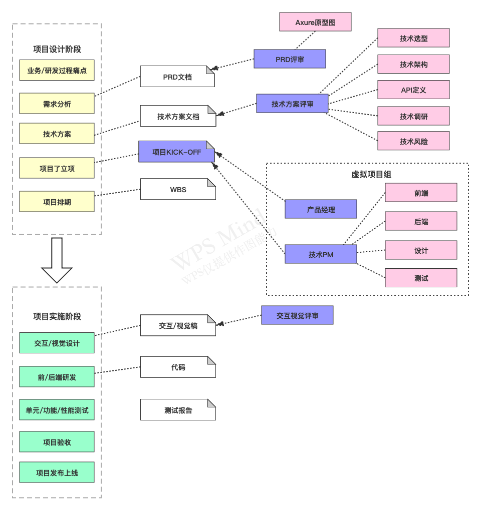
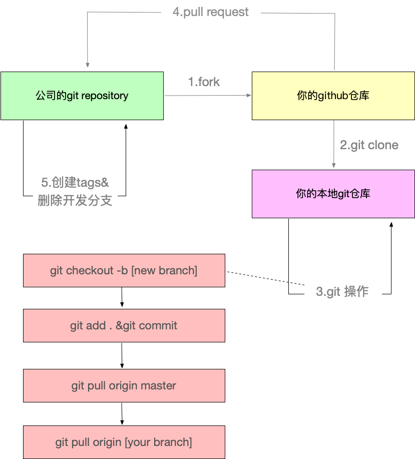
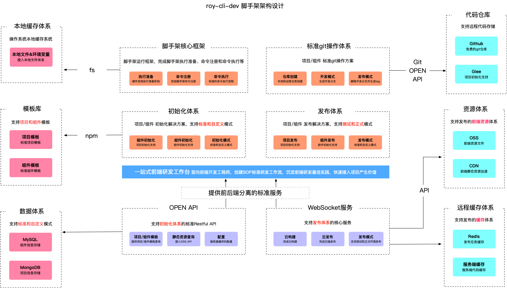
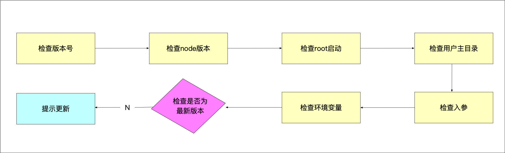
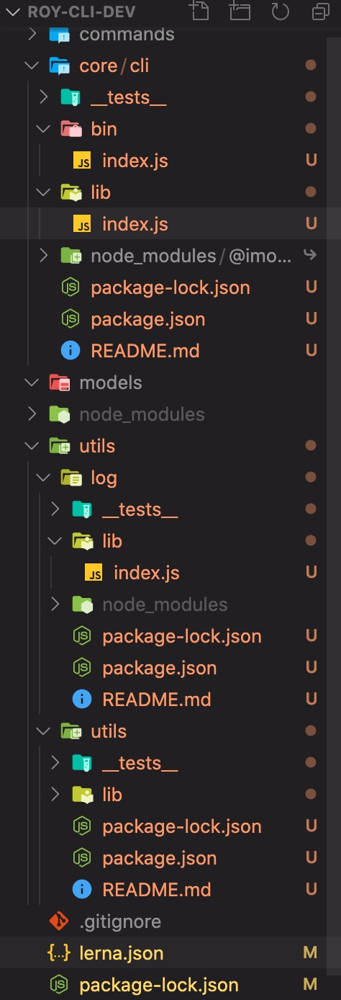

# 脚手架核心流程开发

## 脚手架需求分析

### 大厂做项目流程



### 痛点分析

- 创建项目/组件时，存在大量重复代码拷贝:快速复用已有沉淀
- 协同开发时，由于git操作不规范，导致分支混乱，操作耗时:制定标准的git操作规范并集成到脚手架
- 发布上线耗时，而且容易出现各种错误:定制标准流程混合规范并集成到脚手架

### 需求分析
- 通用的研发脚手架
- 通用的项目/组件创建能力
    - 模板支持制定，制定后能够发布生效
    - 模板支持快速接入，极低的接入成本
- 通用的项目/组件发布能力
    - 发布过程自动完成标准的git操作
    - 发布成功后自动删除开发分支并创建tag
    - 发布后自动完成云构建、CDN、域名绑定
    - 发布过程支持测试/正式两种模式

### git规范




### 架构设计图




## 脚手架拆包策略

### 拆包原则
- 核心流程: core
- 命令:commands
    - 初始化
    - 发布
- 模型层:models
    - Commands命令
    - Project项目
    - Component组件
    - Npm模块
    - Git仓库
- 支撑模块: utils
    - Git操作
    - 云构建
    - 工具方法
    - API请求
    - Git API


## core模块技术方案

### 命令执行流程
- 准备阶段
- 命令注册
- 命令执行

#### 准备阶段的过程




### 涉及技术点

#### 核心库
- import-local:优先执行本地的命令
- commander:命令注册

#### 工具库
- npmlog:打印日志
- fs-extra:文件操作，基于fs封装了很多有价值的操作
- semver:版本比对
- colors:在终端中打印不同的颜色文本
- user-home:快速拿到用户的主目录
- dotenv:获取环境变量
- root-check:root账户的检查和自动降级


## 代码编写
1. 通过[week02-笔记](./02-week02-笔记.md)里面的代码来做修改。

2. 通过拆包原则，在根目录下创建 **core**，**modules**，**commands**，**utils** 目录，修改lerna.json里面packages的代码:
```js
{
  "packages": [
    "core/*",
    "commands/*",
    "models/*",
    "utils/*"
  ],
  "version": "1.0.4"
}
```

3. 然后把packages目录下的core文件夹移动到根目录core文件夹下面并把core改成cli，把utils文件夹拖到根目录下的utils目录下。




4. 在`core/cli/bin/index.js`里面写入下面代码:
```js
const importLocal = require('import-local');
if (importLocal(__filename)) {
    require('npmlog').info('cli','正在使用roy-cli-dev本地版本')
} else {
    require('../lib')(process.argv.slice(2));
}
```

**import-local作用是当全局node_modules和本地node_modules存在相同的库，优先加载本地的,npmlog为日志打印**

5. 检查版本开发`core/cli/lib/index.js`
```js
const pkg = require('../package.json');
function checkPkgVersion(){
    log.info('cli',pkg.version);
}
```
这样我们就可以获取到`package.json`里面的版本号，那么我们想一想为什么`require`加载资源的方式有那些？

`require`可以加载资源文件有`.js`,`.json`,'.node',加载其他的文件`require`会默认把他当做js来执行
- 加载`.js`时需要我们必须在js文件中，使用`module.exports`或者`exports=`
- 加载`.json`时会使用`JSON.parse`进行转换编译从而得到一个json对象
- `.node`是一个C++插件

6. 检查Node版本`core/cli/lib/index.js`

```js
function checkNodeVersion() {
    //第一步，获取当前Node版本号
    const currentVersion = process.version;
    const lastVersion = constants.LOWEST_NODE_VERSION;
    //第二步，对比最低版本号
    if (!semver.gte(currentVersion, lastVersion)) {
        throw new Error(colors.red(`roy-cli-dev 需要安装v${lastVersion}以上版本的Node.js`));
    }
}
```

为什么我们要检查Node版本?

因为我们可能用到一些Node API在低版本是不支持的，所以我们要设置一个最低的版本号。

7. 检查root启动
```js
function checkRoot() {
    //使用后，检查到root账户启动，会进行降级为用户账户
    const rootCheck = require('root-check');
    rootCheck();
}
```

8. 检查用户主目录
```js
const userHome = require('user-home');//获取当前用户主目录
const pathExists = require('path-exists').sync;//判断目录是否存在
function checkUserHone(){
    if (!userHome || !pathExists(userHome)) {
        throw new Error(colors.red('当前登录用户主目录不存在!!!'));
    }
}
```

9. 检查入参和debug模式开发
```js
function checkInputArgs(){
    const minimist = require('minimist');//获取入口参数
    const args = minimist(process.argv.slice(2));
    checkArgs(args);
}

function checkArgs(args){
    if (args.debug) {
        process.env.LOG_LEVEL = 'verbose';
    } else {
        process.env.LOG_LEVEL = 'info';
    }
    log.level = process.env.LOG_LEVEL;
}
```

10. 检查环境变量

```js
unction checkEnv() {
    const dotenv = require('dotenv');//获取环境变量
    const dotenvPath = path.resolve(userHome,'.env');
    if (pathExists(dotenvPath)) {
        config = dotenv.config({
            path:dotenvPath
        });
    } 
    createDefaultConfig();
}

function createDefaultConfig(){
    const cliConfig = {
        home:userHome
    }
    if (process.env.CLI_HOME) {
        cliConfig['cliHome'] = path.join(userHome,process.env.CLI_HOME);
    } else {
        cliConfig['cliHome'] = path.join(userHome,constants.DEFAULT_CLI_HOME);
    }
    process.env.CLI_HOME_PATH = cliConfig.cliHome;
}
```

11. 检查当前版本是否是最新版本

使用`lerna`创建`get-npm-info`模块`lerna create ./utils/get-npm-info`，在`utils/get-npm-info`里面编写代码:
```js
const axios = require('axios');
const urlJoin = require('url-join');
const semver = require('semver');


function getNpmInfo(npmName,registry) {
    if (!npmName) {
        return null;
    }
    const registryUrl = registry || getDefaultRegistry();
    const npmInfoUrl = urlJoin(registryUrl,npmName);
    return axios.get(npmInfoUrl).then(response => {
        if (response.status === 200) {
            return response.data;
        }
        return null;
    }).catch(err => {
        return Promise.reject(err);
    })
}

function getDefaultRegistry(isOriginal = false) {
    return isOriginal ? "https://registry.npmjs.org/" : "https://registry.npm.taobao.org/";
}

async function getNpmVersions(npmName,registry) {
    const data = await getNpmInfo(npmName,registry);
    if (data) {
        return Object.keys(data.versions);
    } else {
        return [];
    }
}

function getSemverVersions(baseVersion,versions) {
    return versions.filter(version => 
        semver.satisfies(version,`^${baseVersion}`)
    ).sort((a,b)=> semver.gt(b,a));
}

async function getNpmSemverVersion(baseVersion,npmName,registry) {
    const versions = await getNpmVersions(npmName, registry);
    const newVersions = getSemverVersions(baseVersion, versions);
    if (newVersions && newVersions.length > 0) {
        return newVersions[0];
    }
}

module.exports = {
    getNpmInfo,
    getNpmVersions,
    getSemverVersions,
    getNpmSemverVersion
};

```

在`core/cli/package.json`里面添加链接库`"@roy-cli-dev/get-npm-info": "file:../../utils/get-npm-info"`,`core/cli/lib/index.js`代码如下:
```js
async function checkGlobalUpdate() {
    //1.获取当前版本号和模块名
    const currentVersion = pkg.version;
    const npmName = pkg.name;
    //2.调用npm API,获取所有版本号
    const {getNpmSemverVersion} = require('@roy-cli-dev/get-npm-info');
    //3.提取所有版本号，比对哪些版本号是大于当前版本号
    const lastVersion = await getNpmSemverVersion(currentVersion,npmName);
    if (lastVersion && semver.gt(lastVersion,currentVersion)) {
    //4.获取最新的版本号，提示用户更新到该版本
        log.warn(colors.yellow(`请手动更新${npmName},当前版本:${currentVersion},最新版本:${lastVersion} 
                    更新命令:npm install -g ${npmName}`))
    }
}
```

检查是否需要更新的步骤为以上四步。


