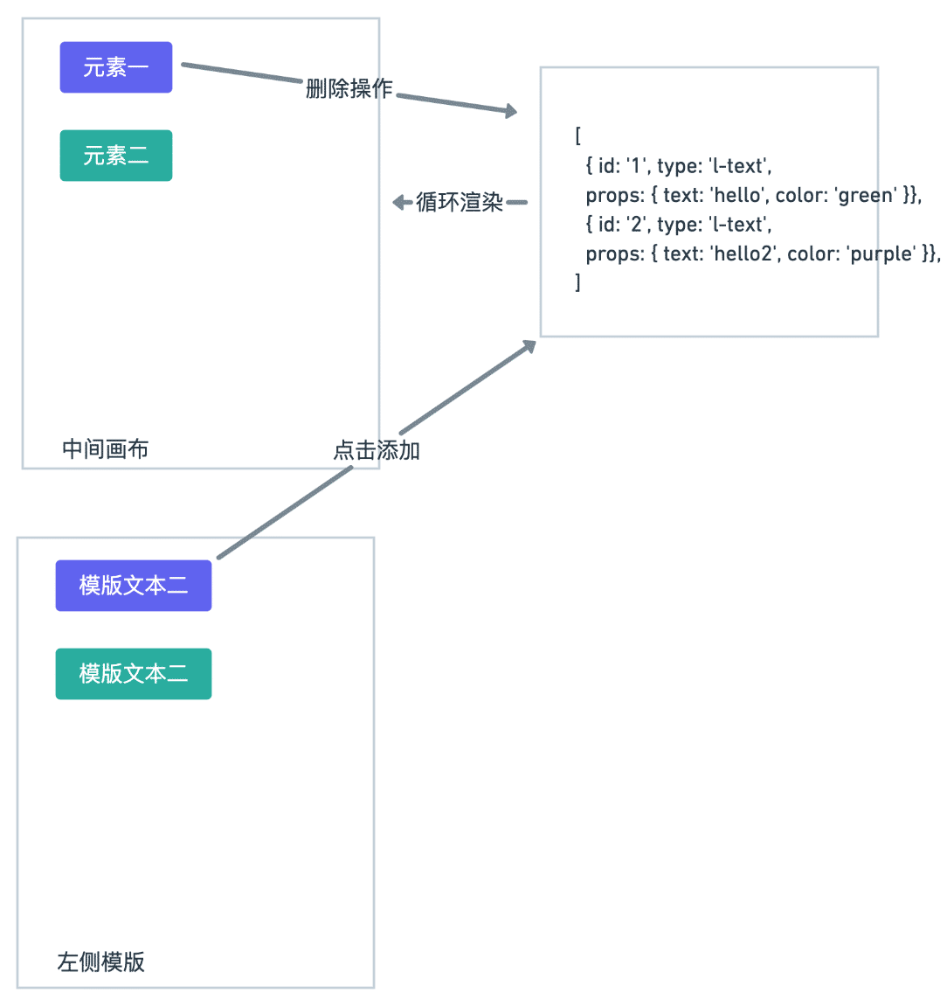
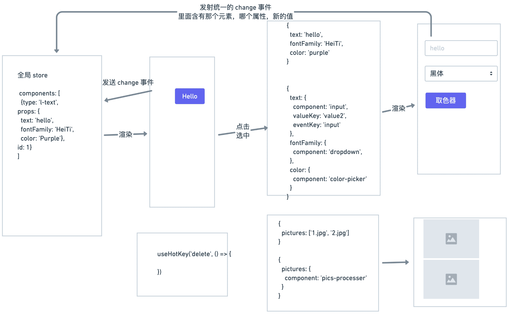
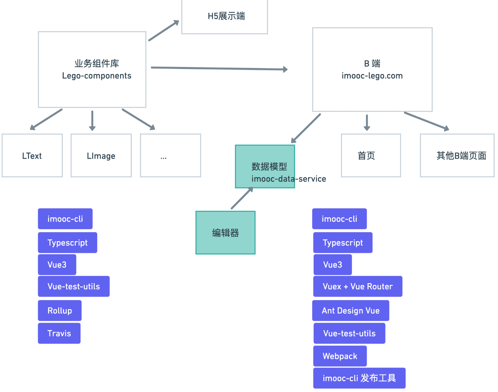

# B段项目需求分析和架构设计

## 需求初步分析

### 首页
- 导航条:未登录和已登录
    - 未登录:显示登录按钮
    - 已登录:显示创建设计，我的作品还有下拉菜单(个人设置和登出)

- 展示列表
    - 图片
    - 标题
    - 作者信息和使用人数
    - Hover显示创建按钮

- 搜索
    - 搜索以后有清空按钮

- 点击更多展示列表(每页展示8条)

- 我的作品(展示四条，右侧到我的作品页面)

### 登录

- 发送验证码

- 登录
    - 表单验证

### 模板详情页

- 展示图片、二维码、标题、作者

- 使用该模板创建

- 下载图片

### 我的作品

-  作品或者模板列表
    - 编辑
    - 统计
    - 删除
    - 转赠
    - 下载图片

- 搜索

- 翻页

### 编辑器

- 左边:组件面板 - 可以添加到编辑器中的组件类型
    - 文本
    - 图形
    - 形状

- 中间:编辑器区域 - 从左侧添加的组件都会呈现到编辑器中
    - 点击选中
    - 拖动改变位置
    - 拖动改变大小
    - 快捷键
    - 右侧菜单

- 右侧:属性编辑面板 - 可以编辑中间组件的属性以及其他功能
    - 元素属性
    - 图层面板，隐藏显示，锁定解锁，拖动排序
    - 背景设置

- 顶部:保存、发布、预览和设置
    - 点击保存
    - 点击预览、弹框
        - 左侧显示预览
        - 右侧设置标题，描述和头图
    - 发布、弹框
        - 左侧显示截图 
        - 右侧显示默认渠道，并且可以进行编辑

- 其他:不属于界面上的一些功能(定时保存，退出前提示等等)

## 难点分析
- 发现核心问题: **编辑器和h5页面其实整个就就是一系列元素构成的** ，这些元素的自然应该抽象成组件，这些组件的属性应该怎样设计，在不同的项目中怎样做到统一的用法。

- 在不同的项目中怎样做到统一的使用？

- 编辑器页面做的核心功能其实就是对一系列组件增删改的操作。所以怎么设计编辑器的整体状态

- 组件有多种，它的属性也有多种，1 怎样将这些属性渲染成不同的表单组件(也有可能不仅仅是表单组件) 2 在表单组件中，属性做出修改以后，怎样实时将值反射到组件中去

- 组件的可扩展性，虽然在需求中我们只要求了三种组件，但是最初的设计是否能够具有良好的可扩展性

- 编辑器有很多的交互:拖动移动位置，拖动改变大小，快捷键，右键菜单，缩放，重做/回滚等等功能。它们都是在核心问题之外的交互，那么很自然，我们是否能将这些功能进行解耦?

## 业务组件库难点解决方案

第一个问题:

在不同的项目中重用这些组件，所以把这些组件自然而然的抽取成一个代码库。降低和任何一个项目的耦合性，单独代码库让业务组件有独立的标准开发流程:

- 编码
- 测试
- 打包生成通用JS模块
- 发布至NPM
- CI/CD - 自动发布


第二个问题，组件属性设计

从需求可以得知，[需求地址](https://www.yuque.com/docs/share/37224f92-3071-4ff7-adf1-0d0635677c34) 组件的属性和这些可以编辑的属性很自然的一一对应的结果。对于每一个组件，它们需求中的属性其实可以分为两大类。


```js
// 方案一，将 css 作为一个统一的对象传入
<LText
    css={{color: '#fff' ...}}
    text="nihao"
/>
// 内部实现比较简单
<p style={props.css}></p>

// 方案二，将 所有属性全部平铺传入
<LText
    :text="nihao"
    :color="#fff"
  ...
/>
// 内部实现会复杂一点
const styles = stylePick(props)
<p style={styles}></p>

// 方案一内部实现简单，但是保存的时候要多一层结构，并且更新数据的时候要知道是样式还是其他属性
// 方案二 内部实现稍微复杂一点，但是保存简单，更新数据不需要再做辨别
所以我觉得第二种解决方案是更好的，当然你也可能总结出更好的方案，就看大家自己怎样分析这个问题了。

```

这些组件目前有一些公有的属性，称之为公共属性。提到公共属性我们就要注意代码重用的问题

```js
// 比如 在 Ltext 和 LImage 中都点击跳转的功能，属于公共属性的行为
// 抽象出一些通用的函数，在组件中完成通用的功能
import useClick from 'useClick'

useClick(props)

//这里只是分析可能遇到的问题，并不会写具体的代码，都用伪代码代替。

```

第三个问题:组件扩展性的问题

组件扩展性正在业务组件库中不存在什么问题，因为每个组件都是独立的个体，它们的实现方案相对独立，那么这里的扩展性是指在编辑器中是否能对它进行适配，包括展示和编辑的适配

## 编辑器难点解决方案
编辑器页面主要有三个部分，为左中右结构，左侧为组件模板库，中间为画布，右侧是设置面板

- 左侧是预设各种组件模板并进行添加
- 中间是使用交互的手段更新元素的值
- 右侧是使用表单的手段更新元素的值

第一个问题:整体状态设计

不难看出我们的编辑器其实就是围绕着中间画布的元素来进行一些列操作，那么自然而然是一系列的元素组成的，我们应把它抽象成一系列拥有特定数据结构的数组



```js
export interface EditorStore {
  // 供中间编辑器渲染的数组
  components: ComponentData[];
  // 一系列和其他状态相关的信息，应该有很多
  // 当前编辑的是哪个元素，uuid
  currentElement: string;
}
interface ComponentData {
  // 每个元素 props 所有属性
  // 我们上节课已经分析过了，是 css 属性和其他属性的混合体
  // 并且我们会把这些属性完全平铺开来，其实在编辑器分析过后，你就能更感受到平铺的一个好处
  props: { [key: string]: any };
  // id，uuid v4 生成
  id: string;
  // 业务组件库名称 l-text，l-image 等等 
  name: string;
}


```

### 场景设计

#### 将元素渲染到画布

使用store中componentsd当中的数据，循环渲染

```js
compoents.map(component => <component.name {...props} />）
```

#### 渲染左侧预设组件模板

原理和上面一样的，只不过数据是预设好的，这个可以写死在本地，也可以从服务端获取。他们和中间元素不一样的是，这些组件都有一个点击事件，我们可以添加一层wrapper来解决这个问题。这样也可以和内部lego components做到隔离，互不影响。

```js
compoents.map(component => <Wrapper><component.name {...props} /></Wrapper>）

```

#### 添加和删除组件
非常简单的逻辑，向store中添加和删除组件即可

```js
// 添加
components.push({type: '', props: {} })
// 删除
components = components.filter((component) => component.id !== id)

```

#### 将属性映射到表单

我们用一张图来表述应用的整个流程:



现在我们完成了数据到画布渲染这第一步，接下来要到点击画布中的某个组件需要将该元素的属性以不同表单的形式展示到右侧

一个很容易想到的是直接将这些表单组件写死到页面中去。

```js
const currentComponentProps = {
  text: '123',
  color: '#fff'
}

<input value={text}/>
<color-picker value={color}/>
...
```

缺点:
    - 代码冗长
    - 对不同类型业务组都要判断
    - 可扩展性很差

看到界面展示，应该想到另一个纬度，界面UI其实就是数据的抽象，所以我们自然想到的就是使用特定的数据结构将它渲染成界面。

```js
const textComponentProps = {
  text: 'hello',
  fontFamily: 'HeiTi',
  color: '#fff'
}

const propsMap = {
  text: {
    component: 'input'
  },
  fontFamily: {
    component: 'dropdown',
  },
  color: {
    component: 'color-picker'
  }
}

// 这里我们还是循环所有属性，在每个属性中渲染对应处理这个属性的组件
map(textComponentProps, (key, value) => {
  <propsMap[key] value={value}>
})

```

- 当遇到没有类似的Form组件的时候，我们可以进行二次开发，只要这个组件有value的对应属性

- 这在一定程度上还满足了可扩展性这个命题，组件的属性可以扩展，对于color这个属性，我们自己开发一个取色器或者二次封装一个取色器组件，只要传入value属性即可

#### 组件更新
我们的数据流始终保持自上而下的顺序，也就是说表单更新最终要反射回到总体的store当中去。这个时候我们在对应的组件当中发射出一个事件，change，当change发生的时候，我们能够知道是哪个元素的哪个属性，以及新的值是什么，我们就用这些信息更新这个值，这样store完成更新，元素的props发生更新，那么整个数据流动就完成了。

```js
map(textComponentProps, (key, value) => {
  const handleChange = (propKey, newValue, id) => {
    const updatedComponent = store.components.find(component.id === id)
    updatedComponent.props[propKey] = newValue
  }
  <propsMap[key] value={value} @change={handleChange}>
}

```

除了表单的更新，还要说一下画布中的交互更新，其实画布中的更新也是采用发射事件的方式对store的某些值进行更新，比如说拖动改变位置，最终拖动的过程中也是触发对应的change事件去用相同饿逻辑对值进行更新，这里也有注意，我们需要在业务组件外层，添加Wrapper，各个事件都是放在这个Wrapper上面的，比如支持拖动，改变位置后发送change事件。

对于复杂的组件也是如此，不管你内部的逻辑有多复杂，添加上传图片，删除，逻辑，最终发送出来的事件里面的值，就是对这个pictures的值的变换，比如多加了一张照片，那就是数组中的值变成了三项。

#### 画布操作的插件化
比如快捷键，他只写成普通的可重用的函数即可，提供回调即可，在回调中，我们可以对全局store进行一系列的改写，而快捷键这个功能和编辑器是没有任何关系的


## 总体架构




