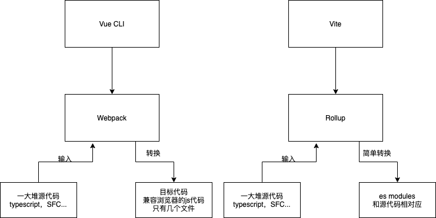
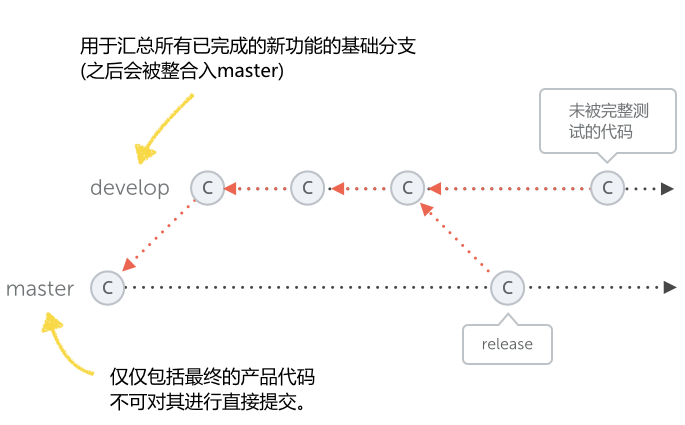
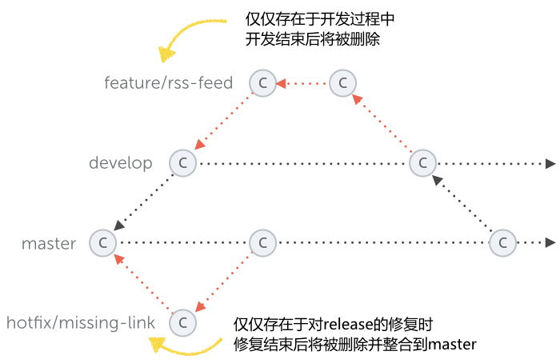
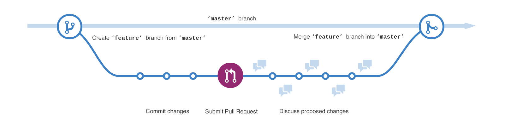
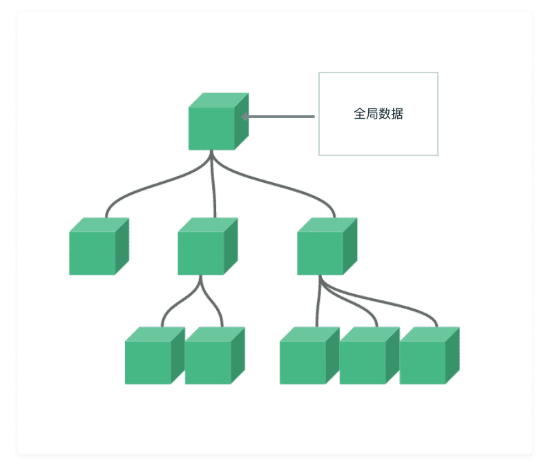
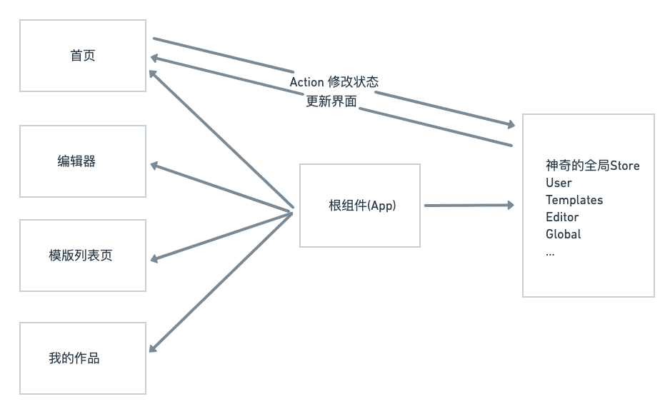
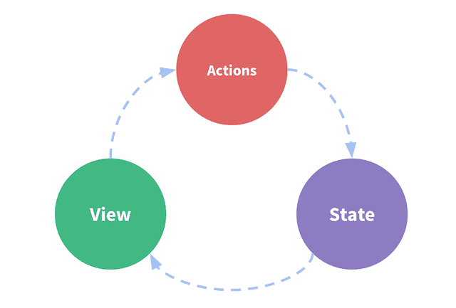
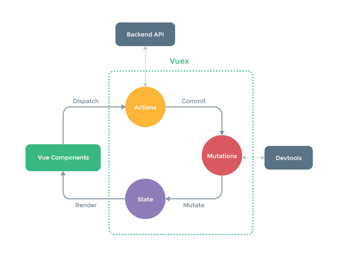

# 项目整体搭建

## 前端工具链

前端的飞速发展:带来了更复杂的项目

项目的常见需求 - 依赖管理，预编译，构建打包，压缩合并等

随着项目越来越复杂 - 诞生了 **前端工程化**

随着工程化的产生 - 产生了对应的 **前端工具栏链**

### 静态类型语言

动态语言的弊端
  - typescript
  - flow

### 代码风格检查Linter

多人协作的弊端，风格各异，维护和扩展的困难

  - eslint

#### 包管理器

- npm 

- yarn - 兼容 npm registry

### 开发服务器

- live reload

- HMR

### 打包工具Bundler

将源代码转换成符合生成环境的代码

- Webpack - Loader，Plugin，大而全的功能

- Rollup - 专注于打包 输出多种格式

- Parcel - 零配置

### 任务管理工具Task Runner

自动执行项目所需的重复任务

- CSS预处理
- 优化图片
- 合并压缩JavaScript
- 文件处理(拷贝，删除)
- 文件监听变化
- Gulp - 流式管道写法组合多个任务
- Webpack - 通过插件的方式
- npm scripts 或者 Shell脚本

### 脚手架 Scaffolding tools

**将工具链聚合在一个工具内** 简单，快速，零配置

- Vue - Vue CLI，Vite
- React - createa-react-app  
- Angular - Angular CLI

## Vue CLI 和 Vite 对比

### Vue CLI的功能

- 工程脚手架
- 开发服务器
- 插件系统
- 用户UI界面

Vue CLI构建是基于Webpack的。主要耗时都在Webpack的性能上。

### Vite
与Vue CLI类似，Vite也是一个提供基本项目脚手架和开发服务器的构建工具

然后，Vite并不是基于Webpack的，它有自己的开发服务器，利用浏览器中的原生ES模块。这种架构使得Vite比Webpack的开发服务器快了好几个数量级。Vite采用Rollup进行构建，速度也更快。

Vite目前还处于测试阶段，看来Vite项目的目的并不是像Vue CLI那样的一体化工具，而是专注于提供一个快速的开发服务器和基本的构建工具。

### 对比



### Vite的缺点
- 测试阶段
- 只支持新版支持ES modules的浏览器
- 第三方库也需要都支持ES modules
- CommandJS支持有限
- 开发构建属于两套系统，可能导致生产和开发的不一致

## Git Flow规范
所有的这些规范都是针对特定的 **多人** 设定的，意在让多人协作的过程更顺畅，更简单，减少不必要的冲突和时间的浪费。



### 预设两个分支
- master只能用来包括产品代码。你不能直接工作在这个master分支上
- develop是你进行任何新的开发的基础分支

### 这两个分支被称之为长期分支



- 功能开发feature

  - 整合回到develop
  - 等待更全面的测试
  - 等待和develop一起进行发布

- 管理release

  - 新功能已经添加，bug已经修复
  - 代码已经被测试
  - release分支使用版本号命名的

- bug修复hotfix

  - 针对master分支

优点:清晰可控

缺点:相对复杂，不合适持续发布

### Github Flow

[Github Flow 官方文档](https://guides.github.com/introduction/flow/index.html)



- 根据需求，从master拉出分支
- 激烈的开发阶段，提交commit
- 开发完毕，发起PR(pull request)
- 代码评审
- 部署，并且测试
- 没问题，merge到master

Github Flow的最大有点就是简单，对于"持续发布"的产品，可以说是最合适的流程。

### 两大规则

- branch命名
  - feature开头代表功能开发
  - hotfix开头代码bug修复

- commit信息，必须言之有物，杜绝update, fix bug这类废话

## SPA应用路由的基本原理

### SPA和普通网页应用的区别

- 普通网页
  - 跳转到新网页，每次冲洗加载所有资源
  - HTML内容是后端直接渲染的

- SPA应用
  - 不跳转，JS拦截器，修改URL
  - JS动态渲染DOM内容

### SPA路由的实现方式

History API

[pushState文档地址](https://developer.mozilla.org/zh-CN/docs/Web/API/History_API#%E6%B7%BB%E5%8A%A0%E5%92%8C%E4%BF%AE%E6%94%B9%E5%8E%86%E5%8F%B2%E8%AE%B0%E5%BD%95%E4%B8%AD%E7%9A%84%E6%9D%A1%E7%9B%AE)

[codesanbox演示地址](https://codesandbox.io/s/optimistic-cookies-wgxhc?file=/src/index.js)

URL Hash

### SPA优点
- 速度快
- 体验好
- 为前后端分离提供了实践场所

## 什么是状态管理工具
首先搞清楚，是否 **真的** 需要状态管理工具。

它随着SPA的出现，而浮出水面。客户端需要处理复杂的状态数据。

多个组件需要共享的一系列数据，称之为 **全局数据**

### 解决方案

#### 方案一:单向数据流，从父组件传递到子组件



#### 缺点
- 多层传递非常反锁
- 中间传递层有可能根本不需要这个数据
- 根组件压力太大，逻辑代码会非常繁杂

#### 方案二 使用全局对象


#### 缺点
- 数据非响应式
- 修改无法追踪
- 直接从组件获取数据是一种反模式

### 状态管理工具三杰

[Vuex](https://next.vuex.vuejs.org/)

[Redux](https://redux.js.org/)

[Mobx](https://mobx.js.org/README.html)



### 状态管理工具的特点

- store，神奇的全局数据结构:single source of truth
- 不能随意修改，调用特殊的方法来实现数据修改
- 变化可追溯，可预测(predictable)

## Vuex

Vue的数据流
```js
const Counter = {
  // state
  data () {
    return {
      count: 0
    }
  },
  // view
  template: `
    <div>{{ count }}</div>
  `,
  // actions
  methods: {
    increment () {
      this.count++
    }
  }
}

```



### 出现问题:多组件共享状态
- 根组件多层传递的困境
- 多组件同步数据的繁琐

### Vuex的解决方案



### Vuex的特点
- 核心就是一个store
- Vuex的状态是响应式的
- 不能直接改变store中state的值，需要显式的提交Mutation

```js
const store = createStore({
  state: {
    count: 0
  },
  mutations: {
    add (state) {
      state.count++
    }
  }
})
store.commit('add')
console.log(store.state.count)

```

