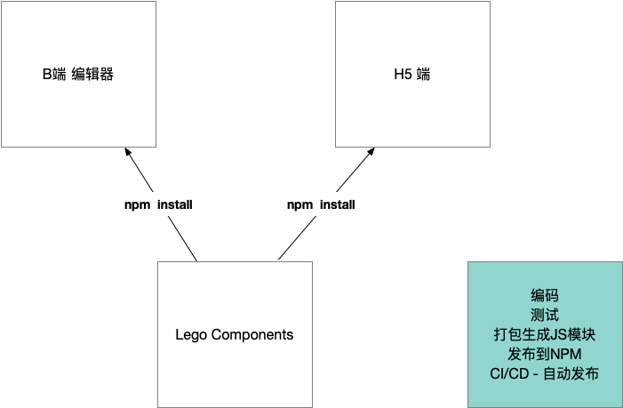
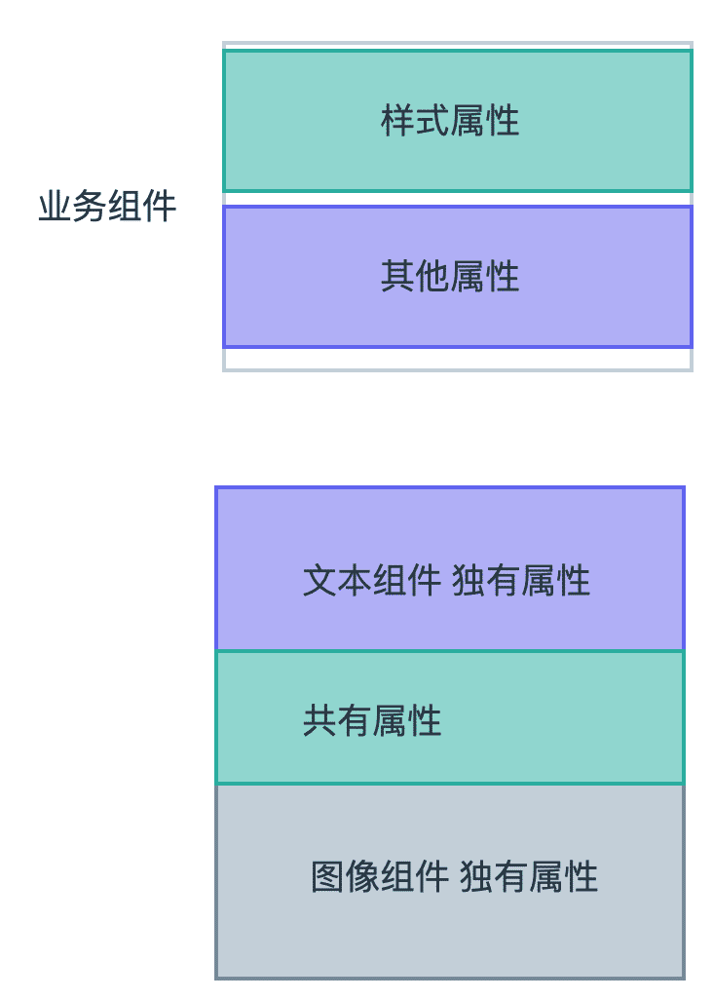
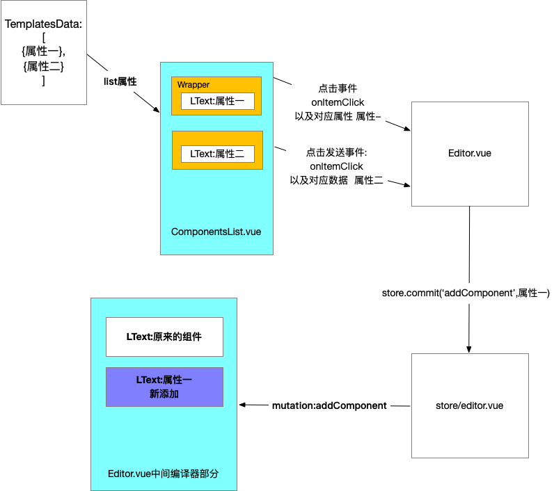
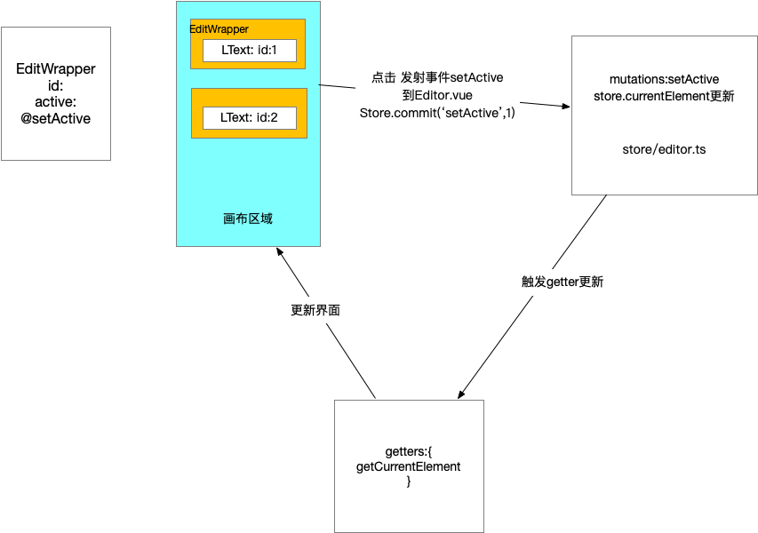
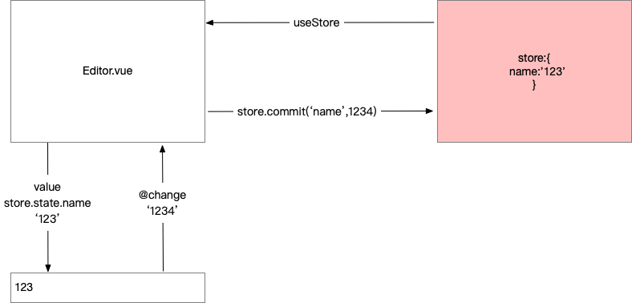
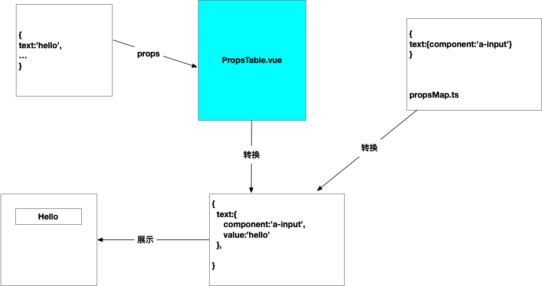

# B端编辑器技术实现方案

编辑器页面主要有三部分，为左中右结构，左侧为组件模板库，中间为画布，右侧设置面板。

左侧是预设各种组件模板并进行添加

中间是使用交互得手段更新元素的值

右侧是使用表单的手段更新元素的值

## 总体状态结构
整个编辑器使用一个store来实现具体功能，总体设计如下
```js
export interface EditorProps {
  // 供中间编辑器渲染的数组
  components: ComponentData[];
  // 当前编辑的是哪个元素，uuid
  currentElement: string;
  // 当然最后保存的时候还有有一些项目信息，这里并没有写出，等做到的时候再补充
}
export interface ComponentData {
  // 这个元素的 属性，属性请详见下面
  props: {[key: string]: any};
  // id，uuid v4 生成
  id: string;
  // 业务组件库名称 l-text，l-image 等等 
  name: string;
}
```

## 业务组件库实现方案

**编辑器和h5页面其实整个就是一系列元素构成的，** 这些元素的自然应该抽象成组件。

### 单独代码库
在不同的项目中重用这些组件，所以把这些组件自然而然抽取成一个代码库。降低和任何一个项目的耦合性没单独代码库让业务组件有独立的标准开发流程:
- 编码
- 测试
- 打包生成通用JS模块
- 发布至NPM
- CI/CD - 自动发布



### 原则
业务组件库大多数都是展示型组件，其实就是把对应的template加上属性(大部分是CSS属性)展示出来，会有少量行为，比如点击跳转等，而且这些组件会在多个不同的端进行展示，所以业务组件库就是从简的原则，必须避免和编辑器编辑流程的耦合。

### 组件命名
使用一个字母(L表示)加组件的名称:比如LText或者l-text

### 组件属性设计
从需求可以得知，[需求地址](https://www.yuque.com/docs/share/37224f92-3071-4ff7-adf1-0d0635677c34) 组件的属性和这些可以编辑的属性很自然的一一对应的结果。对于每一个组件，它们需求中的属性其实可以分为两大类。




#### 公共属性处理

```js
import { mapValues, without } from 'lodash-es'
//组件公共属性
export interface CommonComponentProps {
  // actions
  actionType: string;
  url: string;
  // size
  height: string;
  width: string;
  paddingLeft: string;
  paddingRight: string;
  paddingTop: string;
  paddingBottom: string;
  // border type
  borderStyle: string;
  borderColor: string;
  borderWidth: string;
  borderRadius: string;
  // shadow and opacity
  boxShadow: string;
  opacity: string;
  // position and x,y
  position: string;
  left: string;
  top: string;
  right: string;
}
//设置默认属性值
export const commonDefaultProps: CommonComponentProps = {
  // actions
  actionType: '',
  url: '',
  // size
  height: '',
  width: '373px',
  paddingLeft: '0px',
  paddingRight: '0px',
  paddingTop: '0px',
  paddingBottom: '0px',
  // border type
  borderStyle: 'none',
  borderColor: '#000',
  borderWidth: '0',
  borderRadius: '0',
  // shadow and opacity
  boxShadow: '0 0 0 #000000',
  opacity: '1',
  // position and x,y
  position: 'absolute',
  left: '0',
  top: '0',
  right: '0'
}
//文本组件属性
export interface TextComponentProps extends CommonComponentProps {
  text: string;
  fontSize: string;
  fontFamily: string;
  fontWeight: string;
  fontStyle: string;
  textDecoration: string;
  lineHeight: string;
  textAlign: string;
  color: string;
  backgroundColor: string;
}
export interface ImageComponentProps extends CommonComponentProps {
  src: string;
}
//文本属性设置默认参数
export const textDefaultProps: TextComponentProps = {
  // basic props - font styles
  text: '正文内容',
  fontSize: '14px',
  fontFamily: '',
  fontWeight: 'normal',
  fontStyle: 'normal',
  textDecoration: 'none',
  lineHeight: '1',
  textAlign: 'left',
  color: '#000000',
  backgroundColor: '',
  ...commonDefaultProps
}
export const imageDefaultProps: ImageComponentProps = {
  src: 'test.url',
  ...commonDefaultProps
}
//剔除文本中其他的属性
export const textStylePropNames = without(Object.keys(textDefaultProps), 'actionType', 'url', 'text')
//剔除图片中其他的属性
export const imageStylePropsNames = without(Object.keys(imageDefaultProps), 'src')
export const transformToComponentProps = <T extends {}>(props: T) => {
  // 创建一个对象，对象的key相同，值是通过 iteratee 产生的
  return mapValues(props, (item) => {
    return {
      type: (item as any).constructor as StringConstructor,
      default: item
    }
  })
}
```

#### 抽离页面样式和点击事件的处理
```js
const useComponentCommon =(props: Readonly<Partial<TextComponentProps>>, picks: string[]) => {
  const styleProps = computed(() => pick(props, picks))
  const handleClick = () => {
    if (props.actionType === 'url' && props.url) {
      window.location.href = props.url
    }
  }
  return {
    styleProps,
    handleClick
  }
}

export default useComponentCommon
```

## 场景设计

### 渲染左侧预设组件模板
数据都是预设好的，这个可以写死本地，也可以从服务端获取。他们和中间元素不一样的是，这些组件都有一个点击事件，我们可以添加一层wrapper来解决这个问题。这样也可以和内部的lego components做到隔离，互不影响。
```js
components.map(component => <Wrapper><component.name {...props} /></Wrapper>)
```

左侧写死数据如下:
```js

export const defaultTextTemplates = [
  {
    text: '大标题',
    fontSize: '30px',
    fontWeight: 'bold',
    tag: 'h2'
  },
  {
    text: '正文内容',
    tag: 'p'
  },
  {
    text: '链接内容',
    color: '#1890ff',
    textDecoration: 'underline',
    tag: 'p'
  },
  {
    text: '按钮内容',
    color: '#ffffff',
    backgroundColor: '#1890ff',
    borderWidth: '1px',
    borderColor: '#1890ff',
    borderStyle: 'solid',
    borderRadius: '2px',
    paddingLeft: '10px',
    paddingRight: '10px',
    paddingTop: '5px',
    paddingBottom: '5px',
    width: '100px',
    tag: 'button',
    textAlign: 'center'
  }
]
```

### 添加和删除组件
非常简单的逻辑，向store中添加和删除组件即可
```js
//添加
components.push({type:'',props:{}})
```


### 更新属性的过程
- 点击某一个组件，选中
- 将它的属性以不同类型的表单呈现在右侧
- 编辑表单中的值，在值更新的同时将数据更新至页面

```html
<editor-component :value="#111111/123/[1,2,3]"/>
<editor-component :[value.valueProp]="#111111/123/[1,2,3]"/>
<editor-component :[value.valueProp]="#111111/123/[1,2,3]" @[value.eventName]="handleChange"/>

type handleChange = (newValue:any) => void
```



### 支持属性展示和编辑的组件
- 必须提供一个属性传入需要编辑的值，默认为value
- 必须提供一个事件发射出编辑后新的值，默认为change



### 难点 编辑组件
看到页面展示，应该想到另一个纬度，界面UI其实就是数据的抽象，所以我们自然想到的就是使用特定的数据结构将它渲染成界面。

对应关系

```js
export interface PropToForm {
    component: string;
    subComponent?: string;
    extraProps?: { [key: string]: any };
    text?: string;
    options?: { text: string | VNode; value: any }[];
    initalTransform?: (v: any) => any;
    afterTransform?: (v: any) => any;
    valueProp?: string;
    eventName?: string;
}

export type PropsToForms = {
    [p in keyof TextComponentProps]?: PropToForm;
}

const fontFamilyArr = [
    { text: '宋体', value: '"SimSun","STSong"' },
    { text: '黑体', value: '"SimHei","STHeiti"' },
    { text: '楷体', value: '"KaiTi","STKaiti"' },
    { text: '仿宋', value: '"FangSong","STFangsong"' },
];

const fontFamilyOptions = fontFamilyArr.map(font => {
    return {
        value: font.value,
        text: <span style={{ fontFamily: font.value }}>{font.text}</span> as VNode
    }
})

export const mapPropsToForms: PropsToForms = {
    text: {
        text: '文本',
        component: 'a-textarea',
        extraProps: { rows: 3 },
        afterTransform: (e: any) => e.target.value,
    },
    fontSize: {
        text: '字号',
        component: 'a-input-number',
        initalTransform: (v: string) => parseInt(v),
        afterTransform: (e: number) => e ? `${e}px` : '',
    },
    lineHeight: {
        text: '行高',
        component: 'a-slider',
        extraProps: { min: 0, max: 3, step: 0.1 },
        initalTransform: (v: string) => parseFloat(v),
        afterTransform: (e: number) => e.toString()
    },
    textAlign: {
        component: 'a-radio-group',
        subComponent: 'a-radio-button',
        text: '对齐',
        options: [
            { value: 'left', text: '左' },
            { value: 'center', text: '中' },
            { value: 'right', text: '右' }
        ],
        afterTransform: (e: any) => e.target.value,
    },
    fontFamily: {
        component: 'a-select',
        subComponent: 'a-select-option',
        text: '字体',
        options: [
            { value: '', text: '无' },
            ...fontFamilyOptions
        ]
    },
    // width: {
    //     text: '宽度',
    //     ...pxToNumberHandler
    // },
    color: {
        component: 'color-picker',
        text: '字体颜色'
    }
}

```



### 更新表单将数据更新到属性
我们的数据流始终保持自上而下的顺序，也就是说表单更新最终要反射回到总体的store当中去。这个时候我们在对应的组件当中发射出一个事件，change，当change发生的时候，我们能够知道是哪个元素的哪个属性，以及新的值是什么，我们就用这些信息更新这个值，这样store完成更新，元素的props发生更新，那么整个数据流动就完成了。

```js
map(textComponentProps,(key,value) => {
  const handleChange = (propKey,newValue,id) => {
    const updatedComponent = store.components.find(component.id === id)
    updatedComponent.props[propKey] = newValue
  }
  <propsMap[key] value={value} @change={handleChange}>
})
```

## 优化方案

### 下拉菜单支持更丰富的类型

**组件由虚拟DOM构成，整个应用就是一棵虚拟DOM树**

组件怎样转换成虚拟DOM的呢?

```js
//Hello.tsx
createVNode('h1',null,[props.msg])
```

```js
//App.vue
{name:'App',render:() => {},...}
//https://v3.vuejs.org/guide/render-function.html
createVNode(_router_view)
```

**组件是虚拟DOM的映射**

#### [h函数](https://v3.vuejs.org/guide/render-function.html#h-arguments) 

```js
//type 元素的类型
//propsOrChildren 数据对象，这里主要表示(props,attrs,dom props,class和style)
//children 子节点

h('div',{'class':'div-test'},'hello there')
```

### 使用JSX

#### JSX动态组件名称
```jsx
import {Button} from 'button'
const Name = Button;
<Name/>
```

#### 展开属性
```jsx
<Component {...props} />
```

#### 事件的写法

```js
v-on:click => onClick
```

#### PropsTable.tsx实现
```js
import { computed, defineComponent, PropType, VNode } from 'vue'
import { reduce } from 'lodash'
import { PropsToForms, mapPropsToForms } from '../propsMap'
import { TextComponentProps } from '../defaultProps'
import { Input, InputNumber, Slider, Radio, Select } from 'ant-design-vue'
const mapToComponent = {
  'a-textarea': Input.TextArea,
  'a-input-number': InputNumber,
  'a-slider': Slider,
  'a-radio-group': Radio.Group,
  'a-radio-button': Radio.Button,
  'a-select': Select,
  'a-select-option': Select.Option
} as any

interface FormProps {
  component: string;
  subComponent?: string;
  value: string;
  extraProps?: { [key: string]: any };
  text?: string;
  options?: { text: string | VNode; value: any }[];
  valueProp: string;
  eventName: string;
  events: { [key: string]: (e: any) => void };
}

function capitalizeFirstLetter(string: string) {
  return string.charAt(0).toUpperCase() + string.slice(1)
}


export default defineComponent({
  name: 'props-table',
  props: {
    props: {
      type: Object as PropType<TextComponentProps>,
      required: true
    }
  },
  emits: ['change'],
  setup(props, context) {
    const finalProps = computed(() => {
      return reduce(props.props, (result, value, key) => {
        const newKey = key as keyof TextComponentProps
        const item = mapPropsToForms[newKey]
        if (item) {
          const { valueProp = 'value', eventName = 'change', initalTransform, afterTransform } = item
          const newItem: FormProps = {
            ...item,
            value: initalTransform ? initalTransform(value) : value,
            valueProp,
            eventName,
            events: {
              ['on' + capitalizeFirstLetter(eventName)]: (e: any) => {
                context.emit('change', { key, value: afterTransform ? afterTransform(e) : e });
              }
            }
          }
          result[newKey] = newItem
        }
        return result
      }, {} as { [key: string]: FormProps })
    })
    return () =>
      <div class="props-table">
        {
          Object.keys(finalProps.value).map(key => {
            const value = finalProps.value[key];
            const ComponentName = mapToComponent[value.component];
            const SubComponent = value.subComponent ? mapToComponent[value.subComponent] : null;
            const props = {
              [value.valueProp]: value.value,
              ...value.extraProps,
              ...value.events
            }
            return (
              <div key={key} class="props-item">
                { value.text && <span class="label">{value.text}</span>}
                <div class="props-component">
                  <ComponentName {...props}>
                    {
                      value.options && value.options.map(option => {
                        return (
                          <SubComponent value={option.value}>{option.text}</SubComponent>
                        )
                      })
                    }
                  </ComponentName>
                </div>
              </div>
            )
          })
        }
      </div>
  }
})
```

### Vue组件的三种形式

- SFC单文件组件(混合三种标签，返回vue的template)
```html
<template>
   <h1>{{title}}</h1>
</template>
```

- 函数组件Function Component(函数形式，使用JSX或者h函数)
```jsx
function Title(props){
   return <h1>{{props.title}}</h1>
}
```

- render function(对象形式，使用对象上的render方法返回，使用JSX或者h函数)

```jsx
return defineComponent({

  render() {
    return  <h1>{{this.title}}</h1>
  }
})

return defineComponent({
  setup(props) {
    return  () => {
      <h1>{{props.title}}</h1>
    }
  }
})
```

#### template语法

**优点**
- 有非常多的指令，可以快速完成某些任务
- 基于DOM结构，更容易理解
- 基于template分析做了很多优化

**缺点**
- 不够灵活

#### JSX或者h函数
**优点**
- 灵活，可以利用js来表达各种逻辑

**缺点**
- 可读性差
- 编辑优化

结论: **优先选择template，当template写起来费劲时用jsx**

> Vue推荐在绝大多数情况下使用模板来创建你的HTML。然而在一些场景种，你真的需要JavaScript的完全编程的能力。


### 右侧最终实现
```js
//RenderVnode.ts
import { defineComponent } from 'vue'

const RenderVnode = defineComponent({
  props: {
    vNode: {
      type: [Object, String],
      required: true
    }
  },
  render() {
    return this.vNode
  }
})

export default RenderVnode

```

```js
//PropsTable.vue
<template>
  <div class="props-table">
    <div v-for="(value, key) in finalProps" :key="key" class="prop-item">
        <span class="label" v-if="value.text">{{value.text}}</span>
        <div class="prop-component">
        <component v-if="value" :is="value.component" 
        :[value.valueProp]="value.value" 
        v-bind="value.extraProps"
        v-on="value.events"
        >
            <template v-if="value.options">
                <component 
                    :is="value.subComponent"
                    v-for="(option, k) in value.options" :key="k"
                    :value="option.value"
                >
                    <RenderVnode :vNode="option.text"></RenderVnode>
                </component>
            </template>
        </component>
        </div>
    </div>
  </div>
</template>

<script lang="ts">
import { TextComponentProps } from "@/defaultProps";
import { reduce } from "lodash";
import { defineComponent, PropType, computed, VNode } from "vue";
import { mapPropsToForms, PropsToForms } from "../propsMap";
import RenderVnode from './RenderVnode'
import ColorPicker from "./ColorPicker.vue"
interface FormProps {
  component: string;
  subComponent?: string;
  value: string;
  extraProps?: { [key: string]: any };
  text?: string;
  options?: { text: string | VNode; value: any }[];
  valueProp: string;
  eventName: string;
  events: { [key: string]: (e: any) => void };
}
export default defineComponent({
  name: "props-table",
  props: {
    props: {
      type: Object as PropType<TextComponentProps>,
    },
  },
  components: {
    RenderVnode,
    ColorPicker
  },
  setup(props,context) {
    const finalProps = computed(() => {
      return reduce(
        props.props,
        (result, value, key) => {
          const newKey = key as keyof TextComponentProps;
          const item = mapPropsToForms[newKey];
          if (item) {
            const { valueProp = 'value', eventName = 'change', initalTransform, afterTransform } = item;
            const newItem: FormProps = {
                ...item,
                value:initalTransform ? initalTransform(value) : value,
                valueProp,
                eventName,
                events: {
                    [eventName]: (e: any) => {
                        context.emit('change',{key, value: afterTransform ? afterTransform(e) : e});
                    }
                }
            }
            result[newKey] = newItem;
          }
          return result;
        },
        {} as {[key: string]: FormProps}
      );
    });
    return {
      finalProps
    }
  },
});
</script>

<style>
.prop-item {
  display: flex;
  margin-bottom: 10px;
  align-items: center;
}
.label {
  width: 28%;
}
.prop-component {
  width: 70%;
}
</style>

```


