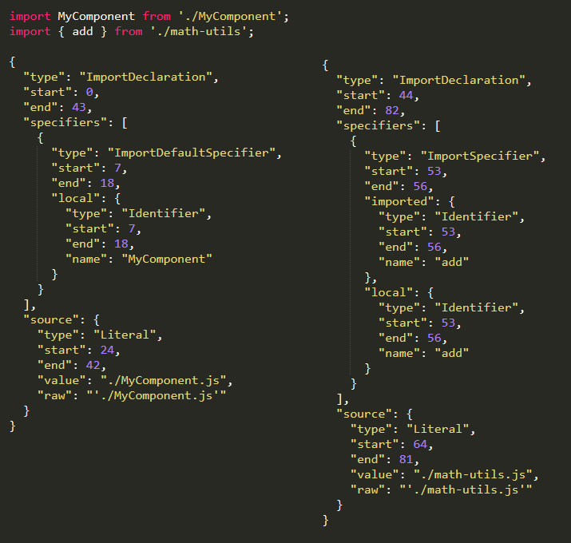
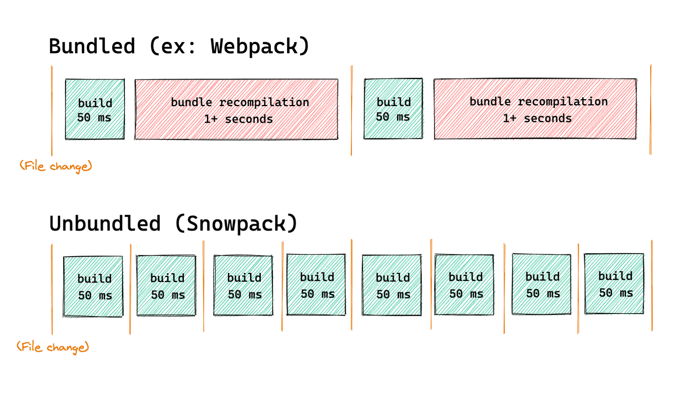
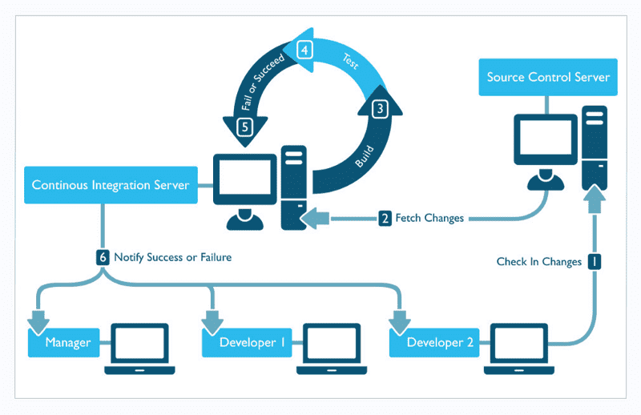

# 业务组件库打包、发布、添加CI/CD

## JavaScript模块发展史

### 模块(modules)是什么?
模块通常是指编程语言所提供的代码组织机制，利用次机制可将程序拆解为独立且同样的代码单元。所谓模块化主要是解决代码分割、作用域隔离、模块之间的依赖管理以及发布到生成环境时的自动大包与处理等多个方面。

### 模块化的优点
- 可维护性。因为模块时独立的，一个设计良好的模块会让外面的代码对自己的依赖越少越好，这样自己就可以独立去更新和改进。

- 命名空间。在js里面，如果一个变量在最顶级的函数之外声明，它就直接变成全局可用。因此，常常不小心出现命名冲突的情况。使用模块化来开发封装变量，可以避免武软全局环境。

- 重用代码。我们有时候会喜欢之前写过的项目种拷贝代码到新的项目，这没有问题，但是更好的办法是，通过模块引用的方式，来避免重复的代码库。

### ES6之前没有模块的年代
```js
	// 使用 backbone.js 的方法
  <script src="spec/support/jquery.js"></script>
  <script src="spec/support/underscore.js"></script>
  <script src="spec/support/backbone.js"></script>
  <script src="backbone.localStorage.js"></script>
  <script src="todos.js"></script></script>  

```

### 全局变量 + 命名空间(namespace)
```js
// IIFE 自执行函数，创建一个封闭的作用域，赋值给一个全局变量
var namesCollection = (function() {
    // private members
    var objects = [];
    
    // Public Method
    function addObject(object) {
        objects.push(object);
        printMessage(object);
    }
  
    // Private Method
    function printMessage(object) {
        console.log("Object successfully added:", object);
    }
    // public members, exposed with return statement
    return {
        addName: addObject,
    };
})();
namesCollection.addName('roy')
```

**缺点**
- 依赖全局变量，污染全局作用域，不安全
- 依赖约定命名空间来避免冲突，可靠性不高
- 需要手动管理依赖并控制执行顺序，容易出错
- 需要在最终上线前手动合并所有用到的模块

### Common.js
```js
const bar = require('./bar')
module.exports = function() {

}
```

- 没法在浏览器理直接运行

### AMD - (Asnychronous module definition)
- 采用异步方式加载模块
- 仅仅需要在全局环境定义require和define，不需要其他的全局变量
- 通过文件路径或模块自己声明的模块名定位模块
- 提供了打包工具自动分析依赖并合并
- 配合特定的AMD加载器使用，RequireJS
- 同时还诞生了很多类似的模块标准CMD

```js
define(function(require) {
	// 通过相对路径获取依赖模块
	const bar = require('./bar')
	// 模块产出
	return function () {
	
	}
})

```

### ES6 modules
```js
// 通过相对路径获取依赖模块
import bar from './bar'
// 模块产出
export default function () {

}

```

- 引入和暴露的方式更加多样
- 支持复杂的静态分析

## Bundler是什么？

### 诞生原因
使用import export这种同步加载的方式在大多数浏览器中无法使用。

### Bundler - 打包工具
将浏览器不支持的模块进行编译，转换，合并最后生成的代码可以在浏览器良好的运行的工具

### Webpack
- 对于web应用来说:一般采用单JavaScript文件入口
- https://webpack.js.org/

```js
npx webpack main.js
```
### Rollup

[地址](https://rollupjs.org/guide/en/)

```js
npx rollup main.js --file dist/bundle.js --format iife
```

## Webpack与Rollup对比

### Webpack 
大型SPA项目的模块化构建，也就是web应用。

- 通过各种Loader处理各种各样的静态资源
- 通过各种插件Plugins对整体文件进行一些处理
- Code splitting将公共模块进行提取
- 提供一个webpack-dev-server，进行本地开发
- 支出HMR模块热体换

### Rollup
Rollup设计之初就是面向ES module的，构建出结构扁平，性能出众的类库。

### ES module的规则
- import只能作为模块顶层的语句出现，不能出现在function里面或是if 里面
- ES import的模块名只能是字符串常量
- 不管import的语句出现的位置在哪里，在模块初始化的时候所有的import都必须已经导入完成。

### 使用工具静态分析的过程



- Tree shaking机制 - 摇树
- 目的就是es modules打包生成特定的JS模块文件，并减小它的体积

### Webpack与Rollup对比
通过以上的对比可以得出，构建App应用时，webpack比较合适，如果是类库(纯js项目),rollup更加合适。

#### webpack的优势
- 强大的生态插件
- 面向开发应用的特性支持HMR，按需加载，公共模块提取
- 简化Web开发的环节，图片自动转base64，资源的缓存(添加chunkid)

#### Rollup的优势
- 构建高性能的模块文件，这正式类库所需要的
- 编译出来的代码可读性好，内容更小，执行效率更高
- 配置比较简单


## 打包什么类型的文件
- Commonjs,es6 modules - 需要特殊的module bundler支持
- AMD已经有点过时了 - 需要使用特殊的Loader - require.js
- 浏览器中直接使用 - UMD(Universal Module Definition)
  - 通用的一种JavaScript格式
  - 兼容common.js，AMD，浏览器
  - https://github.com/umdjs/umd
  - Vue和React都提供了这样的格式
  - 不是一种推荐的格式，太大了。不支持tree shaking

```js
(function (root, factory) {
    if (typeof define === 'function' && define.amd) {
        // AMD. Register as an anonymous module.
        define(['b'], factory);
    } else if (typeof module === 'object' && module.exports) {
        // Node. Does not work with strict CommonJS, but
        // only CommonJS-like environments that support module.exports,
        // like Node.
        module.exports = factory(require('b'));
    } else {
        // Browser globals (root is window)
        root.returnExports = factory(root.b);
    }
}(typeof self !== 'undefined' ? self : this, function (b) {
    return {};
}));

```

### 结论
- 首要格式 - ES modules，并且提供支持typescropt的type文件
- 备选方案 - UMD


## Snowpack

### Bundler的问题
- 当资源越来越多的时候，打包速度越来越慢
- 大中型项目，启动时间可能达到好几分钟

### Snowpack
- https://www.snowpack.dev/
- 利用新版浏览器支持es module的特性
- 不会被打包
- 每个文件编译一次，永久呗缓存
- 当一个文件修改的时候，只需要重新build那一个文件



### 处理Node_modules中的模块
- 它扫描node_modules中的模块。找到使用的模块
- 将每个模块都分别转换成单个js文件
- 这些单个文件都是esm模块，可以被最新的浏览器直接使用

```js
node_modules/react/**/*     -> http://localhost:3000/web_modules/react.js
node_modules/react-dom/**/* -> http://localhost:3000/web_modules/react-dom.js
```

### 为生成环境Build代码

默认情况下，和开发环境生成的代码是几乎一致的。

提供了插件，生成bundle以后全浏览器兼容的代码。

## Vue3的插件系统
一段代码给vue应用实例添加全局功能。它的格式是一个object暴露出一个install()方法，或者一个function

它没有严格的限制，一般有一下几种功能

- 添加全局方法或者属性
- 添加全局资源:指令，过滤器等
- 通过全局混入来添加一些一些组件选项
- 通过config.globalProperties来添加app实例方法

```js
import { App } from 'vue'
import HelloWorld from './HelloWorld'
const plugins = {
  install:(app:App) => {
    //注册全局属性
    app.config.globalProperties.$echo = () => {
      console.log('a plugin')
    }
    //注册全局组件
    app.component('hello-world',HelloWorld);
    app.provide('test',{message:'from plugin'})
  }
}
export default plugins
```

```js
//main.ts 
import TextPlugin from './TextPlugin'
app.use(TextPlugin)

// App.vue setup里面
onMounted(() => {
  console.log(inject('test'))
  getCurrentInstance()?.appContext.config.globalProperties.$echo();
})

//输出
// {message:'from plugin'}
//a plugin

```

## 组件库入口文件的设计
所有组件一次性全部导入并且作为插件使用
```js
import LegoComponents from 'lego-components'
app.use(LegoComponents)

```

- 建立一个入口文件index.ts
- 将所有组件导入，作为一个数组，创建一个install函数，循环调用app.component
- 默认导出一个插件(这个install函数)

```js
import { App } from 'vue'
import LText from './components/LText'
import LImage from './components/LImage'
import LShape from './components/LShape'

const components = [
  LText,
  LImage,
  LShape
]

const install = (app: App) => {
  components.forEach(component => {
    app.component(component.name, component)
  })
}

export {
  LText,
  LImage,
  LShape,
  install
}
export default {
  install
}
```

单个组件导入并且作为插件使用
```js
import { LText } from 'lego-components'
app.use(LText)
// 或者
app.component(LText.name, LText)

```

- 每个组件新建一个文件夹，并且创建一个单独的index.ts文件
- 每个组件设计成一个插件(一个object拥有install方法)
- 在全局入口文件导出

```js
import { App } from 'vue'
import LText from './LText.vue'
LText.install = (app: App) => {
  app.component(LText.name, LText)
}

export default LText
```

## Rollup Typescript处理插件

[Typescript处理](https://github.com/ezolenko/rollup-plugin-typescript2)

[TSconfig文档地址](https://www.typescriptlang.org/zh/tsconfig)

[处理node_modules插件](https://www.npmjs.com/package/@rollup/plugin-node-resolve)

### npm依赖的分类

- dependencies
  - 运行项目业务逻辑需要依赖的第三方库
  - npm install '模块名'的时候都会呗解析，下载

- devDependencies
  - 开发模式工作流下依赖的第三方库
  - 单元测试，语法转换，lint工具，程序构建，本地开发 等等

- peerDependencies
  - 需要核心依赖库，不能脱离依赖库单独使用

```js
//rollup.config.js 
import vue from 'rollup-plugin-vue'
import css from 'rollup-plugin-css-only'
import typescript from 'rollup-plugin-typescript2'
import { nodeResolve } from '@rollup/plugin-node-resolve'
import { name } from '../package.json'
const file = type => `dist/${name}.${type}.js`
const overrides = {
  compilerOptions: { declaration: true },
  exclude: ["tests/**/*.ts", "tests/**/*.tsx"]
}
export { name, file }
export default {
  input: 'src/index.ts',
  output: {
    name,
    file: file('esm'),
    format: 'es'
  },
  plugins: [
    nodeResolve(),
    typescript({ tsconfigOverride: overrides }),
    vue(),
    css({ output: 'bundle.css' })
  ],
  //告诉rollup不要将此打包，而作为外部依赖
  external: ['vue', 'lodash-es']
}
```

## NPM简介以及package.json的信息更新

### NPM的主要功能
- 从npm服务器下载别人编写的第三方包到本地，比如vue
- 从npm服务器下载并安装别人编写的命令行程序到本地使用，比如vue-cli
- 允许用户将自己编写的包或命令行程序上传到npm服务器供别人使用

### 语义化 - semver
说明网址:https://semver.org/lang/zh-CN/

版本格式:主版本号.次版本号.修订号(1.0.0)，版本号递增规则如下:
- 主版本号:当你做了不兼容的API修改
- 次版本号:当你做了向下兼容的功能性新增
- 修订号:当你做了向下兼容的问题修正

#### npm files字段
- 默认忽略掉gitingore中的内容
- 直视npm publish的时候需要上传的内容
- package.json/README.md/CHANGLOG.md/LICENSE都会包含在其中

## CI/CD的概念
业务组件库的开发和发布是随着一系列任务进化的
- 本地commit钩子韩山虎完成commit验证
- 代码push到远端以后
- 跑特定的test(不仅仅是本机的unit test，也可能有时间很长的E2E test)
- test通过以后检查是否有新的tag，假如有就自动publish一个新的版本
- 甚至还有更多，自动部署文档站点等等

### CI(Continuous integration) - 持续继承
持续继承指的是，频繁的(一天多次)将代码集成到主干。一旦开发人员对应用所做的更改被合并，系统就会通过自动构建应用并运行不同级别的自动化测试(通常是单元测试和集成测试)来验证这些更改，确保这些更改没有对应用造成破坏



- 快速发现错误
- 防止分支大幅度偏离主干

持续继承的目的，就是让产品可以快速迭代，同时还能保持高质量

### CD(Continuous Delivery) - 持续交付
持续交付指的是，频繁的将软件的新版本，交付给质量团队或者用户，以供评审

### CD(Continuous Deployment) - 持续部署
持续部署是持续交付的下一步，指的是代码通过评审以后，自动部署到生成环境。

### 两大服务
- [Github Actions](https://github.com/features/actions)
- [Travis](https://www.travis-ci.com/)

### Travis使用
配置需要的文档列表
- [nodejs yml配置文件设置详情](https://docs.travis-ci.com/user/languages/javascript-with-nodejs/)
- [travis deplyment支持的providers列表](https://docs.travis-ci.com/user/deployment/)
- [travis自动发布npm文档](https://docs.travis-ci.com/user/deployment/npm/)
- [travis命令行工具生成加密串](https://docs.travis-ci.com/user/encryption-keys/#usage)

```js
travis encrypt --pro 你要加密的内容 --add deploy.api_key 
// 后面为你要加密的字段名称

```


