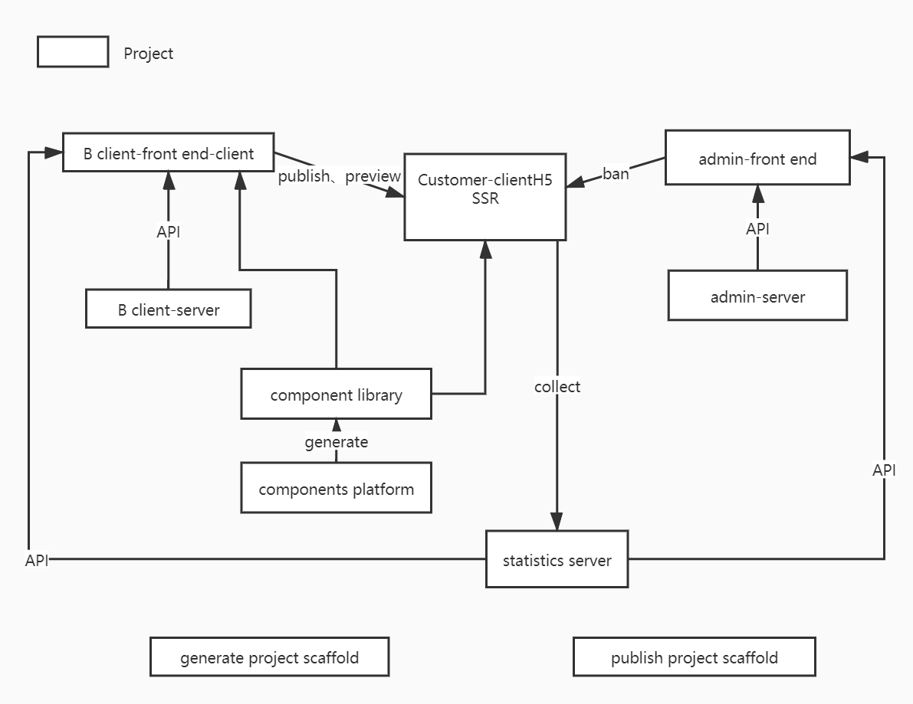

# 需求分析

|用户类型|功能|
|-------|---|
|图片创作者|注册，登陆，使用模板，保存，保存为模板，作品增删改，作品统计|
|管理员|用户增删改，作品增删改，作品统计，用户统计，流量统计，设置热门作品|
|运维人员|作品封禁|

# 范围

整体设计，架构设计

# 模块设计

|项目范围|项目|
|-------|---|
|B端|前端、后端|
|C端|SSR|
|管理端|前端、后端|
|开发|组件库、组件生成平台、项目生成脚手架、项目发布脚手架|



# 数据结构

## 1.作品vuex store 数据结构

```json
{
  "currentLayerIndex": 0,
  "layers": [
    {
      "type": "text",
      "value": "123",
      "width": 12,
      "height": 44,
      "position": {
        "x": 1,
        "y": 1
      }
    }
  ]
}
```

## 2.数据流转

# 扩展性保证

编辑器组件类型的扩展  
编辑器功能的扩展

# 开发提效

脚手架  
组件平台

# 运维保障

线上服务和运维服务  
安全  
监控和报警  
服务扩展性：流量大
