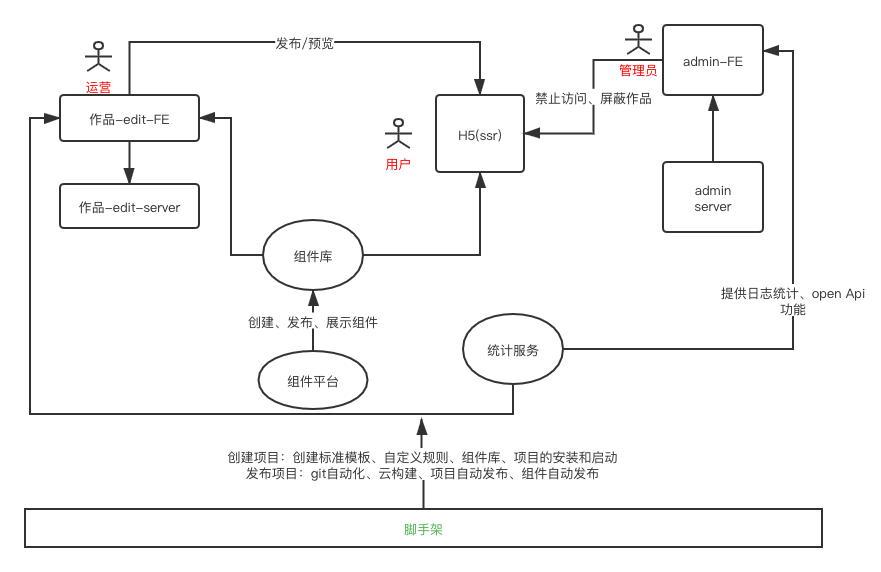
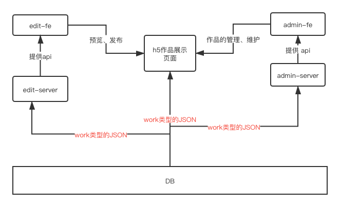

## 整体架构设计 V1.0

## 需求
https://www.yuque.com/books/share/af79538c-09eb-4ddd-bfb7-599816c233bf/whhax9

说明：批量生成定制化的h5页面，并可供用户分享和浏览

## 范围
整体设计、架构设计、没有细节

## 模块设计

#### 1 模块的拆分和关系图、结果
- 模块划分
    - 编辑平台前端
    - 编辑平台server
    - h5页面（因为是在手机端显示，考虑ssr，响应速度快）
    - 管理平台前端
    - 管理平台后端
    - 统计服务
    - 组件库
- 模块间的关系图
    

    
    
#### 2 模块的关键功能，职责
- 编辑平台:通过拖拽、选择生成h5作品、查看作品相关的统计
- 编辑平台server:用于给编辑平台前端提供api
- h5页面：展示作品、分享作品、关于作品的统计
- 管理平台前端：对作品进行维护和管理
- 管理平台server: 为管理平台前端提供api
- 业务组件库：考虑到编辑平台和h5端都需要公用组件，所以封装为组件库，便于复用，为开发提效
- 组件平台：创建、发布和展示组件
- 统计服务：收集统计日志、为接入统计服务的平台提供open api

#### 3 特殊模块说明
- 同时用于组件库和h5展示，所以独立出一个组件平台
- 计服务由于第三方要么是功能不齐全，要么是性价比很低，因此考虑自研一个统计服务。

 

#### 4 作品数据结构
- vuex store的结构
```javascript
{
        work: {
            title: '作品标题',
            setting: {}, // 配置项 扩展性保证
            props: {}, // 页面设置 扩展性保证
            components: [
            {
                id: '1',
                name: '文本1',
                tag: 'text',
                attrs: {
                    fontSize: '20px'
                },
                children: ['文本1']
            },
            {
                id: '2',
                name: '图片1',
                tag: 'image',
                attrs: {
                    src: 'xxx.png',
                    width: '120px'
                },
                children: null
            }
        ]
    }
}
```
- 数据流转关系图


    
#### 扩展性保证
- 扩展组件库、扩展数据结构层面
- 扩展编辑器的功能
- 组件隐藏和锁定 （vnode）
- 扩展页面的配置

#### 开发提效
- 脚手架
- 组件开放平台：减少编写重复代码，对业务组件进行抽象，积累业务组件


#### 运维服务
- 线上服务和运维服务
- 安全
- 监控和报警
- 服务扩展性：基于云服务，可以随时扩展机器配置


