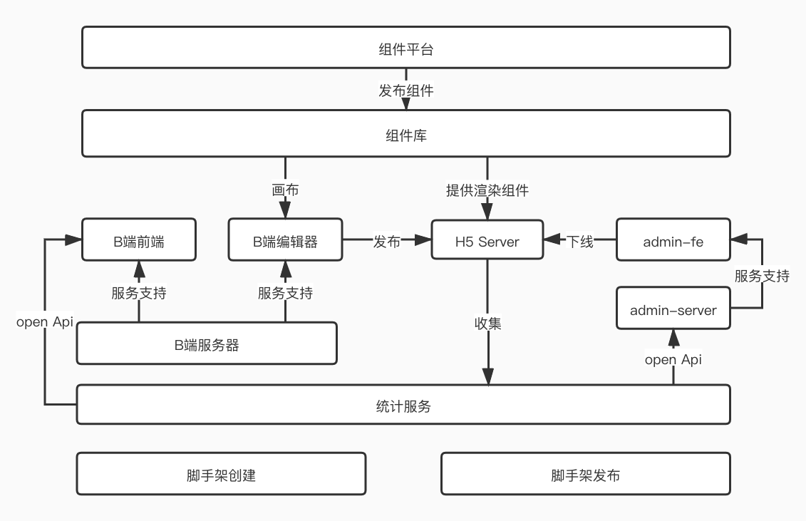

#### 学习主要内容
1. 学习以架构师的思维分析需求
2. 写技术方案文档
3. 核心数据结构设计
4. 由浅入深的需求分析

#### 重点牢记
- 技术永远都是为业务服务的，技术是实现业务增长的工具
- 需求即业务，无业务不架构
- 架构思维，闭环思维，需求闭环很重要！

#### 架构设计


#### 核心数据结构
```
{
    // 作品
    work: {
        title: '作品标题',
        setting: { /* 一些可能的配置项，用不到就先预留 */ },
        props: { /* 页面 body 的一些设置，如背景色 */ },
        components: [
            // components 要用数组，有序结构
            // 单个 node 要符合常见的 vnode 格式
            {
                id: 'xxx', // 每个组件都有 id ，不重复
                name: '文本1',
                tag: 'text',
                attrs: { fontSize: '20px' },
                children: [
                    '文本1' // 文本内容，有时候放在 children ，有时候放在 attrs 或者 props ，没有标准，看实际情况来确定
                ]
            },
            {
                id: 'yyy',
                name: '图片1',
                tag: 'image',
                attrs: { src: 'xxx.png', width: '100px' },
                children: null
            }
        ]
    },
    // 画布当前选中的组件
    activeComponentId: 'xxx'
}
```