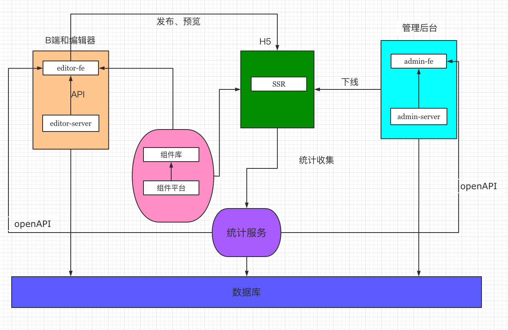

# 慕课乐高架构方案设计文档

## 需求（背景）

[背景链接](https://www/yuque.com/imooc-lego/zlz87z)

## 范围

三种角色对应三个方面（平台）：普通用户使用的 H5（前台）、企业或者说 H5 作者们使用的编辑器（中台）、平台管理员使用的管理系统（后台）。  

| 平台      |  使用者     | 开发方式 | 用途 |
| :-----:   | :------:   |:------     |:------ |
| H5(前台)   | 普通用户    | 前后端分离(editor-fe + editor-server) |对作品进行查看、分享 |
| 编辑器(中台) | 作品创作者 | SSR|可以自己创建或者根据模板生成作品，对作品进行创建、分布、管理 |
| 管理系统(后台) | 管理员   | 前后端分离(admin-fe + admin-server) |可以对作品进行管理，包括用户管理、模板管理、模板使用统计、作品上下线、作品审核等 |

## 模块设计

如下图所示


## 核心数据结构

### 数据结构思路

-   每个组件尽量符合 vnode 规范
-   用数组来组织数据，有序
-   尽量使用引用关系，不要冗余

### 数据结构示例

```javascript
{
        work: {
            title: '作品标题',
            setting: {}, // 一些可能的配置项 扩展性保证
            props: {}, // 页面的一些设置 扩展性保证
            components: [
            {
                id: '1',
                name: '文本1',
                tag: 'text',
                attrs: {
                    fontSize: '20px'
                },
                children: ['文本1']
            },
            {
                id: '2',
                name: '图片1',
                tag: 'image',
                attrs: {
                    src: 'xxx.png',
                    width: '120px'
                },
                children: null
            }
        ]
    }
}
```

### 数据关系流转


**一个核心： B端、C端和管理后台都共用一个数据库。** 

- 创建作品：初始化一个JSON数据
- 发布作品：给后端发请求，对JSON数据修改一个标记
- 保存作品：给后端发请求，保存JSON数据
- C端浏览作品： 获取JSON数据，使用SSR渲染页面
- 屏蔽作品： 给后端发请求，修改一个标记，C端来判断是否显示

## 扩展性保证

-   扩展组件（丰富组件功能，比如加入一些动画组件）
-   扩展编辑器功能，如锁定、隐藏
-   扩展页面信息，如增加多语言
-   扩展其他功能，如大数据计算

## 研发提效

-   脚手架：创建、发布
-   组件平台： 减少编写重复代码的时间，对业务组件进行抽象，积累业务组件

## 运维保障

-   线上服务和运维服务
-   安全
-   监控和报警
-   服务扩展性：基于云服务，可以随时扩展机器配置
