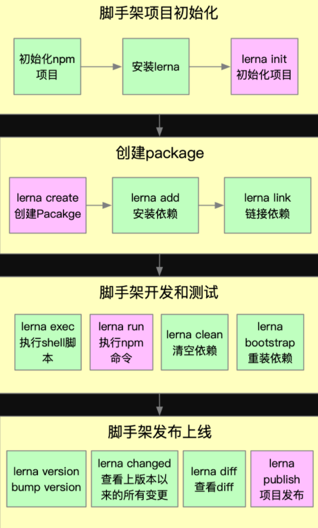

<!--
 * @LastEditors: qf
 * @Date: 2021-01-11 16:26:47
 * @Description: 
-->

# Lerna

## 简介

Lerna是一个优化基于git+npm的多package项目的项目管理工具

- 多package管理：减少重复操作
- 版本一致性：操作标准化

> 架构优化的产物——项目复杂度提升后，架构优化的主要 目标是**效能**为核心的。

## lerna开发脚手架流程

练级[https://github.com/lerna/lerna]
