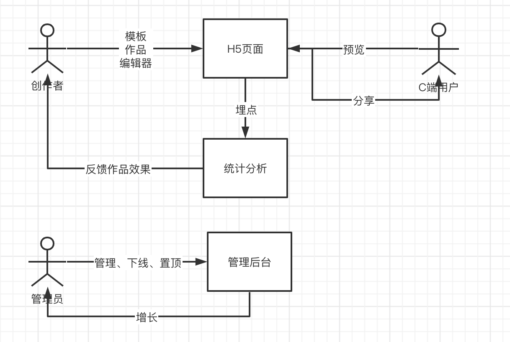
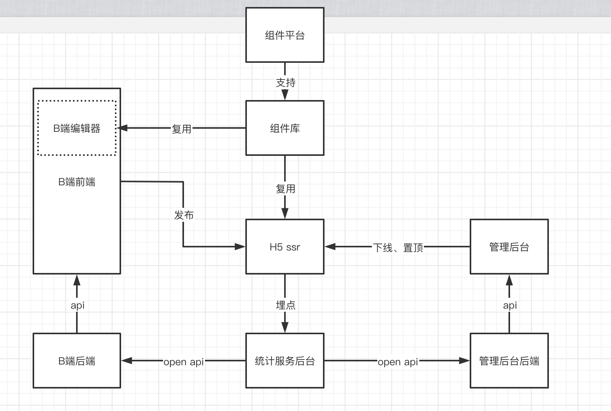
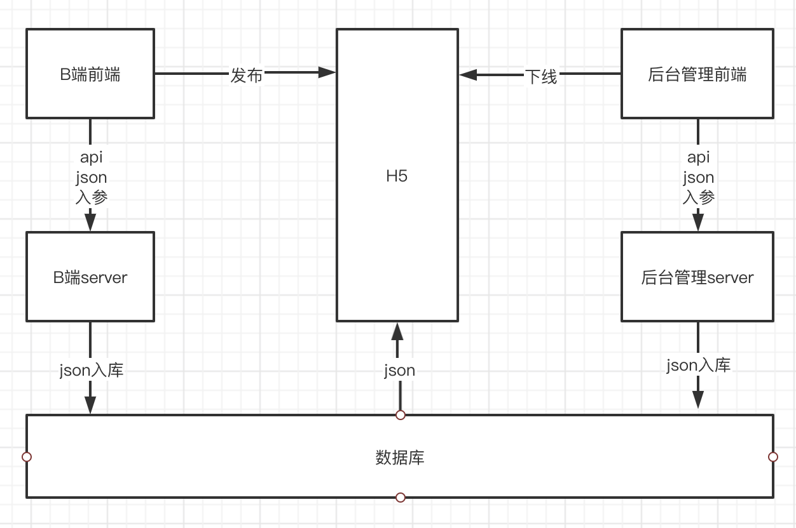

## 整体架构设计

### 需求

- 自动生成海报系统， 创作者可通过浏览器使用平台生成模板，并发布作品；
- 普通C端用户预览、使用、分享作品，通过H5埋点分析作品的使用情况，用可视化界面呈现埋点效果，给创作者反馈作品效果；
- 管理员可在后台管理系统管理作品，审核、下线、置顶优秀作品等操作。

<br />

<a name="NzRL1"></a>
### 模块设计

<br />

<a name="gfPY3"></a>
### 数据结构
组件使用vnode数据格式， 业界规范， 节约沟通、阅读成本；<br />使用字段activeId 标记当前选中组件， 共享单一数据源；
```
{
	work: {
  	id: '',
    title: '', // 
    config: '', // 基础配置项
    props: '', // 页面整体配置 body
    components: [
    	{
      	id: '12u8d',
        name: '图片',
        tag: 'image', // 组件类型
        attrs: {}, // 标签属性
        children: []
      }
    ],
    activeId: '12u8d' // 当前激活的组件
  }
}
```

<br />

<a name="iRFXm"></a>
#### 数据流转关系图

- 创作作品： 基于基础json模板创建
- 保存作品： 修改json
- 发布作品： 修改json一个标识属性
- 预览： 或者json数据  ssr渲染
- 下线： 修改json一个标识属性

<br />

<a name="XJgF8"></a>
### 扩展、维护
设计考虑扩展性<br />不一定要自己都把所以都想通， 自己尽可能去思考，最后设计评审头脑风暴、集思广益，讨论补充<br />

<a name="NlFqf"></a>
### 开发提效
组件复用<br />第三方库<br />脚手架等
<a name="5z8WB"></a>
### 运维保障
线上服务和运维服务<br />安全性<br />监控和报警<br />服务扩展性：流量大<br />
