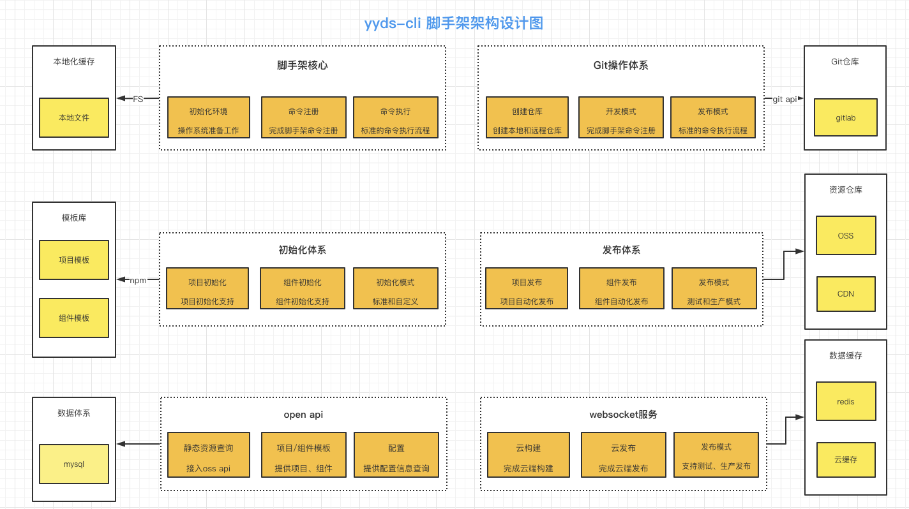

### 脚手架 架构设计图
<br />


### require加载规则
.js :  module.exports / exports
.json:   会以JSON.parse 转化为对象
.其他： 默认以.js解析   如果.txt文件内容是js 那么也可以正常解析


### utils/log模块，增强npmlog日志功能：
```javascript
npmlog.level = process.env.LOG_LEVEL ? process.env.LOG_LEVEL : 'info' //判断debug模式
npmlog.addLevel('success', 2000, { fg: 'green', bold: true });  //添加日志自定义指令
npmlog.heading = 'yyds-cli'; // 增加前缀
npmlog.headingStyle = { fg: 'yellow', bg: 'white' } // 修改前缀样式
```


### 脚手架核心模块： 初始化环境检测


检测node版本
使用semver进行版本比对，  semver可以进行兼容处理
```javascript
function checkNodeVersion() {
   const currentVersion = process.version;
   const lowNodeVersion = constant.LOW_NODE_VERSION;
   if (semver.lt(currentVersion, lowNodeVersion)) {
      throw new Error(colors.red(`Node版本错误， 不能低于${lowNodeVersion}`))
   }
}
```
用户权限检测
使用root-check进行，降级处理，  防止有的是用root用户(sudo)的权限过高，没办法对文件等进行操作
```javascript

/**
 * 检查用户目录是否正确
 */
const userHome = require('user-home');

function checkUserHome() {
   if (!userHome || !pathExists(userHome)) {
      throw new Error(colors.red('用户主目录不正确！'))
   }
}
```
入参监测，兼容debug模式
```javascript
/**
 * minimist(process.argv.slice(2)
 * 输入yyds-cli --debug
 * minimist(process.argv.slice(2) 输出为：{ _: [], debug: true }
 */
function checkInputArgs() {
   const minimist = require('minimist'); // 处理入参
   if (minimist(process.argv.slice(2)).debug) {
      process.env.LOG_LEVEL = 'verbose';
   } else {
      process.env.LOG_LEVEL = 'info';
   }
   
   log.level = process.env.LOG_LEVEL
}
```
检查用户环境变量， 当不存在时给予默认值


dotenv.config 把环境变量文件中的属性 加载到 node的环境变量中 process.env
```javascript
/**
 * 检查/设置 环境变量
 */
function checkEnv() {
   const dotenv = require('dotenv')
   const envPath = path.resolve(userHome, '.env');
   if (pathExists(envPath)) {
      dotenv.config({
         path: envPath
      })
   }

   setEnvDefaultConfig();
   
   log.verbose('环境参数', process.env.CLI_HOME_PATH);
}

function setEnvDefaultConfig() {
   const cliConfig = {
      home: userHome
   }

   if (process.env.CLI_HOME) {
      cliConfig['cli_home'] = path.join(userHome, process.env.CLI_HOME);
   } else {
      cliConfig['cli_home'] = path.join(userHome, constant.CONFIG_CLI_HOME);
   }

   process.env.CLI_HOME_PATH = cliConfig.cli_home;
}
```
检查本地脚手架版本， npm上有新版本提示更新， 并显示对应的版本号
```javascript
/**
 * 检查npm版本
 */
async function checkGlobalUpdate() {
   // 获取当前版本信息
   const currentNpmVersion = pkg.version;
   const npmName = pkg.name;

   // 获取线上版本信息
   const { getLastVerion } = require('@yyds-cli/get-npm-info');
   const lastVersion = await getLastVerion(npmName, currentNpmVersion);  //get-npm-info包内有详细代码

   // 比对版本信息
   if (lastVersion && semver.lt(currentNpmVersion, lastVersion)) {
      log.warn(colors.yellow(`请升级到最新版本, 当前版本为: ${currentNpmVersion}, 最新版本为: ${lastVersion}, 更新命令: npm install -g ${npmName}`));
   }
}
```


