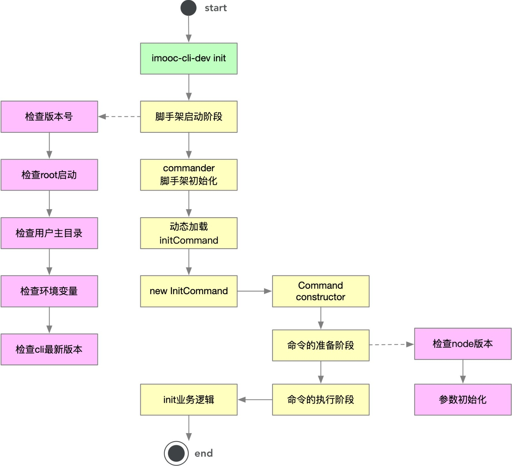
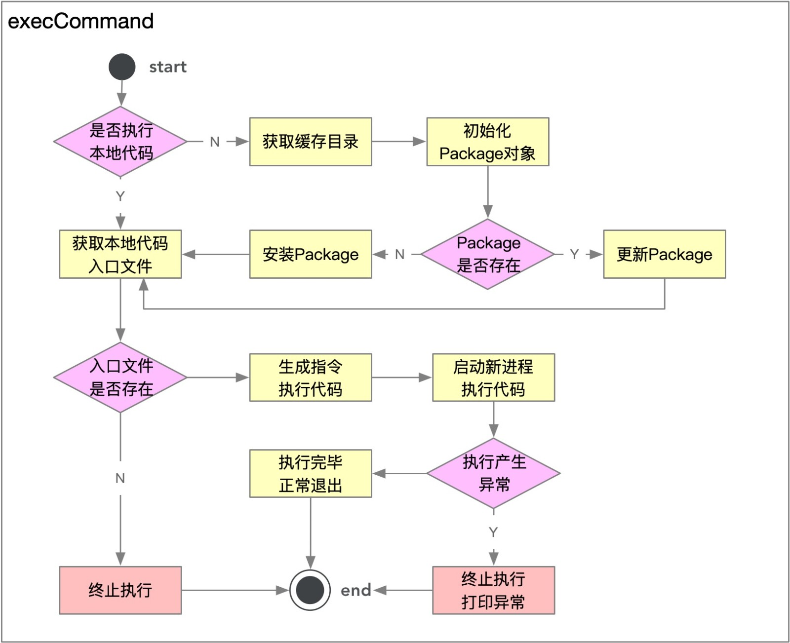

**核心：基于 Commander 完成脚手架命令注册和命令执行过程开发**
**
#### 脚手架优化架构图：
<br />


#### Command基类核心代码：
```javascript
class Command {
  constructor(argv) {
    console.log("argv:", argv)
    // 校验入参
    this.validateArgv(argv)

    this._argv = argv
    this.runner = new Promise((resolve, reject) => {
      let chain = Promise.resolve()
      chain = chain.then(() => this.checkNodeVersion()) // 检查node版本
      chain = chain.then(() => this.initArgv()) // 初始化参数， 把cmd分离
      chain = chain.then(() => this.init()) // 初始化
      chain = chain.then(() => this.exec()) // 执行
      chain.catch(err => {
        log.error(err.message)
      })
    })
  }
  
  ...
}
```


#### exec类核心代码：

- 主要是处理包的加载与更新
- 获取执行文件地址， 加载并使用node 多进程child_process执行
- 兼容不同系统(win, linux)
```javascript
// 缓存目录位于用户主目录下的 .yyds-cli，如果没有生成该目录时，我们可以手动创建，或者通过如下代码生成：
const userHome = require('user-home');
const fse = require('fs-extra');
const path = require('path');

const cachePath = path.resolve(userHome, '.imooc-cli'); // 生成缓存目录路径

fse.mkdirpSync(cachePath); // 生成缓存目录

```


#### execCommand 设计流程图：





#### execCommand
```javascript
// 需要安装的包（执行）
const SETTING = {
  init: '@yyds-cli/init'
}

// 缓存目录(.yyds-cli/CACHE_DIR)
const CACHE_DIR = 'dependencies'

async function exec() {
  let targetPath = process.env.CLI_TARGET_PATH;
  let storePath = ''
  let pkg;
  const homePath = process.env.CLI_HOME_PATH;

  const cmdObj = arguments[arguments.length - 1];
  const cmdName = cmdObj.name();
  const packageName = SETTING[cmdName]
  const packageVersion = 'latest'

  /* 安装更新命令包 start */
  if (!targetPath) {
    // 未指定targetPath -- 线上
    targetPath = path.resolve(homePath, CACHE_DIR)
    storePath = path.resolve(targetPath, 'node_modules')

    pkg = new Package({
      targetPath,
      storePath,
      packageName,
      packageVersion
    });

    if (await pkg.exists()) {
      // 更新package
      await pkg.update()
    } else {
      // 安装package
      await pkg.install()
    }
  } else {
    // 用户指定了targetPath -- 本地
    pkg = new Package({
      targetPath,
      packageName,
      packageVersion
    });
  }
  /* 安装更新命令包 end */

  // 执行动态加载命令
  const rootFile = pkg.getRootFilePath()
  if (rootFile) {
    try {
      // require(rootFile)(Array.from(arguments))
      const argv = Array.from(arguments)

      /** start: argv中的cmd很大， 有许多冗余字段， 需要去除 */
      const newCmdArgv = Object.create(null) // 纯净的对象， 没有原型链
      const cmd = argv[argv.length - 1]
      Object.keys(cmd).forEach(key => {
        if (cmd.hasOwnProperty(key) && !key.startsWith('_') && key !== 'parent') {
          newCmdArgv[key] = cmd[key]
        }
      })
      argv[argv.length - 1] = newCmdArgv
      /** end: argv中的cmd很大， 有许多冗余字段， 需要去除 */

      const code = `require('${rootFile}')(${JSON.stringify(argv)})`
      // stdio: 'inherit' -> 将所有的子进程输出流 直接输出到 主进程中
      const child = spawn('node', ['-e', code], {
        cwd: process.cwd(),
        stdio: 'inherit'
      })

      child.on('error', e => {
        log.error(e.message)
        process.exit(1)
      })

      child.on('exit', e => {
        console.log('命令正确执行完毕', e)
        process.exit(e)
      })
    } catch (err) {
      log.error(err.message)
    }
  }
}
```


**try catch 异常-异步的捕获不到，  异步任务 异常需要单独捕获**


#### 写代码中遇到的问题汇总：
```javascript
// 初始化尝试结构 结果报错SyntaxError: Rest element must be last element
// ...rest只能出现在最后
initArgv() {
  	// 错误
    [...this._argv, this._cmd] = this._argv
    console.log('argv', this._argv)
    console.log('_cmd', this._cmd)
  
  	// 正确
  	// slice(start, end) 包括start 不包括end
  	this._cmd = this._argv[this._argv.length - 1]
    this._argv = this._argv.slice(0, this._argv.length - 1)
  }
// 测试代码
const obj = {	
  a: 10,	
  b: 20,	
  c: 30	
};	
const {...rest, a} = obj;    // → SyntaxError: Rest element must be last element
```


#### node子进程， child_process理解
**
exec、execFile、spawn、fork 都用来创建子进程
exec、execFile 底层都是使用spawn实现
spawn 可以 逐步输出信息， exec、execFile类似同步，最终输出信息
fork是增强版本的spawn， fork可以与父进程通信??， 使用send 和 on api


`process.cwd()` 方法返回 Node.js 进程的当前工作目录。

child_process  stdio: 'inherit'，  这个参数会把子进程同步给父进程， 父进程在控制台输出的效果为 会出现执行进度条， 否则不出现

课程中的这个场景`require(rootFile)(Array.from(arguments))`，主进程一直在等待子进程回调，所以处于等待状态，我们项目用多进程提升性能是不明显的，多进程最典型的一个应用场景就是下载，当需要下载大文件时，可以同时启动多个进程进行下载，下载完毕后进行文件合并，这个场景比较典型。

node.js 是单线程的，如果某一个操作需要消耗大量资源和时间，会导致程序整体性能下降。我们可以创建子进程，让子进程去跑那些费时费力的操作，而主线程该干嘛干嘛。子进程间可以共享内存，通过互相通信来完成数据的交换。
