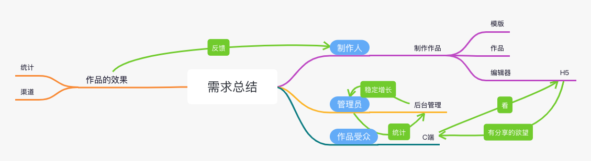
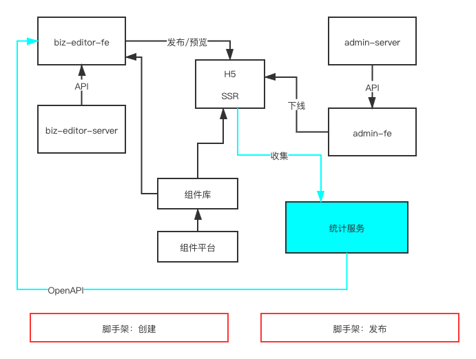
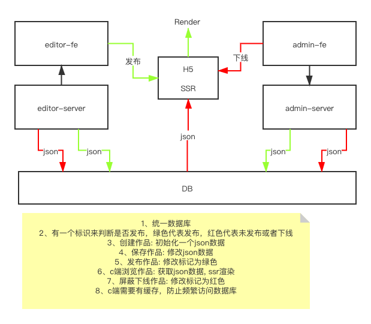

# 技术方案文档

## 需求

项目需求url,比如禅道链接

- #### 分析需求

- #### 浅层需求

  1. 登录
     - 注册功能
     - 短信验证码登录
     - 用户信息（昵称，头像等等的修改）
  2. 作品
     - 新建
     - 保存草稿
     - 发布
     - 获取作品详情
     - 获取作品列表

  3. 模版
     - 模版列表
     - 使用模版创建

- #### 深度需求

  1. 作品的管理
     - 删除和恢复
     - 转赠
     - 复制
  2. 作品统计
     - pv/uv
     - 自定义事件统计，分渠道统计
  3. 作品发布
     - url不能变
     - 支持多渠道
  4. H5
     - 分享
  5. 后台管理
     - 数据统计
     - 作品管理，能快速下线作品，防止有违规内容
     - 用户管理，能快速冻结用户，防止有违规用户
     - 模版管理，能控制哪些模块展示、哪些不展示

- #### 需求总结

  

## 范围

- #### 需要哪些项目

  - B端和编辑器，做前后分离
    - biz-editor-fe
    - biz-editor-server
  - H5
    - H5-server
  - 管理后台
    - admin-fe
    - admin-server

- #### 独立的业务组件库

## 模块设计



- 组件库，独立第三方，同时用于编辑器和H5，实现所见即所得，UI一致性
- 统计服务自研，因为第三方服务（如百度）只能统计基本的pv/uv，自定义统计，参数级别的统计要么没有要么收费，综合考虑还是自研比较好，还能加入日志统计，日志分析

## 作品的数据结构

- #### vuex store的结构

  ```json
  {
    work: {
      title: '作品标题'，
      setting: { /* 一些可能的配置项，用不到就先预留 */ },
    	props: { /* 页面body的设置，如背景色，全局字体大小，颜色 */ },
    	components: [
        // 用数组，有序结构
        
        // 单个 node 要符合常见的 vnode格式
        {
          id: 'xxx', //唯一组件id
          name: '文本1',
          tag: 'text',
          attrs: { fontSize: '20px' },
          children: [
            '文本1' //
          ]
        },
        {
          id: 'yyy',
          name: '图片1',
          tag: 'image',
          attrs: { src: 'xxx.png', width: '100px' },
          children: null
        }
      ]
    },
  
  	// 画布当前选中的组件
  	activeComponentId: 'xxx'
  }
  ```

- #### vuex getter

  ```json
  {
    //图层
    layers() => {
    		store.work.components.map(c => {
    				return {
    						id: c.id,
    						name: c.name
  					}
  			})
  	}
  }
  ```

  

- #### 数据流转关系图

  

## 扩展性保证

- 扩展组件，数据结构层面


- 扩展编辑器的功能，例如：组件隐藏、锁定


- 扩展页面的配置


- 能自动生成B端管理后台页面，比如表单组件，表格组件，分页组件，搜索组件等等

- 页面自适应不同平台，可以改变页面的宽高，能编辑保存发布到手机，平板，PC等等
- 有更多的交互，例如弹窗，tooltip，图表等等，随着业务需求的增加，持续的集成
- 可以考虑定期评选精选模版，给予一定奖励，首页置顶展示
- 加入付费功能，用户可以售卖自己的模版
- seo

## 研发提效

- 脚手架：创建、发布
- 组件平台： 减少编写重复代码的时间，对业务组件进行抽象，积累业务组件

## 运维保障

- 线上服务和运维服务
- 安全
- 监控和报警
- 服务扩展性：基于云服务，可以随时扩展机器配置

