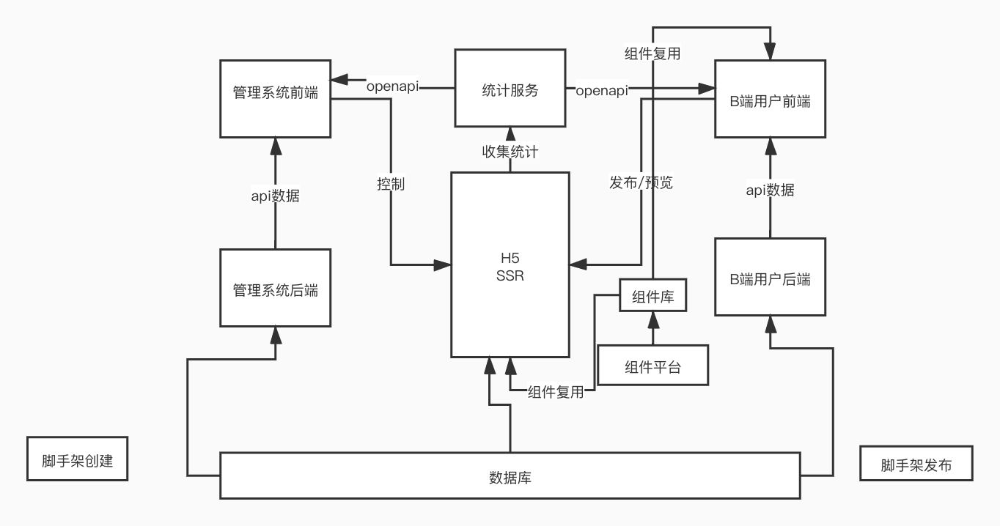
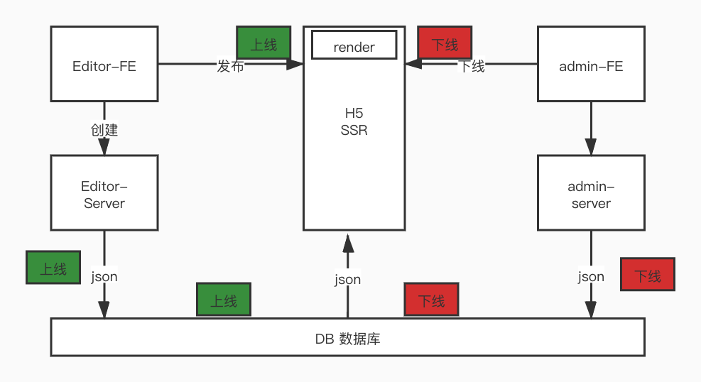

# 慕课乐高架构法案设计文档

## 需求背景

需求总结：B端用户根据自己的需求，生成对应的海报，并分享出去，C端用户看到分享的海报内容，可分享，统计数据反馈给B端，后台用户可管理B端发布的海报，和统计数据

## 范围

#### 普通用户使用C端

浏览、分享、数据收集并反馈

#### 海报制作者使用B端

海报制作、编辑、分享

#### 平台管理员使用后端

管理平台、海报管理

# 模块设计

#### 模块拆分

- C端用户浏览海报
- C端用户分享海报
- 收集C端用户埋点统计数据
- B端用户发布/编辑海报
- B端用户浏览海报
- B端用户分享海报
- B端用接受C端用户统计数据
- 后端用户管理B端发布作品
- 后端用户接受C端用户统计数据

#### 关系图



# 核心数据结构

### 数据结构思路

- 尽量使用vnode结构（扩展性好）
- 最外层结构是对象（方便扩展）
- 有序数据使用数组（方便排序）
- 尽量使用引用关系，不要冗余

#### 数据结构示例

``` javascript
{
  work:{
    	title:'作品标题',
    	setting:{},// 扩展配置项目
      styles:{},// 页面总体样式配置
      componets:[
        {
          id: '1',
          name: '文本1',
          tag: 'text',
          attrs: {
          	fontSize: '20px'
          },
          children: ['文本1']
        },
        {
          id: '2',
          name: '文本1',
          tag: 'text',
          attrs: {
          	fontSize: '20px'
          },
          children: ['文本1']
        }
      ],
      currentComponentId:1//当前选中的组件
  }
}
```

#### 数据关系图



## 扩展性保证

- 扩展组件
- 扩展编辑器功能，如锁定、隐藏
- 扩展页面信息，如增加多语言
- 扩展其他功能，如大数据计算

## 开发提效

- 脚手架：创建、发布
- 组件平台： 减少编写重复代码的时间，对业务组件进行抽象，积累业务组件
- 晨会总结
- 代码review

## 运维保障

- 线上服务和运维服务
- 安全
- 监控和报警
- 服务扩展性：基于云服务，可以随时扩展机器配置


