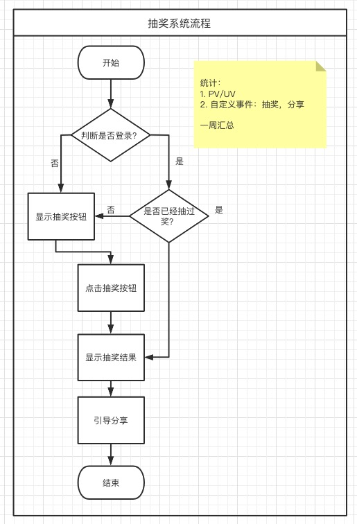
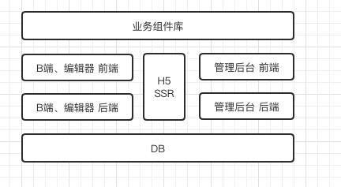

# 需求和架构设计

## 标题

需求分析和整体架构设计

## 主要内容

- 学习如何以<架构师思维>分析需求
- 由浅入深的需求分析
- 架构设计 - 多项目的关系
- 核心数据结构设计
- 写《技术方案设计》文档

## 关键词

- 流程图 - 分析需求的工具
- 全局思维、整体思维、闭环思维 - 架构师思维来分析需求
- 业务组件库 - 独立拆分出来，复用
- 自定义事件统计 - 业务的重要性，如何实现

## 学习方法

- 要有耐心，不要一心想着写代码，觉得需求和设计不重要
- 抛开你固有的程序员思维，开始准备接受架构师思维
- 要坚信：*技术永远都是为业务服务的，技术是实现业务增长的工具*

## 注意事项

- 不要关注细节，要看整体，看范围
- 设计是判断可行性，不确定的就调研以下（这需要大量的工作经验积累，技术能里）
- *设计要考虑复杂度，越简单越好，不要过度设计，不要为了设计而设计*

## 需求设计

> 脱离业务的架构就是耍流氓。 架构师必须要深入理解需求、参与需求、看透需求背后的业务本质。



### 浅层需求

**需求指导设计，设计指导开发**

#### 表面需求：

- 登录（手机号+短信验证码登录）
- 创建一个作品、编辑、发布
- 访问作品 H5 页面

- 用户信息
  - 登录
  - 注册
  - 获取/编辑用户信息
- 作品
  - 创建
  - 保存
  - 发布
  - 获取作品列表
  - 获取作品信息
- 模板
  - 模板列表
  - 使用模板创建

#### 深度需求：

##### 作品管理

- 删除和恢复
- 转增（例如，员工离职交接工作）
- 复制

##### 作品统计

*需求闭环* - 有输入有输出，创建发布了作品，需要看到统计结果

- 统计
- 分渠道统计，渠道对于运营人员非常重要

##### 作品发布

- url 不能变
- 支持多渠道

##### H5

- 分享 —— *对业务增长负责*

##### 后台管理

全局把控，让一切尽在掌握之中。

- 数据统计
- 作品管理，能快速下线作品，防止有违规内容
- 用户管理，能快速冻结用户，防止有违规用户
- 模板管理，能控制哪些模块展示、哪些不展示

##### 小结

- 作品管理
- 统计
- 发布
- H5
- 后台管理

制作人：
输入： 制作作品：模版、作品、编辑器：H5
输出：作品的效果：统计、渠道 

作品受众：
输入：查阅 H5
输出：分享的欲望

管理员：
输入：管理：后台系统
输出：系统的稳定和增长


## 架构设计

> 任务看似复杂的设计，都是让整个系统变的更简单

熟悉了需求之后，就是要考虑如何实现。

### 主要内容

- 需要哪些项目，各项目之间的关系
- 独立的业务组件库
- 为何要自研“自定义事件统计”服务
- 作品的数据结构设计
- 写《技术方案设计》文案

### 分析需求，确定需要创建的项目

先不看细节，看整体，确定项目的范围。（确定范围是做任何事情的第一步）

#### 需要哪些项目

B端和编辑器，做前后端分离
- biz-editor-fe
- biz-editor-server

H5 适合做SSR，因为要考虑性能
- H5-server

管理后台，做前端分析
- admin-fe
- admin-server

【注意】SSR是否使用需要分场景，toB的不适合用，toC适合用。架构设计要考虑成本，要用简单的方案，不要为了设计而设计。

#### 独立的业务组件库

为了让 B端编辑器 和 H5 上的效果一致，有必要独立出一个业务组件库，让组件和Render都能一致。



### 自研统计服务

#### 为何自研

> PV/UV 是针对页面级别的统计，但是不能很好的满足项目中具体的详细的分析

- 支持自定义事件统计
- 支持Open API —— 重要

选择自研一个统计服务：

- 日志收集
- 日志分析
- OpenAPI


### 整体架构


### 数据结构设计

项目如何使用 vue + vuex 来实现？

- 在点“保存”的按钮的时候，往服务器传递的**数据结构**是什么样子的？
- 如何保证画布的属性面板是同步更新的？
- 如果再扩展一个“图层”面板，数据结构该如何设计？

回答：

- node结构，不是规范的vnode形式
- 组件使用了对象，而不是数组，数据就无法排序了
- 在vuex存储，但是问题是如何用vuex标示当前选中的组件
- 图层，应该是一个computed计算出来的索引，而不是一个单独的数据【保证单一数据源】

### 正确的思路

vuex store

```js
{
  // 作品
  work: {
    title: '作品标题',
    description: '作品的描述',
    setting: { /* 一些可能的配置项， 用不到就先预留 */ },
    props: { /* 页面 body 的一些配置，如背景色 */ },
    components: [
      // compnents 要用数组，有序结构

      // 单个 node 要符合常见的 vnode 格式
      {
        id: 'xxx', // 每个组件都有 id, 不重复
        name: '文本1',
        tag: 'text',
        attrs: { fontSize: '20px' },
        children: [
          '文本1', 
        ]
      },
      {
        id: 'yyy',
        name: '图片1',
        tag: 'image',
        attrs: { src: 'xxx.png', width: '100px' },
        children: null
      }
    ]
  },

  // 画布当前选中的数组
  activeComponentId: 'xxx',
}
```

vuex getter

```js
{
  layers() => {
    store.work.components.map(c => {
      return {
        id: c.id,
        name: c.name
      }
    })
  }
}
```

总之，基本思路就是：

- 每个组件尽量符合vnode规范
- 用数组来组织数据，有序
- 尽量使用引用关系，不要冗余

### 数据流转

核心：B端、C端、管理后台，公用一个数据库。
- 创建作品：初始化一个JSON数据
- 保存作品：修改JSON数据
- 发布作品：修改一个标记
- C端浏览作品：获取JSON数据，SSR渲染页面
- 屏蔽作品：修改一个标记，C端来判断

当然，其中C端还有缓存，防止频繁访问数据库


### 写技术方案设计文档

#### 关于技术方案设计文档

为何难写？
- 没有规范可依
- 不常写

如何写，技巧：
- 随性一些，解释一下你要如何做，即可
- 可以先尝试写一部分代码，捋一捋思路，再来写文档 —— 【注意】这里写代码纯是为了捋思路、写文档，搞清楚目的

写设计文档是浪费时间吗？
- 如果你真的像明白来，最多浪费你1-2h时间，不会导致项目延期
- 如果你写不出来，说明你没有明白，正好暴露了问题

#### 写架构设计文档

示例
```md
# 需求
（需求设计的地址）

# 范围
整体设计、架构设计，没有细节

# 模块设计
模块的拆分和关系图
模块的关键功能，职责等

特殊模块需要重点说明：
组件库：独立第三方，同时用于编辑器和H5
自研统计服务：为何自研

# 作品的数据结构
vuex store的结构，需要讲解一下
数据流转关系图

# 扩展性保证
扩展组件：数据结构层面
扩展编辑器的功能：组件隐藏、锁定
扩展页面的配置

（讨论、集思广益）

# 开发提效
脚手架
组件平台

# 运维保障
线上服务和运维服务
安全
监控和报警
服务扩展性：大流量
```