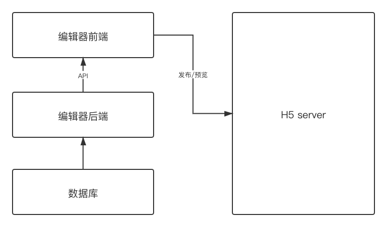
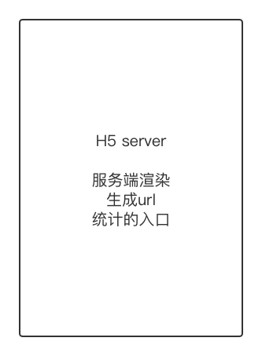
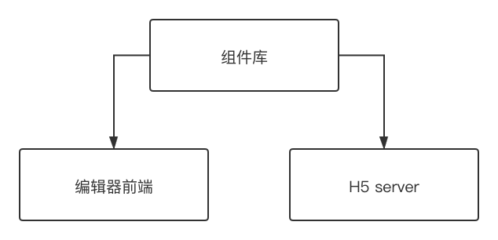
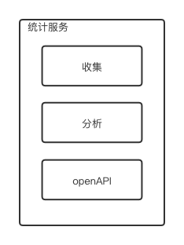
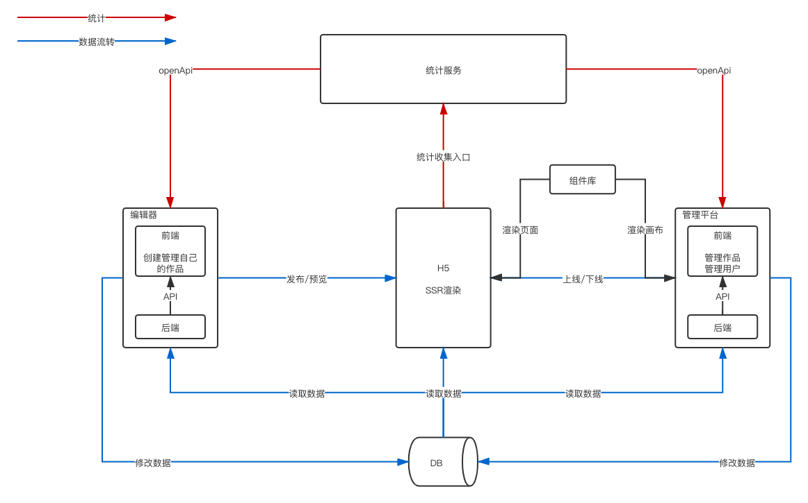

# 整体架构设计V1.0  

## 范围  
拆分模块范围:  
- 编辑器  
  发布和预览h5, 拆分为前端和后端  
- 管理平台  
  管理用户和h5的上线下线, 拆分为前端和后端  
- 展示端 H5  
  服务端渲染html串  
- 组件库  
  展示端和编辑器公用的组件库  
- 统计  
  自研一个统计服务，H5负责收集信息，然后服务进行分析，通过openApi的方式达到展示，完成闭环  
- 数据库  
  编辑器和管理平台共用一套数据库  

## 模块设计  
### 编辑器  
用于发布/预览H5, 新建及更新H5  
  
### 管理平台  
控制H5的上线和下线，比如紧急下线  
  
### H5  
  
### 组件库  
编辑器和H5都用到这个组件库  
  
### 统计  
在H5端收集信息，通过openApi的方式提供对外的接口  
自研主要是为了自定义一些事件  
提供统计服务业务才能闭环  
  

## 整体流程及数据流转  
  

## 作品的数据结构  
- 以数据驱动为思想  
- 维护一份数据，通过这份数据去渲染不同的组建（减少数据同步）  
- 以数组为整体的数据结构，方便排序  
- 单个的数据（组建）以vnode的格式存储读取  
eg:  
``` javascript  
{
  // 作品
  work: {
    title: '作品标题',
    setting: {/* 一些可能的配置项，用不到就预留 */},
    props: {/* 页面body的一些设置，如背景色等 */}，
    components: [
      // 单个node，要符合VNode规范
      {
        id: 'xxx',
        name: '文本1',
        tag: 'text',
        attrs: { fontSize: 20px },
        children: [
          '文本1' // 文本内容，有时候放在attrs或props中，没有标准，看情况而定
        ]
      },
      {
        id: 'yyy',
        name: '图片1',
        tag: 'image',
        attrs: { src: 'xxx.png', width: '100px' },
        children: null
      }
    ]
  },
  
  // 画布当前选中的组件
  activeComponentId: 'xxx'
}
```  

## 扩展性保证  
- 扩展组件  
  - 数据结构层面可扩展  
  - 组件库层面扩展  
- 扩展编译器的功能  
  - 组件隐藏、锁定、滑动翻页  
- 扩展页面配置  

## 开发提效  
- 脚手架  
- 组件平台  

## 运维保障  
- 线上服务和运维服务用什么  
- 安全  
- 监控和报警  
- 服务扩展性：流量大时怎么解决  