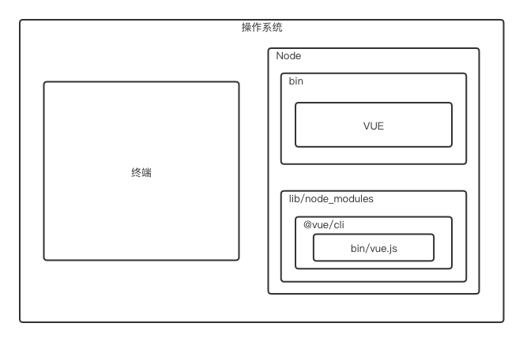
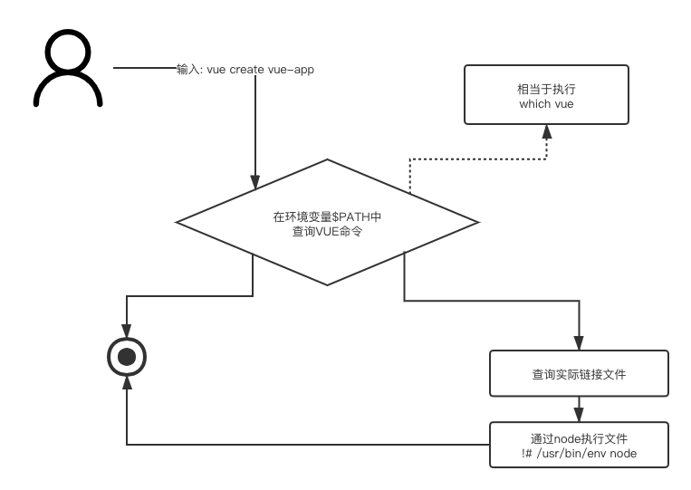
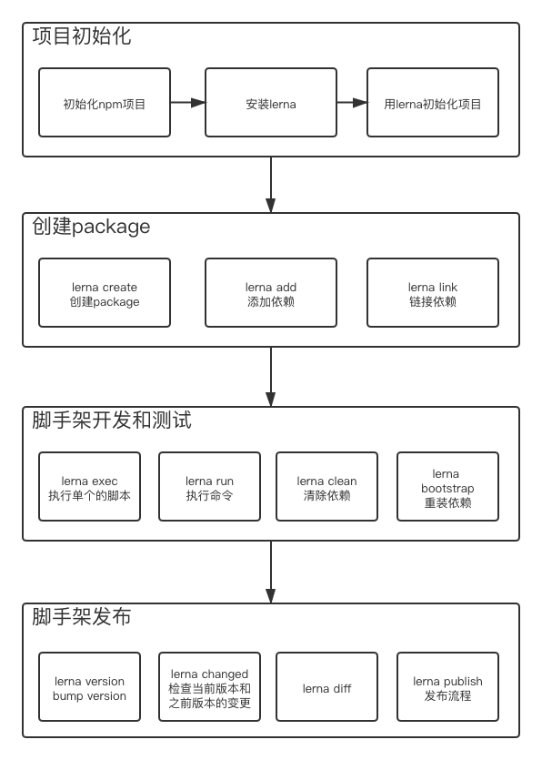
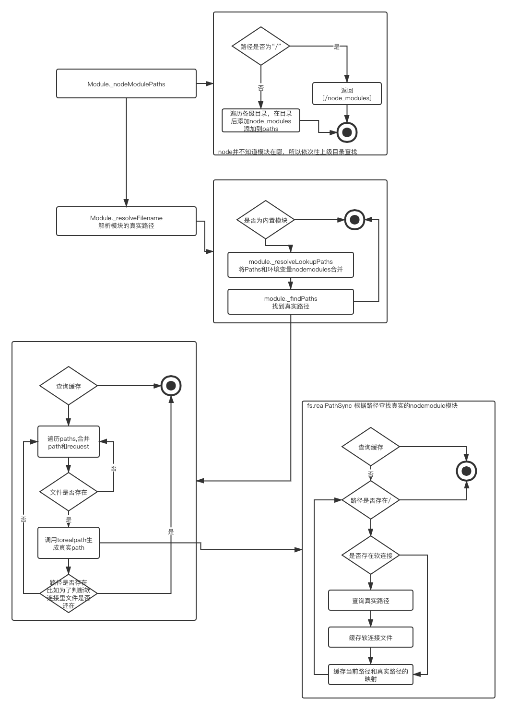

# 项目脚手架  
[通过learn发布的npm项目](https://www.npmjs.com/settings/curlyhair-biz-cli-dev/packages)  
理解git流  
理解前端自动化  

核心是为了提高研发效率（心中牢记）  

听完这周课程又理解了node能做的这么多  

## 脚手架开发入门  
### 脚手架的必要性  
- *提升研发效能*  
  - 创建项目和通用代码  
  - git操作（自动化）  
  - 构建和发布上线  

- 价值
  - 自动化 拷贝重复代码/git操作/发布上线  
  - 标准化 创建项目/git flow/发布流程/回滚流程  
  - 数据化 使研发流程可量化  

### 脚手架到底是什么  
- 从使用的角度  
  - 到底什么是脚手架  
    本质是操作系统的客户端，通过命令执行  
    ``` javascript  
    vue create my-vue-object --force -r xxxx
    ```  

    主命令: vue  
    command: create - 子命令 可以理解成发送一个请求  
    command的param: my-vue-object - command的参数  
    option: force  r - 选项 可以理解成配置  
    option的param: xxxx  
  - 整体执行过程  
    输入命令后 -> 解析出命令所在的真实的位置 -> 执行真实的文件（文件顶部获取环境变量中的node）-> 通过node执行文件 -> 文件再解析命令 执行相关操作 -> 执行完毕退出

    以vue create <app-name> 为例子  
    - 终端会从环境变量中找到vue然后解析出vue.js  
    - vue.js解析command options  
    - vue.js执行command  
        
    - 执行完毕退出  
  - 怎么开发脚手架  
    - 开发一个npm项目，包含一个bin/vue.js, 发布到npm  
    - 将npm项目安装到node的lib/node_modules  
    - 在node/bin目录下配置软连接连接到lib/node_modules/@vue/cli/bin/vue.js  

  - 疑问  
    - 如何自动添加命令  
      通过package.json里的bin字段进行设置  
    - 全局安装脚手架时发生了什么  
      安装依赖 -> 设置软连接（bin）  
    - 执行命令为什么不用输入node就可以执行  
      js文件的顶部设置了通过环境变量里的node来执行  
### 实现原理  
- 依赖node  
- 和操作系统有关 - 环境变量 root账户  
- 为脚手架设置别名  
  - 直接设置软连接  
  

### 开发流程  
- npm项目  
- 添加入口文件 最上方添加  
  ``` javascript  
   #! /usr/bin/env node
  ```
- package.json添加bin属性  
- 编写代码  
- 发布npm包  

### 开发难点  
- 如何将复杂系统拆分然后再合成一个复杂系统  
- 注册一系列命令  
- 参数解析  
- 编写帮助文档  

### 参数解析  
- 注册命令 init  
- --version、 init --name  

## lerna  
基于git+npm 多package  
- 解决脚手架过程中的重复操作  
  - 重复操作  
- 解决版本一致性问题  

### 使用lerna搭建项目  
  

### lerna源码分析  
- 源码结构  
- 核心执行流程  
- import-local  
  
#### yargs  
- yargs用法  
- dedent  
  把通过``里换行的部分顶格
``` javascript  
yargs
  .options(opts)
  .group(globalKeys, "Global Options:")
  .option("ci", {
    hidden: true,
    type: "boolean",
  });
```  
options: 全局方法，所有的common都可以使用  
  
### 加载模块过程  
- Module._resolveFilename  
  ``` javascript  
    Module._resolveFilename(moudleId, {
      id: fromFile, // 文件路径
      filename: fromFile,
      path: Module._nodeModulePaths(fromDir) // 所有可能的nodemodule的路径  
    })
  ```  
  

// 细节未添加完

## 架构  
效能为核心目标  