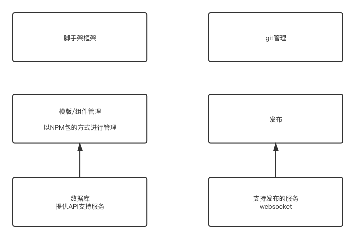
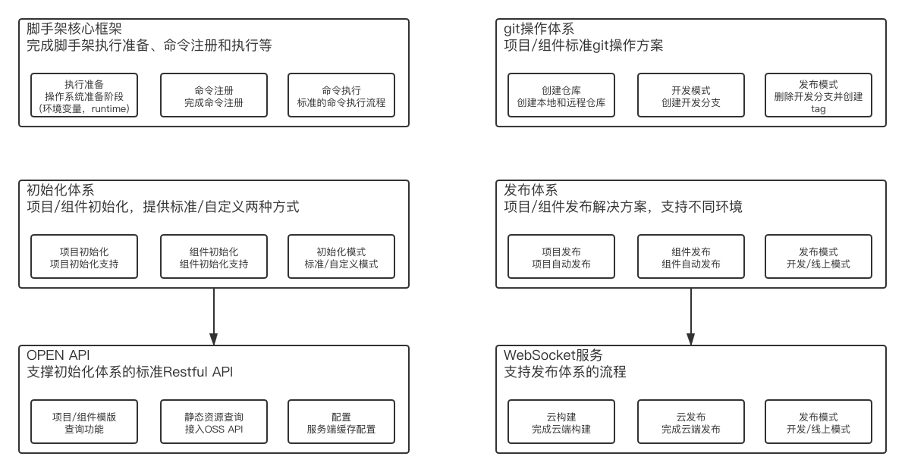
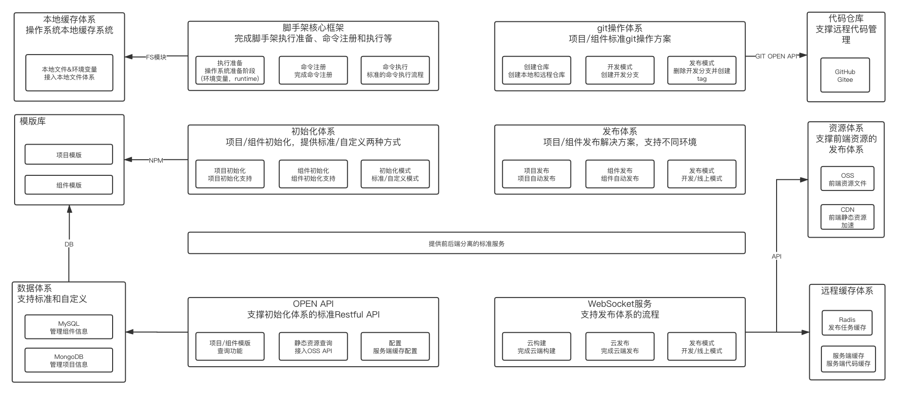

# 了解流程  
  - 项目设计阶段  
    搞清业务或者研发的痛点，然后形成需求，然后输出文档，然后技术方案设计、形成文档，然后立项、启动，排期  
  - 实施  
    交互、视觉设计、输出设计稿，前端根据设计稿开发，后端开发，连调，测试，验收，上线  
- 了解如何设计、拆分  
- 开发  

# 架构图  
看了老师视频 停了一天 自己来画图的时候~ 感觉思路还是不对呀! 比如如何拆分 如何形成闭环 如何让人看明白~ 还得多多联系呀  

先看第一版的图:  
  
是不是很简陋~ 没有细节!  
这个脚手架需要一个框架进行搭建 --> 管理模版和组件（npm的方式，需要后端提供API）--> 通过配置git流来管理开发流程 --> 配置统一的发布上线流程(需要发布服务的支持)  
那么来补充细节:  
- 脚手架核心框架  
  根据操作系统完成准备阶段，完成注册命令，标准的执行命令流程  
- 模版/组件管理  
  模版、组件初始化的支持，支持标准和自定义初始化  
  同时需要服务（通过OPEN API）来支持这个模块: 查询、接入OSS API、缓存配置  
- 发布  
  通过websocket完成云构建、云发布、提供不同环境的支持  
- git管理  
  如何创建仓库 --> 开发时如何创建分支 --> 上线后删除分支创建tag  
更新后的第二版图:  
  
加入了各个模块的细节  
还差一些依赖分析  
- 脚手架要和本地系统的文件系统关联（本地文件系统和环境变量）  
- 初始化体系  
  - 依赖模版库NPM包  
  - 通过一个数据库管理项目模版和组件模版  
  - NPM包也要从数据库中获取信息  
- 发布体系  
  - **前端OSS资源服务**  
  - **CDN 前端资源加速**  
  - **远程缓存体系**  
- git  
  远程仓库托管及相应的操作流程  
  
通过这个对结构有了大体上认识，也能理解实际项目里用的脚手架大概为了解决什么样的工作  
*比如: 我这通过脚手架来创建项目 通过配置git仓库是为了告诉脚手架从哪读取代码，对应这里的git操作体系，还有隐藏在背后的打包发布流程*  

# 基础的流程  
- 检查版本号
  获取package.json里的版本号
  - reqiure加载资源的方式 - .js/.json/.node 其他的格式类型的文件默认以JS文件来解析  
  - npmlog  
    - 添加自定义事件  
    - 判断debug模式(semver和commander两种方式)  
    - 添加自定义前缀  
- 最低node版本要求
  - 获取当前版本号: process.version
  - 比对版本号
    samver - 各种各样的版本号比对

- root账号启动检查和自动降级功能  
  root-check  

- 用户主目录检查功能  
  user-home  
  path-exists  

- 入参检查和debug模式  
  minimist - 参数解析  
  这里解析为了设置log的等级 是否需要打印debug  

- 环境变量检查功能  
  将用户名密码等敏感信息保存在本地  

- npm API  
  - 获取当前版本号  
  - 调用npm api获取所有版本号  
  - 比对版本号  
    url join  

- npm全局更新功能  
- 注册命令  
  commander  
  - commander怎么用  
  - commander全局注册  

*commander搭建脚手架正在公司自己的包管理系统上学着发布*
*node端处理ESmodule github上有了哈*