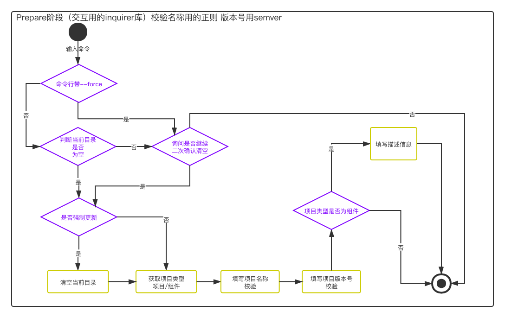

# init阶段  
通过之前的命令进入到init的npm包 业务逻辑都在这个init包里处理  
## 准备阶段  
这个阶段需要拿到开发者填写的项目模板信息  
步骤:  
1. 当前目录是否为空(通过交互或者命令行里的force字段来控制是否清空目录)  
2. 上面逻辑处理完 进入交互阶段获取到项目信息(requirer的链式调用，名称和版本号的校验)  
3. 项目类型是否为组件  
  

## mongodb  
花了点时间弄了下数据库 可以访问了～  
[http://www.curlyhair.cn:7001/project](http://www.curlyhair.cn:7001/project)  
后来不小心删了库，觉得备份还是很重要啊  
弄的时候在系统和版本之间遇到一些问题，启动的时候也遇到一些问题～ 都是百度解决的～  
所以希望老师能讲讲基础的一些部署和规范的mongodb的操作  
启动遇到问题应该是mongodb操作的时候不当  

## 命令行交互  
又觉得事件监听和异步是前端的灵魂！！！  
源码跟着老师通看了一遍  
加上前面的一些源码～ 要加油才能完全看懂了～  
  