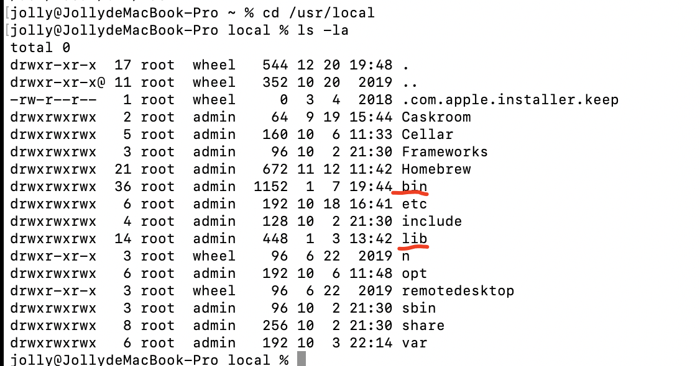
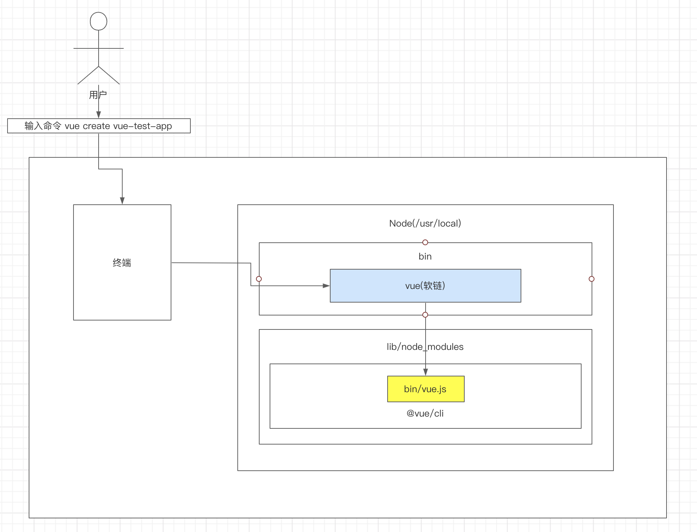
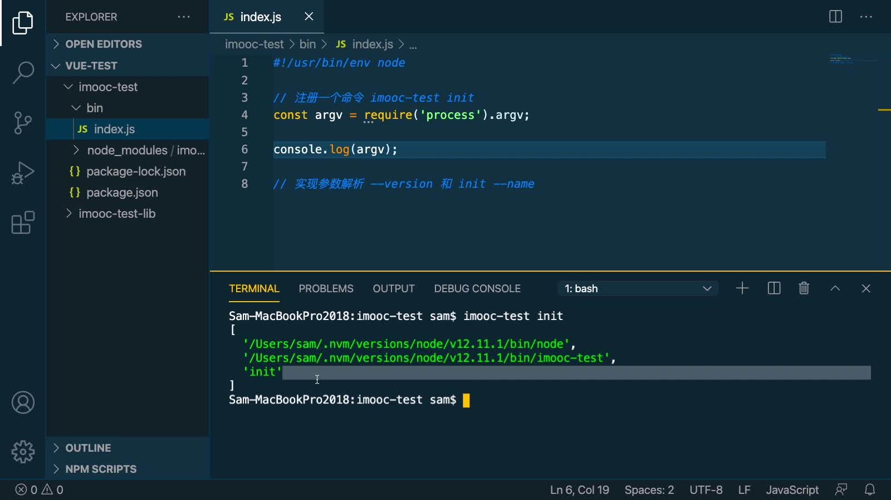
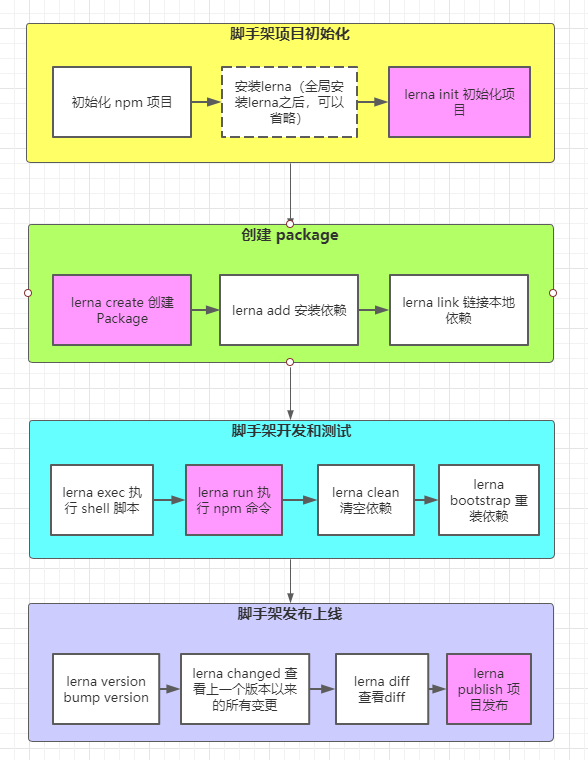

---

---

## 站在前端研发视角，分析开发脚手架的必要性

架构师视角：开发脚手架的目标是什么，能带来什么价值

开发脚手架的核心目标是： **提升前端研发效能**

### 开发过程的共有操作

- 创建项目

  创建项目一般都会有通用代码

- git操作

  创建仓库、处理代码冲突、同步远程分支、创建版本、发布后的tag等，耗时耗力

- 构建和发布上线

  本地构建、资源发布到静态资源服务器、同步CDN、域名绑定、区分正式和测试服务器，人为操作耗时多

解决上述问题，即可提效。突出脚手架的核心价值

### 脚手架的核心价值

将研发过程：

- 自动化

  从创建项目到git操作，到发布上线的自动化，减少人工的耗时

- 标准化

  交给脚手架完成共有操作，可以统一代码风格，规避git flow混乱：杂乱无章的commit。统一发布和回滚流程

- 数据化

  统计脚手架创建项目、git操作、构建和发布的时间，可以对研发过程进行优化。可以把研发过程保存下来

### 和自动化工具的区别

- 不满足需求。jenkins/travis通常需要在git hooks中触发，负责云构建，不能覆盖开发人员本地功能 

- 定制复杂。jenkins、travis定制过程需要开发插件，开发过程复杂，且使用java语言，对前端开发人员不够友好

## 从使用的角度理解什么是脚手架

### 脚手架简介

脚手架是操作系统的客户端。只不过它是通过命令执行：

```bash
vue create vue-test-app
```

上面命令由3部分组成：

- 主命令：`vue` 
- command：`create` 
- command 的 param：`vue-test-app`   

命令表示创建一个vue项目，项目名为`vue-test-app` 

```bash
vue create vue-test-app --force
```

创建项目并覆盖已有同名目录。`--force` 称为option。用来辅助脚手架确认在特定场景下，用户的选择。

```bash
vue create vue-test-app --fore -r https://registry.npm.taobao.org
```

这里`-r` 也是option，--registry的简写。`-r https://registry.npm.taobao.org` 后面的`https://registry.npm.taobao.org` 是`-r` 的param. `--force`简写是 `-f` 。 `--force` 也有param：`--force` `-f` 是 `--force true` 的缩写。

### 脚手架执行原理

`vue create vue-test-app`  命令干了些啥？

1. 终端在环境变量中找到vue指令，`which vue`  指令寻找（mac系统下）本机运行which vue的到结果：    `/usr/local/bin/vue` 

2. 进入node路径，图1，关注bin和lib文件夹(本机是进入`/usr/local/` )，进入bin路径后，ls -la得到vue信息：`lrwxr-xr-x  1 root wheel  39  9 19 15:15 vue -> ../lib/node_modules/@vue/cli/bin/vue.js` 得到vue是一个指向`/usr/local/lib/node_modules/@vue/cli/bin/vue.js` 的软连接

   

   图1：bin文件夹中是软链接。lib中是软链接指向的全局文件（npm包）

3. 以上，实际执行的是`/usr/local/lib/node_modules/@vue/cli/bin/vue.js` 文件。解析command后调用相应方法(create)执行。

**执行过程图解：**



- 终端中输入 `vue create vue-test-app`
- 终端解析出`vue` 命令
- 终端在环境中找到`vue` 命令（使用which vue指令）
- 终端根据`vue` 命令链接到实际文件vue.js
- 终端利用node 执行vue.js
- vue.js解析`command` /`opiton`
- vue.js执行`command` (对应的方法)
- 执行完毕，退出执行

### 开发脚手架的步骤

以`vue-cli` 为例

1. 创建npm项目`mkdir vue-cli && cd vue-cli && npm init -y` 项目中包含`bin/vue.js` 文件，`package.json` 配置：

   ```json
   "bin": {
     "vue": "bin/vue.js"
   }
   ```

   最后，把项目发布到npm。

2. 将`vue-cli` 安装到`node` 的`lib/node_modules` 中：`npm i -g @vue/cli`
3. 在`node` 的`bin` 目录下配置`vue` 软链到`lib/node_modules/@vue/cli/bin/vue.js` 。这一步，npm安装时自动完成。

### 需要解决的问题

1. 为什么全局安装`@vue/cli` 后会添加的命令为vue？

   `package.json` 中`bin` 配置了key`vue`，`npm` 全局安装时，会根据这个配置生成软链接。

2. 全局安装`@vue/cli` 时发生了什么？

   全局安装@vue/cli时

   -  下载npm包到全局的node_modules文件夹下

   - 按`package.json` 中`bin` 的配置，生成软链接

3. 为什么`vue` 指向一个`js` 文件，我们却可以通过`vue` 命令直接执行它？

   - `vue.js` 文件第一行添加`#! /usr/bin/env node` 告诉操作系统，在直接打开文件时，从环境变量中找寻`node` 命令，使用`node` 执行文件。`/usr/bin/env` 在终端中打印出来的是环境变量。
   - `npm` 按照`package.json` 中`bin` 的配置，生成了软链接`vue` 指向了`vue.js` 。所以输入`vue` 就可以执`vue,js` 。

**涉及到的bash命令**

- `chmod 777 filename` 可以将文件改为可执行文件

  `drwxr-xr-x`  最后一个`x` 表示这是一个可执行文件

- `echo $PATH` 打印环境变量

**手动创建软连接**

创建软连接指向js：在node bin目录下，运行命令 `ln -s js路径 name`。之后可以在任何位置，执行`name` 命令

## 脚手架原理进阶

1. 为什么说脚手架本质是操作系统的客户端？它和我们在PC上安装的应用/软件有什么区别？

   因为node是操作系统的客户端，不是编写的对应脚手架js文件是客户端。区别是没有gui，node是通过命令行方式，传入参数执行

2. 如何为node脚手架命令创建别名？

   相当于为现有的vue 这个命令在添加个别名：新建软连接指向他就好了。在`node/bin` 下执行：`ln -s /vue vue2` 即可使用`vue2` 指向`vue` 。`windows` 系统是通过新建快捷方式创建

3. 描述脚手架命令执行的全过程：

   

## 脚手架的开发流程

### 开发流程

1. 创建`npm` 项目

2. 创建脚手架入口文件，最上方添加：

   ```javascript
   #!/usr/bin/env node
   ```

3. 配置`package.json` ，添加`bin` 属性

4. 编写脚手架代码

5. 将脚手架发布到`npm` 

### 安装使用

**作业1**

- 安装

  ```bash
  npm i -g jolly-test
  ```

- 使用

  ```bash
  $ jolly-test -V
  1.0.1
  $ jolly-test --version
  1.0.1
  $ jolly-test init test --option
  执行init流程 test --option
  
  ```

## 脚手架开发难点

- 分包：将复杂的系统拆分成若干个模块

- 命令注册，使用若干命令实现对应功能

  ```bash
  vue create
  vue add
  vue invoke
  ```

- 参数解析

  ```bash
  vue command [options] <params>
  ```

  主命令、command、带params的options等

- options有全称 `--version` 有简写`-v` `-h` 怎么实现

- 帮助文档

  - Global help (针对主命令)
    - Usage
    - Options
    - Commands

  ```bash
  jolly@JollydeMacBook-Pro % vue -h
  Usage: vue <command> [options]
  
  Options:
    -V, --version                              output the version number
    -h, --help                                 output usage information
  
  Commands:
    create [options] <app-name>                create a new project powered by vue-cli-service
    add [options] <plugin> [pluginOptions]     install a plugin and invoke its generator in an already created project
    invoke [options] <plugin> [pluginOptions]  invoke the generator of a plugin in an already created project
    inspect [options] [paths...]               inspect the webpack config in a project with vue-cli-service
    serve [options] [entry]                    serve a .js or .vue file in development mode with zero config
    build [options] [entry]                    build a .js or .vue file in production mode with zero config
    ui [options]                               start and open the vue-cli ui
    init [options] <template> <app-name>       generate a project from a remote template (legacy API, requires @vue/cli-init)
    config [options] [value]                   inspect and modify the config
    outdated [options]                         (experimental) check for outdated vue cli service / plugins
    upgrade [options] [plugin-name]            (experimental) upgrade vue cli service / plugins
    migrate [options] [plugin-name]            (experimental) run migrator for an already-installed cli plugin
    info                                       print debugging information about your environment
  
    Run vue <command> --help for detailed usage of given command.
  ```

还有

- 交互式命令行
- 日志打印
- 命令行文字颜色变化
- 网络通信：HTTP/WebSocket
- 文件处理

......

### 脚手架本地调试

**没有分包的本地调试**

假定在开发jolly-test脚手架，要本地调试`jolly-test`命令

- 在`package.json` 所在目录下`npm link` 

  - 此时会按照 `package.json` 中`bin` 配置在`/usr/local/bin` 中生成软链`jolly-test`（`bin` 配置的）
  - 先指向/usr/local/lib/node_modules/jolly-test，这也是一个软连接
  - /node_modules/jolly-test 指向项目的本地实际路径

- 在`package.json` 所在目录的上级`npm i -g 文件夹名` 也可以实现`npm link` 的效果。唯一的区别在于`node_modules` 中软链指向的地址写法：`npm link` `node_modules` 中软链指向的地址是绝对路径：

  ```bash
  lrwxr-xr-x   1 jolly  wheel    37  1 10 20:42 jolly-test -> /Users/jolly/Desktop/imooc/jolly-test
  ```

  而`npm i -g jolly-test` `node_modules` 中软链指向的地址是相对路径：

  ```bash
  lrwxr-xr-x  1 jolly wheel  48 1 10 16:24 jolly-test -> ../../../../Users/jolly/Desktop/imooc/jolly-test
  ```

**分包的本地调试**

假定开发`jolly-cli`，和`jolly-utils`位于`jolly-cli-dev`文件夹下。`jolly-cli`引入依赖`jolly-utils` 

- 首先在`jolly-utils`中`npm link` 放到全局`node_modules` 文件夹下， 然后在`jolly-cli` 运行指令`npm link jolly-utils`，并在 `package.json` 中手动配置依赖。

- `npm` `package` 的形式之一，就是本地的某个文件夹。所以`npm` 提过如下写法，支持本地包的引入（`jolly-cli`引入依赖`jolly-utils`）

```json
  "dependencies": {
    "@jolly-cli/utils": "file:../utils"
  },
```

​	配置之后，需要`npm install`。但发布时需要具备像`lerna publish` 将本地连接解析成线上连接的功能对依赖进行处理。

**本地调试后发布上线**

- 使用`npm link` 的要先`npm unlink`
  - 没有本地分包调试的，可以直接发布了
  - 有本地分包的，如开发`jolly-cli` ，应先在 `jolly-cli` 中`npm unlink jolly-utils` , 这时`package.json` 中对应依赖会被移除。然后回到 `jolly-utils` 中 `npm unlink` 并先对 `jolly-utils` 进行发布。发布成功之后，在 `jolly-cli` 运行 `npm i -S jolly-utils` 安装依赖，再对 `jolly-cli` 进行发布。
- 通过 `"file:../utils"` 引入依赖的，要使用 `lerna publish` 进行发布。

### npm link & npm unlink

**npm link**

- `npm link` 将当前项目链接到 `node` 全局 `node_modules` 中作为一个库文件，并解析 bin 配置创建可执行文件
- `npm link your-lib` 将当前项目中 `node_modules` 下指定的库文件链接到 `node` 全局 `node_modules` 下的库文件

**npm unlink**

- `npm unlink` 将当前项目从 `node` 全局 `node_modules` 中移除
- `npm unlink your-lib` 将当前项目中的库文件依赖移除

## 脚手架命令注册和参数解析

**不使用第三方库进行解析**

使用 `node` `process` 模块。`process` 是 `node` 的进程事件，`process.argv`  属性会返回一个数组，其中包含当 `Node.js` 进程被启动时传入的命令行参数。第一个元素是 `process.execPath`（启动 `Node.js` 进程的可执行文件的绝对路径名）。 第二个元素是正被执行的 `JavaScript` 文件的路径。 其余的元素是任何额外的命令行参数。

下图是输入 `imooc-test init` 后的 `process.argv`



## 使用lerna进行脚手架开发

lerna 是一个优化基于 git + npm 的多 package 项目的管理工具

### lerna解决的问题

- 大型项目、多 `packages` 的重复操作

  - 本地分包之间的link

  - 依赖安装

  - 单元测试

  - 代码提交

    所有 `package` 提交到一个仓库

  - 代码发布

    每一个 `package` 都要发布成独立的 `npm` 包，version 升级

- 大型项目、多 `packages` 的版本一致性

  - 发布时版本一致性

    `packages` 之间版本一致，只需保证一个版本下的 `packages` 可以协同工作即可，不必考虑向下兼容

  - 发布后相互依赖的版本升级

    一个包升级后，依赖这个包的其他包，也要进行升级

- leran 提升操作的标准化

  标准的发布流程：发布前的 bump version，检查代码是否提交了，生成仓库的 tag 标签等，最后进行 npm 发布

### lerna与架构

lerna 是一个架构优化的产物，它揭示了一个架构真理：项目复杂度提升后，就需要对项目进行架构优化。架构优化的主要目标往往都是以效能为核心。

标椎化带来的好处是减少出错，减少排查错误的成本。

### lerna 开发脚手架流程

紫色为常用命令



### lerna 命令解释

