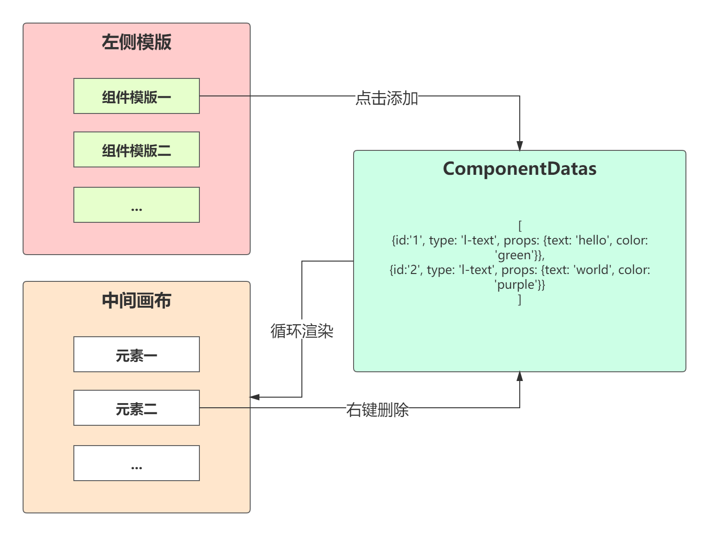
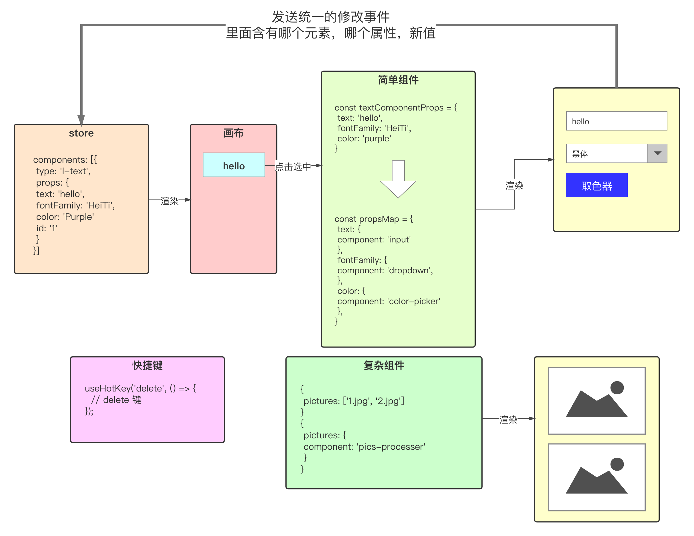
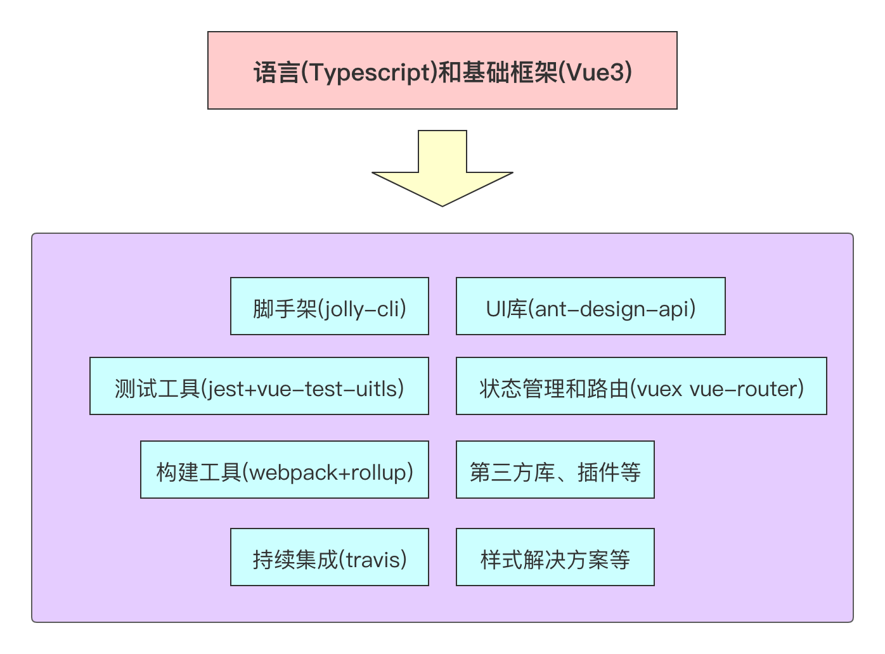

## 复杂项目的定义

从两个维度审视项目复杂度

### 业务交互的复杂度

- 交互的复杂性
- 数据结构和状态的复杂性
- 多项目互相依赖的复杂性
- 针对不同项目（web还是liabrary）怎样完成打包
- 性能优化。大型项目的要点，省的流量就是公司的真金白银
- 第三方库的调研，使用以及二次开发

### 流程的复杂度

- git flow
- 标准的 lint 工具
- 单元测试
- 代码提交的 commit 信息
- PR review - 工程师之间互相交流和学习的重要步骤
- CI/CD 持续集成和部署

## 技术解决方案

- 复杂项目，在需求分析之后，是技术解决方案的编写。技术方案的编写，可以理清思路，预先解决项目中可能存在的难题。解决这些难点就是技术方案设计的归宿。分析项目中的难点继而成为架构师的必要能力。

- 总览的技术设计文档，要站在一定的高度，指引项目的大体流程。至于项目具体功能的具体解决方案，届时在写具体的设计文档。

- 技术方案的内容是，怎样实现需求中的功能，没有固定格式。

## B端需求实现的难点

### 难点分析

实现B端功能的难点，显而易见，是在编辑器。

- 怎样实现组件
- 跨项目使用
- 组件的可扩展性
- 编辑器的整体状态
  - 编辑器做的功能，其实就是对一系列组件增删改查操作
- 元素的增加和删除
- 元素属性的修改（核心）
  - 属性渲染成表单
  - 实时反馈
- 核心之外问题的解耦
  - 插件化
    - 拖动
    - 快捷键
    - 右键菜单
    - 缩放
    - 重做和回滚

### 项目开发要有“前戏”

对于复杂项目，在项目前期，要有像上面的一个思考的过程，并试图找出这些问题的解决方案，争取满足项目的可扩展性、功能的解耦及易维护性等，降低开发和维护成本。

## 组件库难点和解决方案

### 两个项目怎样重用组件

两个项目：pc端编辑器和H5端

#### 单独的代码库

在不同的项目中重用组件，自然把这些组件抽象成一个代码库，降低和任何一个项目的耦合性，单独代码库让业务组件有独立的标准开发流程：

- 编码
- 测试
- 打包生成通用 JS 模块
- 发布至 NPM
- CI/CD - 自动发布


#### 组件库的设计原则

业务组件库大多都是展示型组件，在不同端进行展示，会有少量的行为，如点击跳转。所以，设计原则是**从简，必须避免和编辑器编辑流程的耦合**

#### 组件命名

LText 或 l-text

### 组件属性如何设计

**业务组件属性从功能上，可以分为**

- 样式属性
- 其他属性

两种实现：

```js
// 方案一
<LText
	css={{ color: '#fff' }}
  text="hello"
/>
// 内部实现
<p style={props.css}></p>

// 方案二 将所有的属性全部平铺传入
<LText
	text="hello"
	color="#fff"
	...
/>
// 内部实现
const styles = stylePick(props)
<p style={styles}></p>
```

- 方案一
  - 内部实现简单
  - 数据要多有一层结构：`class.css`
  - 保存数据时
    - 区分样式属性和其他属性
      - 样式属性要深入 `css` 对象进行处理
      - 其他属性在外层处理
- 方案二
  - 内部实现复杂
  - 保存数据简单
  - 数据更新容易

选择方案二。

**从个性上，可分为**

- 独有属性
  - 文本组件独有
  - 图片组件独有
- 共有属性

实现：

```js
// 用户点击
export userClick(props)
```

#### 组件扩展性的保持

***后续***

## 编辑器难点和解决方案

### 编辑器页面结构

不包括其他功能：预览、保存、发布等

- 左侧组件模版库

  预设各种组件模板并进行添加

- 中间画布

  使用交互式的手段更新元素属性

- 右侧表单设置页面

  使用表单更新元素属性

### 添加模板组件到画布



编辑器的核心功能，就是围绕中间画布进行一系列操作，编辑最终效果，作用在数据上：对组件数据的增删改查。

### 伪代码诠释实现流程

```typescript
// 以下代码以后都可能修改
export interface EditorStore {
  components: ComponentData[]
  // 其他状态相关信  // 其他状态相关信关息
  currentElement: string // uuid
  // ...
}
interface ComponentData {
  props: { [key: string]: any };
  id: string;
  name: string
}
const components = [
  {id:'1', type: 'l-text', props: {text: 'hello', color: 'green'}},
  {id:'2', type: 'l-text', props: {text: 'world', color: 'purple'}}
]
components.map(component => <component.name {...props} />);

// 左侧模板
const templateComponents = [
  {id:'1', type: 'l-text', props: {text: '模板一', color: 'green'}},
  {id:'2', type: 'l-text', props: {text: '模板二', color: 'purple'}}
]
templateComponents.map(component => <Wrapper onclick="clickFun"><component.name {...props} /></Wrapper>);

// 添加组件
components.push({id:'3', type: 'l-text', props: {text: '!', color: 'red'}})
// 删除组件
components.filter(component => component.id !== delId);
```

### 组件属性和表单的关系



## 技术选型

首先要确定最上层使用什么 ，才能根据上层确定下层适配的技术

### Typescript

使用 `Typescript` 开发大型项目

- 程序更容易理解
- 效率更高
  - 方便代码库及定义之间的跳转（查找定义）
  - 代码补全
  - 接口提示
- 更少的错误
  - 在运行之前，及时发现错误
  - 很好的避免读取  `undefined` 上的属性或方法
- 良好的包容性
  - `js` 文件可以直接命名为 `ts` 文件运行
  - 可以为非 `ts` 编写的三方库编写类型文件进行读取

### Vue 和 React

#### React

- 代码实现风格
  - 将组件抽象成函数，函数型组件
  - 组件是一个返回特定界面的函数
  - `hook` 使函数式变成，大行其道

- 数据更新机制

  使用 immutable 方式，调用特定 `useState hook`函数更新界面

- 代码重用性

  `React hooks` 最大的创新，它可以使用给定的 hooks 抽象成一系列的函数，在组件内部使用函数调用的方式来重用逻辑，非常符合正常的思维，也能了解重用逻辑代码的来源和返回。

```react
import React, { useState, useEffect } from "react";
import "./styles.css";
import useMousePosition from "./useMousePosition";

export default function App() {
  const [count, /* useState hook */ setCount] = useState(0);
  const positions = useMousePosition(); // hooks 函数
  useEffect(() => {
    alert(count)
  }, [count])
  return (
    <div className="App">
      <h1>Hello CodeSandbox {count}</h1>
      <button onClick={() => setCount(count + 1)}>
        <h2>Add Count</h2>
      </button>
      <h2>{positions.x}</h2>
      <h2>{positions.y}</h2>
    </div>
  );
}
```

#### Vue

- 代码实现风格

  单文件组件：模板、数据、样式三者放到一个 `vue` 文件中

- 数据更新机制

  响应式数据。直接修改数据，就可以更新界面，更符合程序员思考模型

- 代码重用性

  `vue3` 推出 `composition api` , 类似 `React` `hooks` 系统。将逻辑抽象为函数，组件内部调用函数获得结果。

```vue
<template>
  <h1>Hello CodeSandbox {{ count }}</h1>
  <button @click="addCount">
    <h2>Add Count</h2>
  </button>
  <h2>{{ x }}</h2>
  <h2>{{ y }}</h2>
</template>

<script>
import { ref } from "vue";
import useMousePostion from "./useMousePosition"; // 代码复用
export default {
  name: "App",
  setup() {
    const count = ref(0);
    const addCount = () => {
      count.value++;
    };
    const { x, y } = useMousePostion();
    return {
      count,
      addCount,
      x,
      y,
    };
  },
};
</script>

<style>
#app {
  font-family: Avenir, Helvetica, Arial, sans-serif;
  -webkit-font-smoothing: antialiased;
  -moz-osx-font-smoothing: grayscale;
  text-align: center;
  color: #2c3e50;
  margin-top: 60px;
}
</style>
```

### 技术选型说明



## 知识点

- `alibaba/form-render`

## 老师用到的工具

- 协同工具: https://whimsical.com
- 代码高亮编辑器: https://carbon.now.sh/