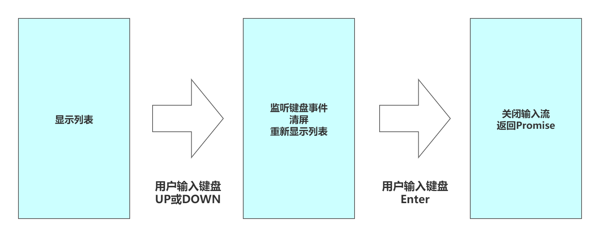
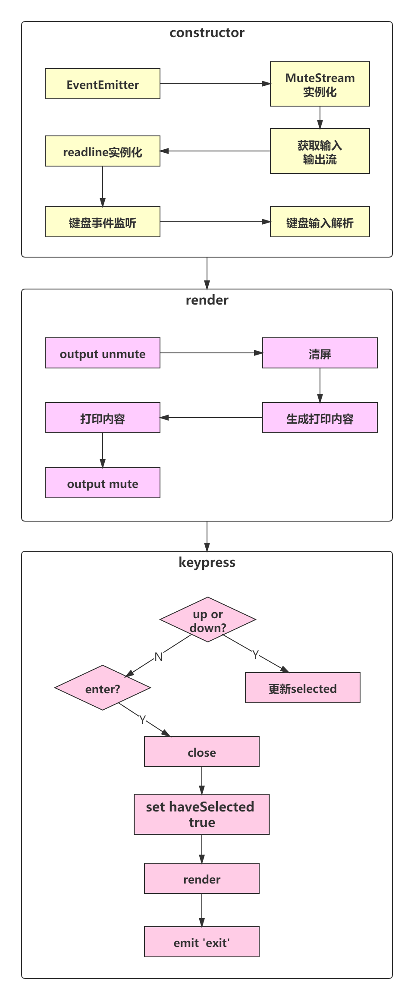
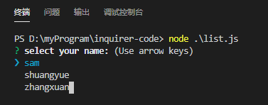
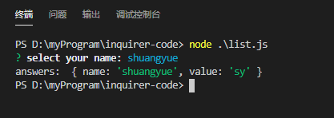

## `inquirer ` 基本使用

### 配置说明

https://www.npmjs.com/package/inquirer#objects

### 代码

```js
const inquirer = require('inquirer');
inquirer
  .prompt([{
    type: 'input', // 默认值为 input
    name: 'yourName',
    message: 'your name:',
    default: 'noname',
    validate: function(v) { // 验证通过才允许输入(按enter键才通过)
      // return v === 'jolly';
      return typeof v === 'string';
    },
    transformer: function(v) { // 将输入的信息进行转换，然后显示给用户，不会改变输入信息
      return 'name['+ v +']';
    },
    filter: function(v) { // 会改变最后的值
      return  v + ' chen'; // 输入 jolly, 返回 jolly chen
    }
  }, {
    type: 'number', // 会将输入转换为数子，不能转换为数子则返回 NaN
    name: 'num',
    message: 'your number'
  }])
  .then(answers => {
    console.log('answers: ', answers);
  })
  .catch(error => {
    if(error.isTtyError) {
      // Prompt couldn't be rendered in the current environment
    } else {
      // Something else when wrong
    }
  });
```

### 运行结果

```bash
jolly@192 inquirer-test % node inidex.js
? your name: name[jolly chen]
? your number 123
answers:  { yourName: 'jolly chen', num: 123 }
jolly@192 inquirer-test % node inidex.js
? your name: name[jolly chen]
? your number NaN
answers:  { yourName: 'name[jolly]', num: NaN }
```

## `type` 的其他值

- `type: confirm` 实现 `y/n` 询问，默认选项大写
- `type: list`：实现选项功能
- `type: rawlist` 和 `list` 差不多，只是显示和交互上有点差异
- `type: expand` 实现简写选择，输入 `h` 显示帮助和全称
- `type: checkbox` 实现列表多选，实现跟 `list` 几乎一致，只是 `type` 值不一样
- `type: password` 密码
- `type: editor` 打开文本编辑器

### `type` 为 `list`：实现选项功能

```js
{
  type: 'list',
  name: 'choice',
  message: 'your choice',
  default: 1, // 默认选择项索引
  choices: [
    { value: 1, name: 'Tom' },
    { value: 2, name: 'Jolly' },
    { value: 3, name: 'Oliver' }
  ]
}
```

运行结果

```powershell
jolly@192 inquirer-test % node inidex.js
? your choice (Use arrow keys)
  Tom 
❯ Jolly 
  Oliver
```

### `type: expand`

```bash
{
  type: 'expand',
  name: 'choice',
  message: 'your choice',
  default: 'red',
  choices: [
    { key: 'R', value: 'red' },
    { key: 'G', value: 'green' },
    { key: 'B', value: 'blue' }
  ]
}
```

运行结果

```powershell
jolly@192 inquirer-test % node inidex.js
? your choice (Rgbh) h
>> Help, list all options

jolly@192 inquirer-test % node inidex.js
? your choice (Rgbh) 
  r) red
  g) green
  b) blue
  h) Help, list all options
  Answer: g
  
jolly@192 inquirer-test % node inidex.js
? your choice green
answers:  { choice: 'green' }
jolly@192 inquirer-test % 
```

### `type: checkbox`

```js
{
  type: 'checkbox',
  name: 'choice',
  message: 'your choice',
  default: 1, // 默认选择项索引
  choices: [
    { value: 1, name: 'Tom' },
    { value: 2, name: 'Jolly' },
    { value: 3, name: 'Oliver' }
  ]
}
```

运行结果

```powershell
jolly@192 inquirer-test % node inidex.js
? your choice (Press <space> to select, <a> to toggle all, <i> to invert selection)
❯◯ Tom
 ◯ Jolly
 ◯ Oliver
 
jolly@192 inquirer-test % node inidex.js
? your choice 
 ◯ Tom
 ◉ Jolly
❯◉ Oliver
```

- 空格选中当前选项
- `a` 键全选
- `i` 键反选：之前没有选中的选中，选中的变成未选中

### `type: editor`

- 提示输入回车后打开编辑器
- 和 `vim` 一样
- 打开的文件是一个缓存文件，输入完后，文件会被删除
- 可以输入比 `type: input` 中，更复杂的内容

### `validate` 中实现报错

```js
validate: function (input) {
  var done = this.async();
 
  setTimeout(function() {
    if (typeof input !== 'number') {
      done('验证未通过的提示');
      return;
    }
    done(null, true);
  }, 0);
}
```

## 命令行交互原理

对于架构师来说，不仅要能使用命令行交互，更要明白其是如何实现。

### 学习路径

- 掌握底层库：readline / events / stream / ansi-escapes / rxjs
  - `stream` 输入输出流。`process.stdout` 
  - `ansi-escapes` 实现命令行特殊显示，改变颜色等
  - `rxjs` 响应式模型库
- 掌握命令行交互的实现原理，并实现一个可交互的列表，类似于 `type: 'list'` 
- 最后，分析 `inquirer` 源码，掌握其中的关键实现

## 手写命令行交互式列表

### 实现原理



### 架构图



### 代码

```js
const EventEmitter = require('events');
const readline = require('readline');
const MuteStream = require('mute-stream');
const { fromEvent } = require('rxjs'); // 处理事件监听
const ansiEscapes = require('ansi-escapes');

const options = {
  type: 'list',
  name: 'name',
  message: 'select your name: ',
  choices: [{
    name: 'sam', value: 'sam'
  },{
    name: 'shuangyue', value: 'sy',
  },{
    name: 'zhangxuan', value: 'zx',
  }],
};

function Prompt(options) {
  return new Promise((resolve, reject) => {
    try {
      const list = new List(options);
      list.render();
      list.on('exit', function(answers){
        resolve(answers);
      });
    } catch (e) {
      reject(e)
    }
  });
}

// 交互列表组件
class List extends EventEmitter {
  constructor(option) {
    super();
    this.name = option.name;
    this.message = option.message;
    this.choices = option.choices;
    this.input = process.stdin;
    this.output = process.stdout;

    const ms = new MuteStream();
    ms.pipe(process.stdout);
    this.output = ms;
    this.rl = readline.createInterface({
      input: this.input,
      output: this.output
    });
    this.selected = 0;
    this.height = 0; // 列表高度， 有四行就是4
    this.keypresss = fromEvent(this.rl.input, 'keypress').forEach(this.onKeypress); // 监听 input keypress 事件。处理函数为 this.onKeypress
    this.haveSelected = false; // 是否已经选择完毕
  }

  /**
   * 处理按下上下键逻辑
   * @param {Array} keymap 按键信息
   */
  onKeypress = (keymap) => {
    const key = keymap[1]; // 第一个元素是undefined
    if (key.name === 'down') { // 下键
      this.selected++;
      if (this.selected > this.choices.length - 1) {
        this.selected = 0;
      }
      this.render();
    } else if (key.name === 'up') {
      this.selected--;
      if (this.selected < 0) {
        this.selected = this.choices.length - 1;
      }
      this.render();
    } else if (key.name === 'return') {
      this.haveSelected = true;
      this.render();
      this.close();
      this.emit('exit', this.choices[this.selected]);
    }
  }

  /**
   * 想控制台输出信息
   */
  render() {
    this.output.unmute(); // 允许输出信息
    this.clean();
    this.output.write(this.getContent());
    this.output.mute(); // 阻止输出信息
  }

  /**
   * 获取当前渲染信息
   */
  getContent = () => {
    if (!this.haveSelected) {
      // 32m：绿色前景；39m：默认前景；1m：字体加粗；22m：默认粗；0m：重置；2m：字体变细
      let title = '\x1B[32m?\x1B[39m \x1B[1m' + this.message + '\x1B[22m\x1B[0m\x1B[0m\x1B[2m(Use arrow keys)\x1B[22m\n';
      this.choices.forEach((choices, index) => {
        if (index === this.selected) {
          // 判断是否为最后一个元素，如果是，则不加 \n
          if (index === this.choices.length - 1) {
            title += '\x1B[36m❯ ' + choices.name + '\x1B[39m';
          } else {
            title += '\x1B[36m❯ ' + choices.name + '\x1B[39m \n';
          }
        } else {
          // 判断是否为最后一个元素，如果是，则不加 \n
          if (index === this.choices.length - 1) {
            title += '  ' + choices.name;
          } else {
            title += '  ' + choices.name + '\n';
          }
        }
      });
      this.height = this.choices.length + 1;
      return title;
    } else {
      // 输入结束后逻辑
      const name = this.choices[this.selected].name;
      let title = '\x1B[32m?\x1B[39m \x1B[1m' + this.message + '\x1B[22m\x1B[0m\x1B[36m' + name + '\x1B[39m\x1B[0m \n';
      return title;
    }
  }

  /**
   * 清屏
   */
  clean() {
    const emptyLines = ansiEscapes.eraseLines(this.height); // 生成空行
    this.output.write(emptyLines);
  }
  
  /**
   * 关闭输入输出流
   */
  close() {
    this.output.mute(); // 禁止输出
    this.rl.output.end();
    this.rl.pause(); // 停止监听
    this.rl.close();
  }
}

Prompt(options).then(answers => {
  console.log('answers: ', answers);
});

```

和 `inquirer` 核心实现类似

### 运行结果





### `mute-stream`

使输入输出流具有静默功能：想输出就输出，不想输出时静默。

### `ansi-escapes`

`ANSI escape codes` 库

