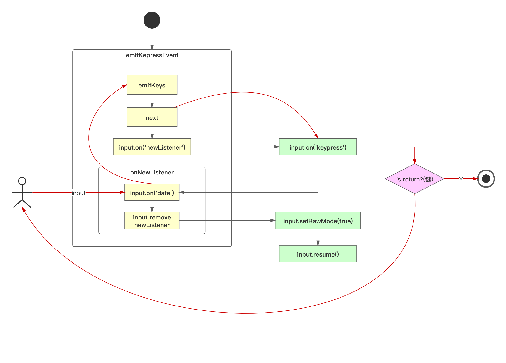
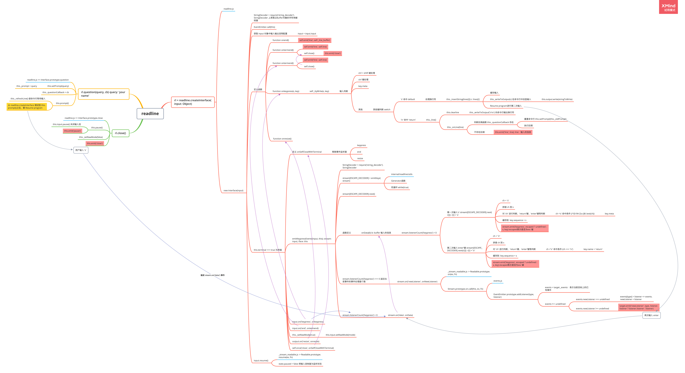

## `inquirer ` 基本使用

### 配置说明

https://www.npmjs.com/package/inquirer#objects

### 代码

```js
const inquirer = require('inquirer');
inquirer
  .prompt([{
    type: 'input', // 默认值为 input
    name: 'yourName',
    message: 'your name:',
    default: 'noname',
    validate: function(v) { // 验证通过才允许输入(按enter键才通过)
      // return v === 'jolly';
      return typeof v === 'string';
    },
    transformer: function(v) { // 将输入的信息进行转换，然后显示给用户，不会改变输入信息
      return 'name['+ v +']';
    },
    filter: function(v) { // 会改变最后的值
      return  v + ' chen'; // 输入 jolly, 返回 jolly chen
    }
  }, {
    type: 'number', // 会将输入转换为数子，不能转换为数子则返回 NaN
    name: 'num',
    message: 'your number'
  }])
  .then(answers => {
    console.log('answers: ', answers);
  })
  .catch(error => {
    if(error.isTtyError) {
      // Prompt couldn't be rendered in the current environment
    } else {
      // Something else when wrong
    }
  });
```

### 运行结果

```bash
jolly@192 inquirer-test % node inidex.js
? your name: name[jolly chen]
? your number 123
answers:  { yourName: 'jolly chen', num: 123 }
jolly@192 inquirer-test % node inidex.js
? your name: name[jolly chen]
? your number NaN
answers:  { yourName: 'name[jolly]', num: NaN }
```

## `type` 的其他值

- `type: confirm` 实现 `y/n` 询问，默认选项大写
- `type: list`：实现选项功能
- `type: rawlist` 和 `list` 差不多，只是显示和交互上有点差异
- `type: expand` 实现简写选择，输入 `h` 显示帮助和全称
- `type: checkbox` 实现列表多选，实现跟 `list` 几乎一致，只是 `type` 值不一样
- `type: password` 密码
- `type: editor` 打开文本编辑器

### `type` 为 `list`：实现选项功能

```js
{
  type: 'list',
  name: 'choice',
  message: 'your choice',
  default: 1, // 默认选择项索引
  choices: [
    { value: 1, name: 'Tom' },
    { value: 2, name: 'Jolly' },
    { value: 3, name: 'Oliver' }
  ]
}
```

运行结果

```powershell
jolly@192 inquirer-test % node inidex.js
? your choice (Use arrow keys)
  Tom 
❯ Jolly 
  Oliver
```

### `type: expand`

```bash
{
  type: 'expand',
  name: 'choice',
  message: 'your choice',
  default: 'red',
  choices: [
    { key: 'R', value: 'red' },
    { key: 'G', value: 'green' },
    { key: 'B', value: 'blue' }
  ]
}
```

运行结果

```powershell
jolly@192 inquirer-test % node inidex.js
? your choice (Rgbh) h
>> Help, list all options

jolly@192 inquirer-test % node inidex.js
? your choice (Rgbh) 
  r) red
  g) green
  b) blue
  h) Help, list all options
  Answer: g
  
jolly@192 inquirer-test % node inidex.js
? your choice green
answers:  { choice: 'green' }
jolly@192 inquirer-test % 
```

### `type: checkbox`

```js
{
  type: 'checkbox',
  name: 'choice',
  message: 'your choice',
  default: 1, // 默认选择项索引
  choices: [
    { value: 1, name: 'Tom' },
    { value: 2, name: 'Jolly' },
    { value: 3, name: 'Oliver' }
  ]
}
```

运行结果

```powershell
jolly@192 inquirer-test % node inidex.js
? your choice (Press <space> to select, <a> to toggle all, <i> to invert selection)
❯◯ Tom
 ◯ Jolly
 ◯ Oliver
 
jolly@192 inquirer-test % node inidex.js
? your choice 
 ◯ Tom
 ◉ Jolly
❯◉ Oliver
```

- 空格选中当前选项
- `a` 键全选
- `i` 键反选：之前没有选中的选中，选中的变成未选中

### `type: editor`

- 提示输入回车后打开编辑器
- 和 `vim` 一样
- 打开的文件是一个缓存文件，输入完后，文件会被删除
- 可以输入比 `type: input` 中，更复杂的内容

### `validate` 中实现报错

```js
validate: function (input) {
  var done = this.async();
 
  setTimeout(function() {
    if (typeof input !== 'number') {
      done('验证未通过的提示');
      return;
    }
    done(null, true);
  }, 0);
}
```

## 命令行交互原理

对于架构师来说，不仅要能使用命令行交互，更要明白其是如何实现。

### 学习路径

- 掌握底层库：readline / events / stream / ansi-escapes / rxjs
  - `stream` 输入输出流。`process.stdout` 
  - `ansi-escapes` 实现命令行特殊显示，改变颜色等
  - `rxjs` 响应式模型库
- 掌握命令行交互的实现原理，并实现一个可交互的列表，类似于 `type: 'list'` 
- 最后，分析 `inquirer` 源码，掌握其中的关键实现

### `readline` 内置模块

提供接口，一次一行地读取可读流（例如 `process.stdin` ）中的数据。基本使用：

```js
const readline = require('readline');

const rl = readline.createInterface({
  input: process.stdin,
  output: process.stdout
});

rl.question('your name: ', (answer => {
  console.log(answer);

  rl.close();
}));
```

### `readline` 源码解读

- 强制将函数转为构造函数

  ```js
  if (!(this instanceof Interface)) {
    return new Interface(input, output, completer, terminal);
  }
  ```

- 获取事件驱动能力

  ```js
  EventEmitter.call(this);
  
  
  ```

- 监听键盘事件

  ```js
  emitKeypressEvents(input, this);
  
  // `input` usually refers to stdin
  input.on('keypress', onkeypress);
  input.on('end', ontermend);
  ```

#### `readline` 核心实现原理



- 核心 `emitKeypressEvents(input, this)`，监听终端中的键盘输入
  - `emitKeys()` 是一个 `Generator` 函数 
- 出现等待用户输入的核心： `stream.on('data', onData)`
- `input.setRawMode(true)` 参数默认是 `false` 表示整行进行监听，变为 `true` 表示逐字监听
- 用户在命令行中输入，`_stream_readable.js` 中 `addChunk()` 函数派发事件 `stream.emit('data', chunk);`
- `this.input.pause()` 将输入流关闭



#### 知识点

- `Number.isNaN(val)`
- `terminal = !!process.stdout.isTTY` / `!!process.stdin.isTTY` 判断是否终端