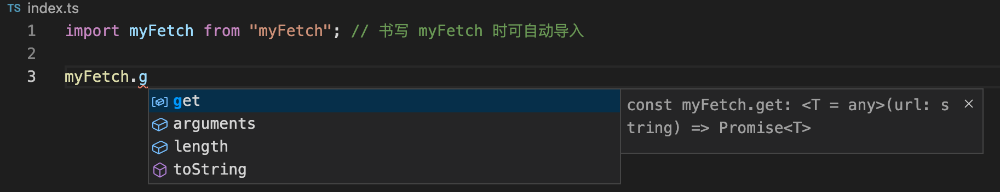
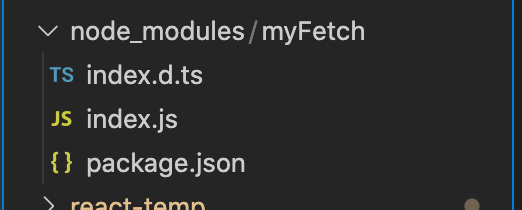

## 定义原始数据类型

- `null` 和 `undefined` 是所有类型的子类型。可以复制给任何类型

- ```typescript
  let arrOfNum: number[] = [1, 2, 3, 4]; // 定义元素类型为数子的数组
  ```

- `tuple` 元组类型

  ```typescript
  let user: [string, number] = ['jolly', 30]; // 两项，第一项类型为 string, 第二项类型为 number
  ```

- 函数声明

  ```typescript
  // 指定参数类型和返回值类型
  function add(x: number, y: number, z?: number): number{
    return x + y;
  }
  let add2 = (x: number, y: number, z?: number): number => {
    return x + y;
  }
  
  let add3: (x: number, y:number) => number = add2;
  ```

- Type inference 类型推断

  ```typescript
  let s = 'str'; // s 类型判定为 'string'. 不能被赋值为非 'string' 类型的值。
  ```

## interface

- 定义对象类型及形状

```typescript
interface Person {
  readonly id: number,
  name: string,
  age?: number
}

// 合法代码
let jolly: Person = {
  name: 'jolly',
  age: 30,
  id: 1 // id不能被修改
}
```

- 定义函数类型

```typescript
interface Count {
  (x: number, y: number): number // 定义参数类型和返回值
}
const sum: Count = (x: number, y: number) => x + y;
```

- Indexable type 可索引类型

```typescript
interface Randmap {
  [propName: string]: string;
}
const map: Randmap = {
  a: 'a',
  b: 'b',
  c: 'c' // 合法
  // d: 1 // 不合法，期望 String
}
```

- LIke Array 类型

```typescript
interface LikeArray {
  [index: number]: string
}
const likeArray: LikeArray = ['a', 'b', 'c']; 
likeArray[0]; // 只能访问，没有其他方法
```

- duck typing 鸭子类型

```typescript
// 定义一个四不像
interface FunWithProps {
  (x: number): number;
  name: string;
}
const a: FunWithProps = (x: number) => { // 传入类型要为 number
  //	return 'x' // 不合法，返回类型应为 number
  return x
}
a.name = 'adf' // 类型要为 string
```

### 类和接口

- `public`
- `private`
  - 只在实例上可以访问，子类上不能访问
- `protected`
  - 只在子类上可以访问，实例上不能访问
- interface 约束类，implements 实现类

```typescript
interface ClockInterface {
  currentTime: number,
  alert(): void
}
interface GameInterface {
  play(): void
}
// 合法代码
class Cellphone implements ClockInterface, GameInterface {
  currentTime: number = 123;
  alert() {

  }
  play() {
    
  }
}
```

### interface 约束构造函数

类的类型由两部分组成：

- 静态类型，这个类本身的类型
- 实例类型，使用 `new` 关键字创建的实例的类型

构造函数由约束静态类型，从而得到约束

```typescript
// 约束静态类型
interface ClockStatic {
  new (h: number, m: number): void;
  time: number
}
// 约束实例类型的属性方法
interface ClockInterface {
  currentTime: number,
  alert(): void
}
// 约束实例类型的属性方法
interface GameInterface {
  play(): void
}

const Cellphone: ClockStatic = class Cellphone implements ClockInterface, GameInterface {
  constructor(h: number, m1: number){
    
  }
  static time: 12
  currentTime: number = 123;
  alert() {

  }
  play() {

  }
}
```

## 泛型

### 函数和泛型

泛型解决的问题

- 类型推断不能延伸到函数

  - 泛型是在定义函数和接口的时候，不预先指定类型，而在使用时指定类型的一种特性

  ```typescript
  function echo<T>(arg: T): T {
    return arg; // T 是泛型的名称，可随意起名。可以理解为将来由参数类型替代
  }
  const result = echo('str'); // result 类型为 string。T = string
  
  // 泛型可以传入多个值
  function swap<T, U>(tuple: [T, U]): [U, T] {
    return [tuple[1], tuple[0]];
  }
  
  //
  ```

### 泛型和接口

#### 从 `react` 定义文件学习 泛型和接口

安装 `@types/react` 

使用命令 `create-react-app` 创建 `react` 项目，返现并没有  `@types/react` 于是手动安装

```bash
npm i -S @types/react
```

安装了之后，在 `tsx` 文件中才能 引入 `FunctionComponent` 接口，不然会报错 “react 没有导出 FunctionComponent”

用来学习的 `ts` 源码便是 `FunctionComponent` 接口的定义

```typescript
interface FunctionComponent<P = {}> {
  (props: PropsWithChildren<P>, context?: any): ReactElement<any, any> | null;
  propTypes?: WeakValidationMap<P>;
  contextTypes?: ValidationMap<any>;
  defaultProps?: Partial<P>;
  displayName?: string;
}
```

例：

```tsx
import { FunctionComponent } from 'react'
interface TestProps {
  title: string,
  desc: string
}

// 将接口 TestProps 传递到函数FunctionComponent中
const Test: FunctionComponent<TestProps> = (props) => {
  return (
    <div>
    <h1>{props.title}</h1>
    <p>{props.desc}</p>
    </div>
  )
}
```

从 `react` `ts` 定义文件源码得知

- 泛型的默认值 `<P = {}>` 

- 类型别名: `type`

  ```typescript
  type PlusType = (x: number, y: number) => number
  let sum: PlusType = (x: numver, y: number) => x + y
  
  // WeakValidationMap 的定义
  type WeakValidationMap<T> = {
          [K in keyof T]?: null extends T[K]
              ? Validator<T[K] | null | undefined>
              : undefined extends T[K]
              ? Validator<T[K] | null | undefined>
              : Validator<T[K]>
      };
  ```

- 交叉类型 '&'

  同时要有两个接口中的定义的数据

  ```typescript
  interface IName {
    name: string
  }
  type IPerson = IName & { age: number }
  let person: IPerson = { name: 'hello', age: 12 } // 同时要有两个接口中的定义的数据
  // 源码中定义 PropsWithChildren 类型，用到了
  type PropsWithChildren<P> = P & { children?: ReactNode }
  ```

- 联合类型 '|'
  注意，在`typescript` 不确定传入的类型是联合类型中的哪种时，我们只能访问两种类型共有的属性和方法。怎样判断是联合类型中的哪种类型，请看后面的 “类型断言”

  ```typescript
  let numberOrString: number | string // numberOrString 为 number 或 string 类型
  ```

- `Partial` 功能，接受一个泛型， 将其中的属性或函数变为可选。是 `typescript` 内置类型

  ```typescript
  interface Person {
    name: string,
    age: number
  }
  type PersonOptional = Partial<Person>
  /*PersonOption = interface {
    name?: string,
    age?: number
  }*/
  // Partial 的源码
  type Partial<T> = {
      [P in keyof T]?: T[P]; // ? 表示可选
  };
  ```

- extends

  在类型别名 `WeakValidationMap` 的赋值处，出现了 `extends` 操作符

  ```typescript
  type WeakValidationMap<T> = {
    [K in keyof T]?: null extends T[K]
    ? Validator<T[K] | null | undefined>
      : undefined extends T[K]
        ? Validator<T[K] | null | undefined>
        : Validator<T[K]>
  };
  ```

  `extends` 作用是判断一个类型是否满足另一个类型的约束。

  - 进行泛型约束

    ```typescript
    interface IWithLength {
      length: number
    }
    
    function echoWithArr<T extends IWithLength>(arg: T): T {
      console.log(arg.length) // 将来传入的参数中，不一定有length。于是需要 extends 进行约束：传入的之中，必须有 length 属性
      return arg;
    }
    ```

  - 条件类型关键字

    `WeakValidationMap` 中 `extends` 的作用便是条件类型关键字，产生一个条件类型。

    ```typescript
    type NonType<T> = T extends null | undefined ? never : T // 假如泛型参数 T 为 null 或 undefined, 返回 never；否则返回 T
    // NonType<T> 变为条件类型：是什么类型，看传入的泛型 T 的类型。
    let demo1: NonType<number> // demo1 的类型是 number
    let demo1: NonType<null> // demo1 的类型是 never
    ```

#### `Partial`  的实现

- `keyof` 操作符，获取键值
- `in` 操作符，用作循环 

```typescript
interface CountryResp {
  name: string;
  area: number;
  population: number;
}
// keyof
type keys = keyof CountryResp // keys = 'name' | 'area' | 'population'
// 在 keys 中的取值
type NameType = CountryResp['name']
type CountryOpt = {
  [p in Keys]?: CountryResp[p]
} 
// CountryOpt = {
//   name?: string;
//   area?: number;
//   population?: number;
// }


// Partial 的源码
type Partial<T> = {
    [P in keyof T]?: T[P];
};
```

- 常量类型

  上面注释中的代码

  ```typescript
  keys = 'name' | 'area' | 'population'
  ```

  `'name'` `'area'` `'population'` 就是常量类型

  注意下面的代码

  ```typescript
  const str = '123' // 用const定义常量， str 类型为 '123' 类型
  let str1 = '123' // str1 类型是 string
  ```

#### 类型断言

使用 `as` 操作符实现

```typescript
function getLength(input: number | string) { // 使用了联合类型（ps：一般不要在 '{' 后面写注释，这里只是方便讲解）
  const str = input as string // 视为 string 类型
  // 通过某个类型特有的属性，判断断言是否成立
  if (str.length) {
    return str.length
  } else {
    const number = input as number // 
    return number.toString().length
  }
}
```

注意，类型断言不是类型转换，如果 `as` 后面是一个新的类型，将报错

```typescript
// 我们将上面的代码中的任何一个 as 后面的类型换为未指定类型
const number = input as boolean // 报错：类型 "string | number" 到类型 "boolean" 的转换可能是错误的...
```

## 定义文件

用于 `ts` 编译时的检查，没有实现真正的代码功能

### 基础

- 定义文件命名：`xx.d.ts`

- 使用 `declare`

  ```typescript
  declare var JQuery: (selector: string) => any;
  ```

  如果 JQuery 是通过 `<script>` 标签引入，不是通过 `import` 引入，则以上声明可以使 `ts` 不报错

- npm 包名为 @types/xx 是声明文件

- `@type/XX` 包的创建，需要向 [DefinitelyTyped](https://github.com/DefinitelyTyped/DefinitelyTyped) 提交定义文件，需要其审批。[社区](https://www.typescriptlang.org/dt/search?search=)

- 默认情况下，node_modules 下面的 @types 包都会被编译器自动加载

### 高级用法

#### 编写声明文件

```typescript
type HTTPMethod = 'GET' | 'POST' | 'PATCH' |'DELETE'
declare function myFetch<T = any>(url: string, method: HTTPMethod, data?: any): Promise<T>

declare namespace myFetch {
  const get: <T = any>(url: string) => Promise<T>;
  const post: <T = any>(url: string, data: any) => Promist<T>;
}

export = myFetch // 放入 node_modules 后要添加
```

可以放入一下文件夹中

```bash
node_modules
  |—— @tayps
  	|—— myFetch
  		|—— index.d.ts
```

现在，在 `ts` 文件中写 `myFatch` 方法时，就可一个获得提示了



注意：

- 这样做，只是为了在书写 `ts` 代码时获得良好的提示。实际方法的执行逻辑是没有的，在编译成 `js` 执行会报错
- `import` 导入的文件，实际上是 `node_modules/@types/myFetch/index` 

下面看看，真正使用环境下的目录



注意：

- `ts` 声明文件的文件名，应和实际的 `js` 文件名保持一致（.d.ts是声明文件的固定格式）


## 知识点总结

- 基本类型
- 类型推断
- interface
- class
- 泛型
  - `react` `FunctionComponent` 定义文件源码
    - 类型别名
    - 联合类型
    - 交叉类型
    - Partial
      - keyof, in
      - 常量类型
    - extends
- 类型断言
- 编写声明文件

内置类型还包括很多

- Promise ...

## 学习方法

多看别人的定义文件，尤其是大项目的。


