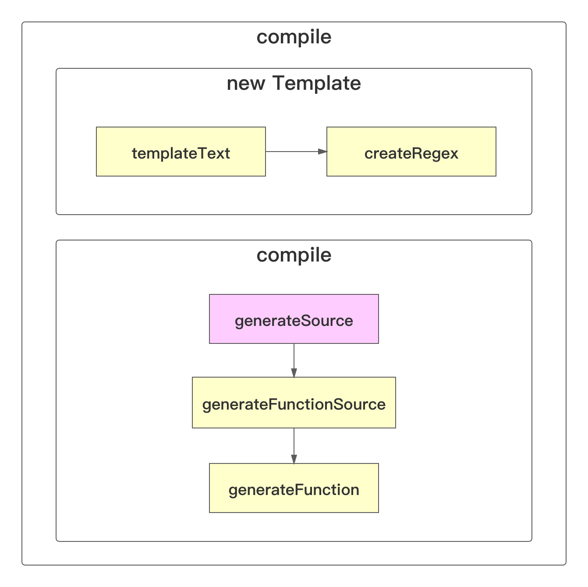
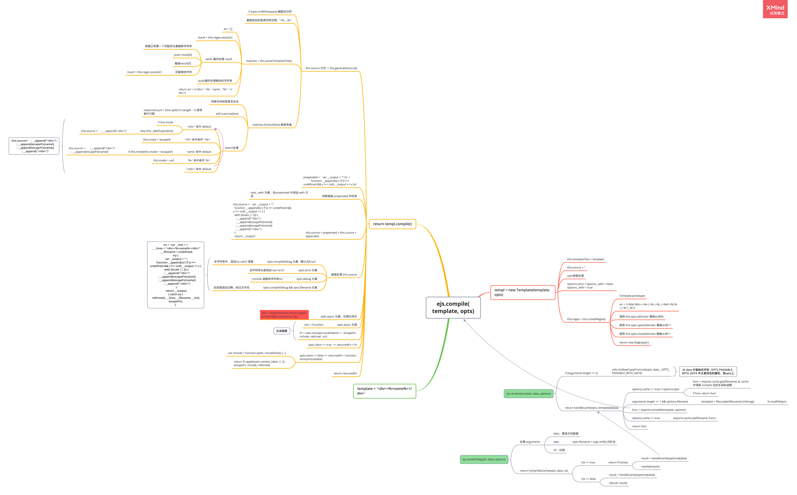

## `ejs` 用法

### 三种基本用法

参见代码

```js
const ejs = require('ejs');
const path = require('path');

const html = '<div><%=name%></div>';
const options = {};
const data = {
  name: 'jolly'
};

// 1. ejs.compile
const template = ejs.compile(html, options); // 可以反复利用，多次渲染时，效率较高
let compileTemplate = template(data);
console.log('template: ', compileTemplate);

// 2. ejs.render
data.name = 'john';
compileTemplate = ejs.render(html, data, options);
console.log('render: ', compileTemplate);

// 3. ejs.renderFile
// 3.1. Promise
data.name = 'Tom';
const templatePromise = ejs.renderFile(path.resolve(__dirname, 'template.html'), data, options);
templatePromise.then(compileTemplate => {
  console.log('templatePromise: ', compileTemplate);
});

// 3. ejs.renderFile
// 3.2. callback
data.name = 'Jim';
ejs.renderFile(path.resolve(__dirname, 'template.html'), data, options, (err, compileTemplate) => {
  console.log('renderFile: ', compileTemplate);
});
```

`template.html`

```ejs
<div><%=name%></div>
```

运行结果

```bash
PS D:\myProgram\templateCompile> node .\ejs.js
template:  <div>jolly</div>
render:  <div>john</div>
renderFile:  <div>Jim</div>
templatePromise:  <div>Tom</div>
```

### 标签含义

- 控制流脚本用 `<% %>`

  ```ejs
  <% if (user) { %> <!-- 有一个换行符 -->
  <div><%=user.name%></div> <!-- 有一个换行符 -->
  <% } %> <!-- 有一个换行符 -->
  ```

  - 输出时会有三个空行

- `<%_ %>` 删除其前面的空格。注意要有一个空格

- `<% _%>` 删除其后面的空格。注意要有一个空格

- `<%- %>` 输出非转义的数据到模板。场景一：直接输出html代码<、>等特殊字符到模板

- `<%= %>` 输出数据到模板

- `<%# %>` 注释标签。不执行、不输出的内容

- `<%%` 输出字符串 '<%'

- `%%>` 输出字符串 '%>'

- `-%>` 删除紧随其后的换行符。将，一般结束符标签 `%>` 换为 `-%>` 可以去掉非预期的空行

### 辅助功能

#### 包含

```ejs
<%- include(path, data) -%>
```

引入另一个 `ejs` 模板，起到拷贝作用

- `path` 为模板路径
- `data` 模板需要的数据

#### 自定义分隔符

通过配置 `options` 中添加 `delimiter: '?'` 修改分隔符为 `?`。书写时，`%` 要变为 `?`

#### 自定义文件加载器

```js
const fs = require('fs');
const ejs = require('ejs');

let myFileLoader = function (filePath) {
  return 'myFileLoader: ' + fs.readFileSync(filePath).toString(); // 在所有加载的 ejs 模板前，加上 myFileLoader 字符串
};

ejs.fileLoader = myFileLoad; // 通过 myFileLoader 去加载文件
```

## `ejs` 源码

### `ejs` 执行流程

`ejs.render` 和 `ejs.renderFile` 最后都是调用 `ejs.compile` 方法。

``ejs.compile` 函数执行流程





- `(new Function('return (async function(){}).constructor;'))()` 获得 `async funtion(){}` 的构造器

当编译模板是

```ejs
'<div><%=name%></div>'
```

```js
const template = ejs.compile(html, options); // 可以反复利用，多次渲染时，效率较高
let compileTemplate = template(data);
```

此时 `template` 最终执行的是**存在内存中的匿名函数**

```js
(function anonymous(locals, escapeFn, include, rethrow
) {
var __line = 1
  , __lines = "<div><%=name%></div>"
  , __filename = undefined;
try {
  var __output = "";
  function __append(s) { if (s !== undefined && s !== null) __output += s }
  with (locals || {}) {
    ; __append("<div>")
    ; __append(escapeFn(name))
    ; __append(escapeFn(name))
    ; __append("</div>")
  }
  return __output;
} catch (e) {
  rethrow(e, __lines, __filename, __line, escapeFn);
}

})
```

- `template = returnedFn(data)`

- `locals` 为 `data`

- `escapeFn` 是处理特殊字符的函数，默认处理的是 `&<>'"` 五个字符，

  ```js
  {
    '&': '&amp;',
    '<': '&lt;',
    '>': '&gt;',
    '"': '&#34;',
    "'": '&#39;'
  };
  ```

  - 该函数，通过 `opts.escape || opts.escapeFunction` 指定

- `include` 模板文件中有 `include` 引入了其他 `ejs` 模板时调用。此时，`with` 中会多出一行 `; __append( include(path, data) )` 

- `rethrow` 错误信息处理函数

### `ejs.render` 

- 将 `options` 中的 `delimiter`, `scope`, `context`, `debug`, `compileDebug`, `client`, `_with`, `rmWhitespace`, `strict`, `filename`, `async` 配置，写到 `data` 中，(此时要)省的 `options` 也是可以的

- `cache` 即 `exports.cache`，在 `option.cache` 设置为 `true` 时，将作为键值缓存 `ejs.compile` 得到的函数，键名为文件名

### `ejs.renderFile`

### 知识点

- 使用 `new Function()` 创建匿名函数

  ```js
  let func = new Function ([arg1, arg2, ...argN], functionBody);
  let func = new Function ('arg1, arg2, ...argN', functionBody);
  let func = new Function ('arg1', arg2', '...' , 'argN', functionBody);
  ```

  前面是匿名函数形参，最后一个参数是匿名函数体，都是字符串

- `ejs.renderFile` 源码中用到了 `Array.prototype.slice.call(arguments)` 将类数组对象 `arguments` 转换成数组

  ```js
  var a = [1,2];
  var b = a.slice(); // [1, 2]
  b === a // false
  ```

#### 获取宿主对象

```js
(new Function('return this;'))()
```

以上代码返回当前 `js`  执行环境的宿主对象：`window` / `global`

