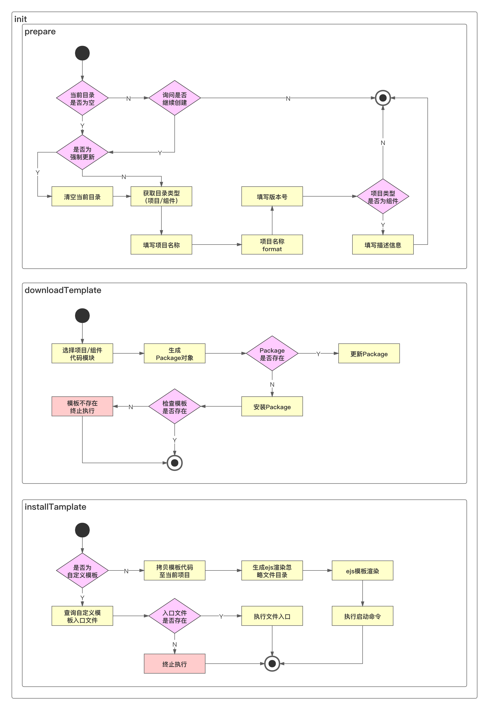

## 收获

- `ejs` 模板渲染
- `glob` 文件筛选
- 项目标准安装和自定义安装
- 组件库初始化和安装

## 学习内容

- 脚手架安装模板功能架构设计
- 脚手架模板安装核心实现：`ejs` 库功能详解
- 脚手架项目模板安装功能开发
- 组件模板开发及脚手架组件初始化功能支持
- 脚手架自定义初始化项目模板功能开发
- `ejs` 源码解析
- `Node.js` `require` 源码解析

### 架构设计图

脚手架项目创建功能架构设计图：

- 本周实现模板安装
  - 自定义模板，执行文件入口后，执行自定义安装过程