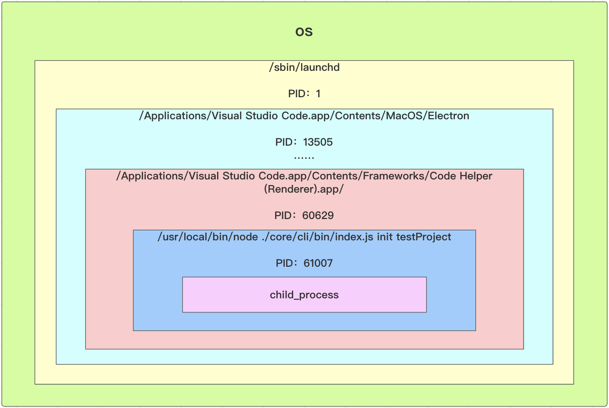

## Node 多进程开发入门

Node多进程核心是创建一个子进程，子进程依附在当前Node进程下面

核心类是 `child_process` 

### 文档路径

http://nodejs.cn/api/child_process.html

### 子进程概念

是系统进行资源分配和调度的基本单位，是操作系统结构的基础

**进程的概念只要有两点**

- 进程是一个实体。每一个进程都有它的地址空间
- 进程是一个“执行中的程序”，存在嵌套关系

进程开线程，进程和线程的区别？

**查看进程（os）**

`ps -ef` 查看所有进程

```bash
Last login: Sun Feb  7 15:42:44 on ttys002
jolly@JollydeMacBook-Pro jolly-cli-dev % ps -ef
  UID   PID  PPID   C STIME   TTY           TIME CMD
    0     1     0   0 301220  ??        14:35.92 /sbin/launchd
    0   112     1   0 301220  ??         0:56.66 /usr/sbin/syslogd
    0   113     1   0 301220  ??         2:26.60 /usr/libexec/UserEventAgent (System)
    0   116     1   0 301220  ??         0:13.29 /System/Library/PrivateFrameworks/Uninstall.framework/Resources/uninstalld
    0   117     1   0 301220  ??         0:54.79 /usr/libexec/kextd
    0   118     1   0 301220  ??         5:35.10 /System/Library/Frameworks/CoreServices.framework/Versions/A/Frameworks/FSEvents.framework/Versions/A/Support/fseventsd

```

- UID 获得权限的用户的UID
- PID 进程的ID
  - `ps -ef|grep PID` 可帅选出对应进程
- PPID 父进程的ID，体现进程的嵌套关系

vscode 启动 `node` 调试时的父子进程关系图。体现了进程嵌套



### child_process 用法

```javascript
const cp = require('child_process');
```

#### 异步

- `exec` 执行 `shell` 命令

  ```javascript
  cp.exec('ls -la', function(err, stdout, stderr){
    console.log('err: ', err); // 错误
    console.log('stdout: ', stdout); // 正常运行输出的结果，后面会有个换行
    console.log('stderr: ', stderr); // 异常输出的结果
  });
  ```

  ```bash
  jolly@JollydeMacBook-Pro child_process % node index.js 
  err:  null
  stdout:  total 8
  drwxr-xr-x   3 jolly  staff   96  2  7 16:58 .
  drwxr-xr-x  14 jolly  staff  448  2  7 16:58 ..
  -rw-r--r--   1 jolly  staff  189  2  7 16:59 index.js
  
  stderr:  
  ```

  - 第二个参数是一个 option 对象
    - `cwd` 设置执行的目录
    - timeout 设置执行命令超时的时间，默认是0(不超时) 

- `execFile` 执行 `shell` 文件

  - 有四个参数

  如果第一个参数不是路径，而是命令，那么通过 `which 命令` 找到对应的文件

  ```javascript
  cp.execFile('ls', ['-la'], function(err, stdout, stderr){
    console.log('err: ', err);
    console.log('stdout: ', stdout);
    console.log('stderr: ', stderr);
  });
  ```

  和上面 `exec` 执行效果一样

  - `execFile` 第二个参数是，传入文件的参数

  - 和 `exec` 的区别

    - `exec` 支持更复杂的 `shell` 命令：`ls -la|grep node_modules`

    - 但 `execFile` 执行 `[-la|grep node_modules]` 会报错，不能执行成功。因为 `grep` 不是 `execFile` 执行文件 `ls` 的参数

    - 可以执行 `.shell` 文件：将 `ls -al|grep node_modules` 写在 `.shell` 文件中

      - `chmod +x test.shell` 添加执行权限

      `test.shell` 文件当中的内容

      ```bash
      ls -la|grep node_modules
      
      echo $1
      ```

      - `$1` 代表 `execFile` 传入的第一个参数

    - `exec` 也能执行指定文件，但是不支持传入参数

- `spwan` 执行 `shell` 文件

  如果第一个参数不是路径，而是命令，那么通过 `which 命令` 找到对应的文件

  ```javascript
  const child = cp.spawn(path.resolve(__dirname, 'test.shell'), ['-la'], {
    cwd: path.resolve('.')
  })
  child.stdout.on('data', function(chunk) {
    console.log('stdout: ', chunk.toString()); //一次输出一个字符串
  });
  child.stderr.on('data', function(chunk) {
    console.log('stderr: ', chunk.toString());
  });
  child.on('error', e => { // 监听错误
  	
  });
  child.on('exit', e => {// 监听执行成功后的退出事件
  
  });
  ```

  option参数

  - `stdio` 选项用于配置在父进程和子进程之间建立的管道。值：
    - `pipe` 默认值，在子进程和父进程之间创建一个管道。
    - `inherit` 将相应的 stdio 流传给父进程或从父进程传入。将输入、输出、错误，绑定到父进程的 `process.stdin`、 `process.stdout` 和 `process.stderr` 上。**直接能看到打印**，还带动画（进度）信息 。

- `fork` 使用 `node` 执行命令

  - 一个参数：模块路径
  - 和 `require()` 的区别
    - `require` 加载的 `js` 模块是在主进程中执行的。`fork` 测试在子进程中的执行的，执行的`js`文件 `process.pid` 会发生变化。

  ```javascript
  const child = cp.fork(path.resolve(__dirname, 'child.js'));
  ```
  - 适合执行耗时任务。

**`exec`、`execFile`、`fork` 底层都是调用 `spawn` 的**

#### 何时使用 `spawn`、`exec`、`execFile`

- `spawn` 适合耗时任务（比如：`npm install`），需要不断日志。`spawn` 逐条执行命令
- `exec`/`execFile`：开销比较小的任务。整个执行完后返回

#### 向子进程发送消息

```javascript
const child = cp.fork(path.resolve(__dirname, 'child.js'));

// 向子进程发送消息
child.send('hello child process', () => {
  // child.disconnect(); // 断开主、子进程直接的连接，否则，命令行将进入等待状态
});

// 接受子进程消息
child.on('mssage', msg => {
  console.log('msg: ', msg);
  child.disconnect();
});

console.log('main pid', process.pid);
```

`child.js`

```javascript
console.log('child process');

console.log('child pid', process.pid);

// 接受主进程消息
process.on('message', msg => {
  console.log('msg: ', msg);
});

// 向主进程发送消息
process.send('hello main process');

```

执行结果

```bash
jolly@JollydeMacBook-Pro child_process % node index.js
main pid 61868
child process
child pid 61869
msg:  hello child process
msg:  hello main process
```

**注意：子进程向主进程发送消息，容易造成死循环**

#### 异步

执行简单 `shell` 命令

- `execSync` 执行 `shell` 命令

  ```javascript
  const ret = cp.execSync('ls -la|grep node_modules');
  console.log(ret.toString()); // ret 是个 buffer
  ```

- `execFileSync` 执行 `shell` 文件

  ```javascript
  const ret = cp.execFileSync('ls', ['-la']);
  console.log(ret.toString()); // ret 是个 buffer
  ```

- `spawnSync` 执行 `shell` 文件

  ```javascript
  const ret = cp.spawnSync('ls', ['-la']);
  console.log(ret.stdout.toString()); // ret 是个 buffer
  ```

  

  

