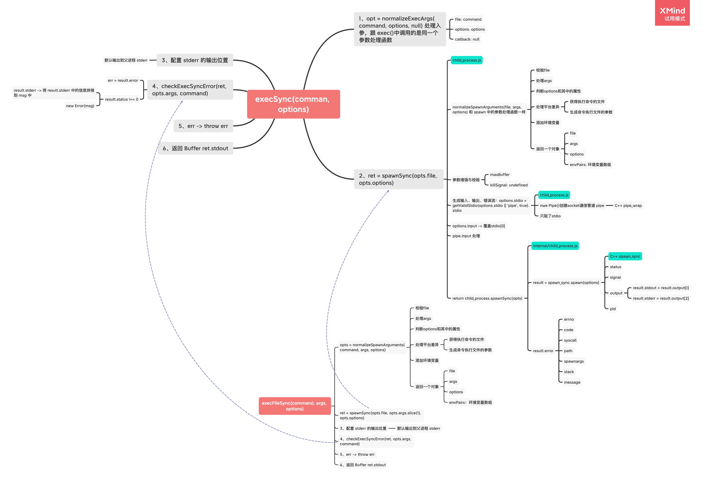
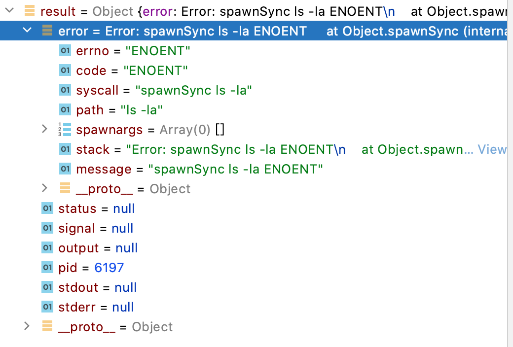

### `execSync`、 `execFileSync` 和 `spawnSync` 执行流程



### `execSync` 、 `execFileSync` 和 `spawnSync` 的区别

- `execSync` 和 `execFileSync` 底层都是调用 `spawnSync`。但是 `execSync` 和 `execFileSync` 在调用 `spawnSync` 之前的参数规范化逻辑不一样：

  - `execSync ` 和 `exec` 都是调用 `normalizeExecArgs()`
  - `execFileSync` 、 `spawn` 及 `spawnSync` 调用的是 `normalizeSpawnArguments()`

- `spawnSync` 返回的是 `child_process.spawnSync(opts)` 中 `spawn_sync.spawn(options)` (`C++`  代码) 执行返回的结果 ` result`

- `execSync` 和 `execFileSync` 都将 `spawnSync` 的执行结果做了同样的处理

  - 有错误，直接从主进程 `threw` 错误

    - 在 `execFileSync('ls -la')` 找不到文件时

      - `result.error` 

        

      - 错误日志

        ```bash
        child_process.js:642
            throw err;
            ^
        
        Error: spawnSync ls -la ENOENT
            at Object.spawnSync (internal/child_process.js:1041:20)
            at spawnSync (child_process.js:607:24)
            at Object.execFileSync (child_process.js:634:15)
            at Object.<anonymous> (/Users/jolly/Desktop/imooc/child_process/index.js:7:19)
            at Module._compile (internal/modules/cjs/loader.js:959:30)
            at Object.Module._extensions..js (internal/modules/cjs/loader.js:995:10)
            at Module.load (internal/modules/cjs/loader.js:815:32)
            at Function.Module._load (internal/modules/cjs/loader.js:727:14)
            at Function.Module.runMain (internal/modules/cjs/loader.js:1047:10)
            at internal/main/run_main_module.js:17:11 {
          errno: 'ENOENT',
          code: 'ENOENT',
          syscall: 'spawnSync ls -la',
          path: 'ls -la',
          spawnargs: [],
          error: [Circular],
          status: null,
          signal: null,
          output: null,
          pid: 6262,
          stdout: null,
          stderr: null
        }
        ```

      - `result.stdout` 和 `result.stderr` 中是 `null`

    - 在命令本身错误时：`lss -la`

      - `result.error = undefined` 
      - `result.stdout` 中的 `ArrayBuffer` 为空
      - `result.stderr` 中 `ArrayBuffer` 有值。`result.stderr` 中的信息，将通过 `process.stderr.write(ret.stderr)` 打印在主进程的日志中：`/bin/sh: lss: command not found`
      - `result.status !== 0`，打印 `result.stderr` 之后，threw 错误信息

  - 没有错误，返回执行成功的结果输出流 `stdout`

### 使用示例

```javascript
const cp = require('child_process');
const path = require('path');
```

- `execSync`

  ```javascript
  const stdout = cp.execSync('lss -la');
  console.log('stdout: ', stdout.toString()); // 有异常不会执行
  ```

- `execFileSync`

  ```javascript
  const stdout = cp.execFileSync(path.resolve(__dirname, 'test.shell'));
  console.log('stdout: ', stdout.toString()); // 有异常不会执行
  ```

- `spawnSync`

  ```javascript
  const result = cp.spawnSync(path.resolve(__dirname, 'test.shell'));
  if (result.status === 0) { // 没有异常
    console.log(result.stdout.toString())
  } else {
    console.log(result)
  }
  ```

  

  

