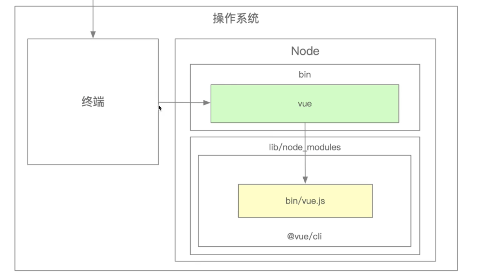
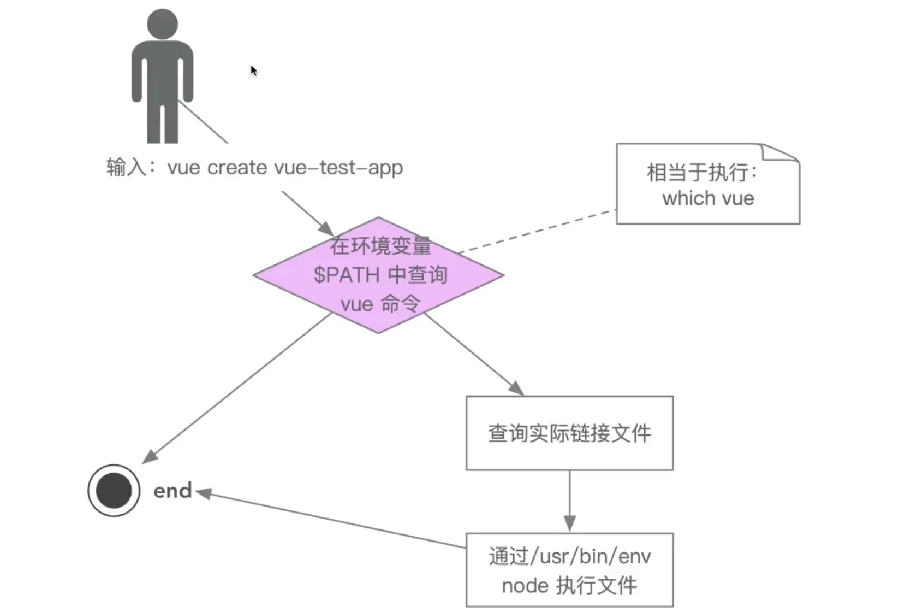
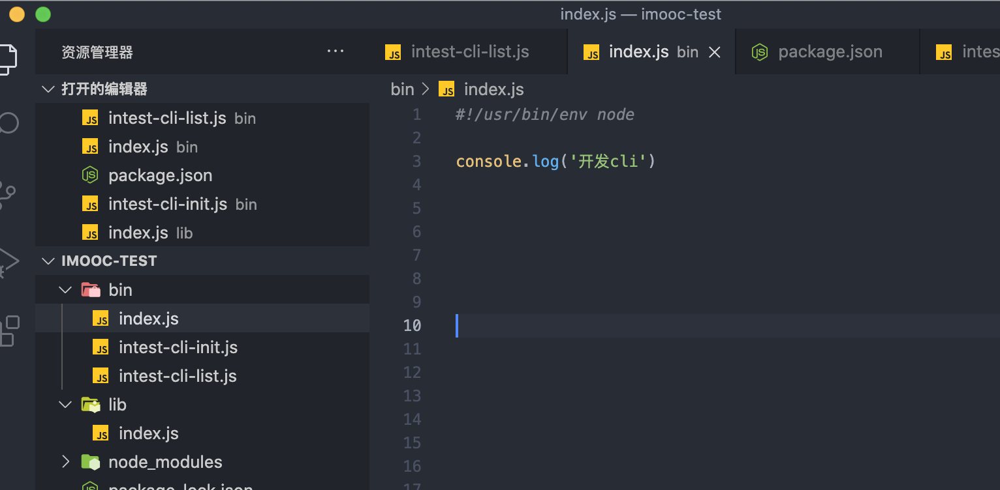

# 脚手架架构设计和搭建

## 脚手架是什么
脚手架的本质是一个操作系统的客户端，他通过命令行执行，比如：
```js
vue create project
```
上面的命令由3部分组成：

- 主命令：vue
- command：create
- command的params：project

他表示创建了一个vue的项目，项目名称为project，以上是一个比较简单的脚手架命令，不过实际应用场景会更加复杂：
```js
vue create project --force
```
这里--force叫做option用来辅助脚手架确认在特定的场合下用户的选择，也可以理解成配置。

**这里我们就会好奇这些指令是怎么来的？**
打开终端输入：vue -h

```js
Usage: vue <command> [options]

Options:
  -V, --version                              output the version number
  -h, --help                                 output usage information

Commands:
  create [options] <app-name>                create a new project powered by vue-cli-service
  add [options] <plugin> [pluginOptions]     install a plugin and invoke its generator in an already created project
  invoke [options] <plugin> [pluginOptions]  invoke the generator of a plugin in an already created project
  inspect [options] [paths...]               inspect the webpack config in a project with vue-cli-service
  serve [options] [entry]                    serve a .js or .vue file in development mode with zero config
  build [options] [entry]                    build a .js or .vue file in production mode with zero config
  ui [options]                               start and open the vue-cli ui
  init [options] <template> <app-name>       generate a project from a remote template (legacy API, requires @vue/cli-init)
  config [options] [value]                   inspect and modify the config
  outdated [options]                         (experimental) check for outdated vue cli service / plugins
  upgrade [options] [plugin-name]            (experimental) upgrade vue cli service / plugins
  migrate [options] [plugin-name]            (experimental) run migrator for an already-installed cli plugin
  info                                       print debugging information about your environment

  Run vue <command> --help for detailed usage of given command.
```
通过面板我们可以看到Commands下有create，add等等一系列的命令。如果我们需要查看create的具体配置如下：
```js
Usage: create [options] <app-name>

create a new project powered by vue-cli-service

Options:
  -p, --preset <presetName>       Skip prompts and use saved or remote preset
  -d, --default                   Skip prompts and use default preset
  -i, --inlinePreset <json>       Skip prompts and use inline JSON string as preset
  -m, --packageManager <command>  Use specified npm client when installing dependencies
  -r, --registry <url>            Use specified npm registry when installing dependencies (only for npm)
  -g, --git [message]             Force git initialization with initial commit message
  -n, --no-git                    Skip git initialization
  -f, --force                     Overwrite target directory if it exists
  --merge                         Merge target directory if it exists
  -c, --clone                     Use git clone when fetching remote preset
  -x, --proxy <proxyUrl>          Use specified proxy when creating project
  -b, --bare                      Scaffold project without beginner instructions
  --skipGetStarted                Skip displaying "Get started" instructions
  -h, --help                      output usage information
```

**那么我们输入这些指令之后到底发生了什么？**

### 脚手架实现原理
当用户输入在终端**vue create project**时：


脚手架的执行原理如下：
- **在终端输入`vue create project`**
- **终端解析出`vue`命令**
- **终端在环境变量中找到`vue`命令**
- **终端根据`vue`命令链接到实际到文件`vue.js`**
- **终端利用`node`执行`vue.js`**
- **vue.js解析`command/options`**
- **vue执行command**
- **执行完毕，退出终端**

### 脚手架原理进阶



## 开发一个脚手架
为什么要开发一个脚手架？
- 1、减少时间，不必从零开始搭建初始项目，提高开发效率。
- 2、便于多人协作。
- 3、项目更新同步方便，只需要更新代码库中项目模板，即可下载最新的项目。

### 脚手架的开发流程
#### 脚手架开发
 创建npm项目
 ```js
 npm init -y
 ```
 创建脚手架文件入口，最上方添加：
 ```js
 #! /usr/bin/env node
 ```
 配置package.json,添加bin属性，编写脚手架代码，发布npm


然后执行`npm link`软连接到node下,这个时候就可以直接使用在**bin**下定义的intest-cli了。

打开终端输入： intest-cli

打印： 开发cli
#### 脚手架安装
以上是我们在本地开发中使用，如果项目发布到npm上了，那么就在终端输入`npm i intest-cli -g`进行全局安装，就可以进行使用了。

#### 脚手架开发难点
- 分包：将复杂到系统拆分为若干个模块
- 命令注册：
```js
vue create
vue add 
vue invoke
```
- 参数解析：
```js
vue command [options] <params>
```
  - options全称：--version,--help
  - options简写：-V,-h
  - 带params的options：--path/ Users/linlei/Desktop/vue-test
  - 帮助文档：
    - global help
    - Usage
    - Options
    - Commands
还有很多，比如：
- 比如命令行交互
- 日志打印
- 命令行文字变色
- 网络通信，http/websocket
- 文件处理
...

## 脚手架本地link标准流程
链接本地脚手架：
```js
cd your-cli-dir
npm link
```
链接本地库文件：
```js
cd your-lib-dir
npm link
cd your-cli-dir
npm link your-lib
```
取消链接本地库文件：
```js
cd your-lib-dir
npm unlink 
cd your-cli-dir
npm unlink your-lib
```
理解`npm link`:
- `npm link your-lib`: 将当前项目中的`node_modules`下指定的库文件链接到`node`全局下的库文件
- `npm link`: 将当前项目链接到`node`全局`node_modules`中作为库文件，并解析`bin`配置，创建可执行文件

理解`npm unlink`:
- `npm unlink`将当前项目从`node`到全局`node_modules`下删除
- `npm unlink your-lib`: 将当前项目中的库文件依赖删除 

## lerna
`lerna`是一个优化给予`git+npm`的多`package`项目的管理工具

### 优势
- 大幅减少重复操作
- 提升操作的标准化
`lerna`是架构优化的产物，它揭示了一个架构真理，项目复杂度提升后，就需要对项目进行架构优化，架构优化的主要目标，往往以效能为核心。

### 如何使用
- 1.脚手架项目初始化
初始化`npm`项目-->安装`lerna`-->`learn init`初始化项目
- 2.创建`package`
`lerna create` 创建`package`-->`lerna add` 安装依赖-->`lerna link` 链接依赖
- 3.脚手架开发和测试
`lerna exec` 执行shell脚本--> `lerna run`执行npm命令 --> `lerna clean` 清空依赖 -->`lerna bootstrap` 重装依赖
- 4.脚手架发布上线
`lerna version` bump version --> `lerna changed`查看上版本以来的所有版本 --> `lerna diff` 查看`diff` --> `lerna publish `发布

### 基于lerna创建项目
安装lerna
```js
npm install -g lerna
```
`lerna`命令：
`lerna create xxx `创建一个项目

`lerna add axios `我们可以看到在packages下的所有子项目都会安装这个依赖

`lerna add axios packages/xxx `给某个项目安装依赖

`lerna exec -- rm -rf node_modules` 删除目录下的所有的`node_modules`文件夹

`lerna exec --scope xxx -- rm -rf node_modules` 删除指定目录下的文件，xxx代表`package.json`的`name`值

`lerna bootstrap` 重装依赖

`lerna run xxx xxx`表示scripts脚本命令，所有的项目都会执行

`lerna run --scope devname xxx `执行指定目录下的脚本，`devname`表示`package.json`包名，xxx表示`scripts`脚本命令

### yargs的基本使用

- 1.安装 `npm i yargs`
- 2.在项目中使用

```js
#!/usr/bin/env node
const yargs = require('yargs/yargs')
const { hideBin } = require('yargs/helpers')
const arg = hideBin(process.argv)
const dedent = require('dedent') // 终端信息栏对齐
const cli = yargs(arg)

cli
.usage('Usage: intest-cli [command] <option>') // 使用方式的介绍
.alias('h', 'help') // 别名
.alias('v', 'version')
.wrap(cli.terminalWidth()) // 终端右侧的宽度
.epilogue(dedent`底部信息 
    111`) // epilogue给底部添加一个信息，dedent，终端左侧栏对齐
.demandCommand(1, 'A command is required. Pass --help to see all available commands and options.') // 最少输入的命令个数
.strict() // 严格模式
.options({ // 对全局的[command]都起作用可以处理多个option
    debug: {
        type: 'boolean',
        describe: 'Bootstrap debug mode',
        alias: 'd'
    }
})
.option('registry', {// 同options类似，处理单个
    describe: '注册',
    alias: 'r'
})
.group(['debug'], 'Dev Options') // 对option进行分组
.command('init [name]', 'create a project', (yargs)=> {// 执行命令
    yargs.option('name', {
        type: 'string',
        describe: 'name of a project'
    })
},(args)=> {    
    console.log(args)
})
.command({ // 可以处理多个command以对象对形式处理
    command: 'list',
    aliases: ['ls', 'li'],
    describe: 'list local packages',
    builder: (yargs) => {

    },
    handler: (argv) => {
        console.log(argv) // 打印终端输入的指令
    }

})
.argv;
```


