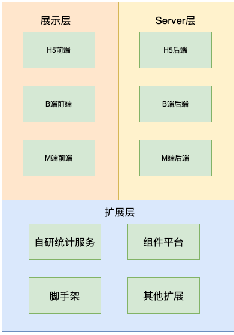

# 

# 整体架构设计V1.0

## 需求背景

[需求文档](https://www.yuque.com/books/share/af79538c-09eb-4ddd-bfb7-599816c233bf)

创建作品、发布作品、管理作品

## 范围

根据我的理解，我将作品范围一共分为三层 
展示层：

1. 给用户展示海报的H5页面
2. 用户生存海报的B端前端
3. 管理员管理的M端前端

server层：

1. 对应的展示层的各个应用的后端

扩展层：

1. 如自研统计服务等
2. 脚手架
3. 组件平台等

## 模块设计



## 核心数据结构

```javascript
{
  // 作品
  work: {
    title: '作品标题',
    setting: {/* 一些可能的配置项，用不到就预留 */},
    props: {/* 页面body的一些设置，如背景色等 */}，
    layers: [ /*我的思路是每个layer里一个组件列表*/
      [
      // 单个node，要符合VNode规范
        {
          id: 'xxx',
          name: '文本1',
          tag: 'text',
          attrs: { fontSize: 20px },
          children: [
            '文本1' // 文本内容，有时候放在attrs或props中，没有标准，看情况而定
          ]
        },
        {
          id: 'yyy',
          name: '图片1',
          tag: 'image',
          attrs: { src: 'xxx.png', width: '100px' },
          children: null
        }
      ]
    ]
  },
  
  // 画布当前选中的组件
  activeComponentId: 'xxx'
}
```
图层的设计

我最初的思路是每个图层里都有一个组件列表，然后根据图层来渲染。
## 扩展性保证

1. 保证配置可扩展：预留扩展字段如setting等
2. 保证服务可扩展：各业务单独部署，互不影响
3. 保证组件可扩展：Vnode格式本身即可满足扩展需求

## 开发提效

1. 脚手架
    1. 脚手架的作用是方便后续工程快速启动。

2. 组件平台
    1. 组件平台可以将公用组件封装起来。方便各项目复用，其实简单的封装组件，还是会有一些问题，比如多项目间组件版本管理。

运维保障 

- 线上服务和运维服务用什么： 阿里云，腾讯云等厂商服务
- 安全： 数据库安全，服务器安全。xss，sql注入等问题。
- 监控和报警： 第三方监控如sentry，结合sdk可以发送邮件，钉钉消息，短信等告警信息
- 服务扩展性：流量大时怎么解决，云服务弹性扩容

