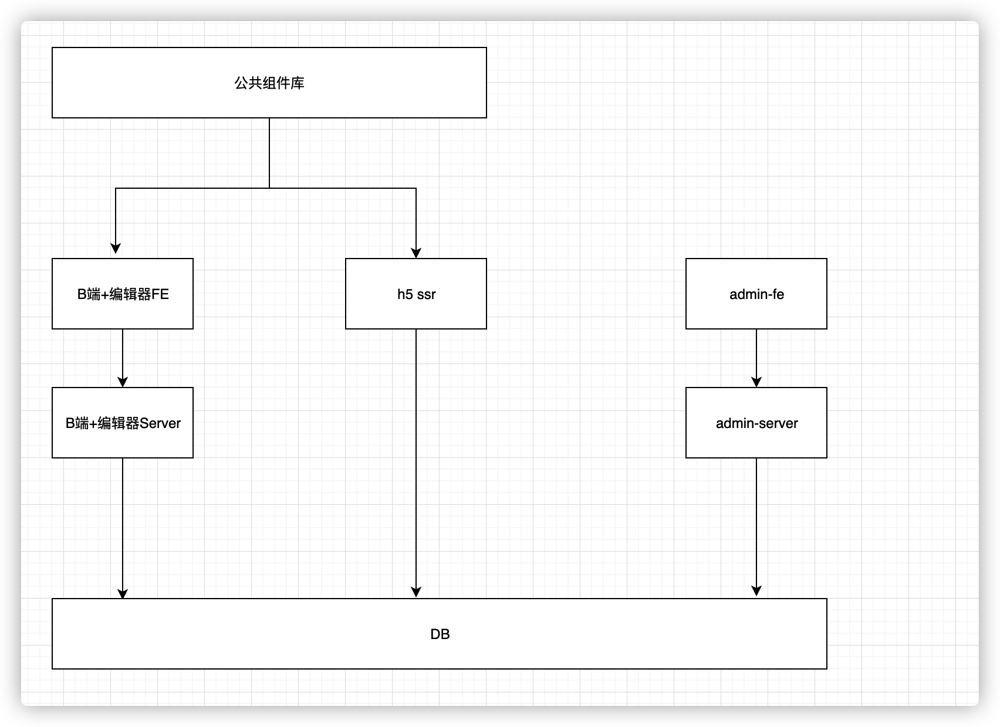

# 第一周笔记
##  收获
### 自身角度
我目前职位是高级前端工程师, 从今年开始, 开始承担项目负责人的职务, 从老师的讲课中发现大部分还是跟自己的现状比较吻合

1.  虽然说是项目负责人, 但是考虑问题的角度更多还是以前端程序员的角度出发, 这个好做,这个不好做, 这个会有什么问题等等的考虑
2.  在开需求评审的时候很少在整体的角度思考问题, 既需求是不是合理, 做的东西是否有输出有体现, 如何更好的交互等
3.  在开发过程中, 要保证准时上线, 那么可能会跟产品有分歧, 砍掉需求等
4.  总体来说, 目前的状态大多数还是跟产品对立的形式, 并没有统一战线, 使项目向着更好更稳定的方向发展

##  项目
### 项目的整体划分

+   B端和编辑器
    -   biz-editor-FE
    -   biz-editor-server
+   C端
    -   H5(SSR)
+   管理系统
    -   admin-FE
    -   admin-server
+   组件库
+   统计服务
    -   三方免费pv/uv
    -   自研自定义事件统计服务

####    为什么这样分
1.  前后端分离, 单独开发, 整体提升工作效率, 这个是必然, 术业有专攻
2.  一个系统从来都不是单纯存在的, 有前台必然有后台, 所以有BC端, 必然有管理系统
3.  组件库, 这个可以复用, 当多个系统同时使用同一套组件库,可以直接看文档传参数直接使用. 或者可以有专门人员来维护, 减少开发成本
4.  统计服务,几乎所有网站都要用到统计, 简单的pv和uv,这个比较浅显, 那么还有一些业务较复杂的统计, 三方很难普及到, 或者说收费高, 那么就需要自己实现一套, 满足于系统业务的统计服务

##  数据结构
### 考虑因素
1.  是否可扩展,个人认为比较重要
2.  结构是否清晰, 或者大多数人可以接受
3.  数据结构本身的考量, 既哪些数据结构具有什么样的特点

### 实现方案
1.  在设计组件或者store的时候都需要考虑扩展性问题
    -   怎么传, 怎么做兼容
    -   如何合并
2.  结构清晰, 数组, 对象的特点, 在设计结构的时候, 是否冗余, 本来可以使用结构特点就可以实现, 最后又加了另外的结构来解决问题, 一直下去, 其他人很难维护
