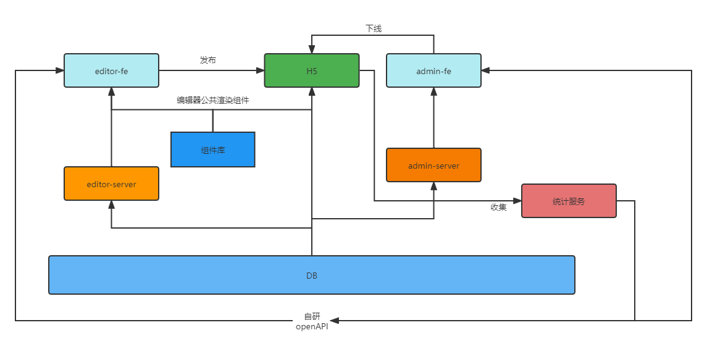

# 慕课乐高整体设计

## 需求分析

[慕课乐高需求文档](https://www.yuque.com/books/share/af79538c-09eb-4ddd-bfb7-599816c233bf)

## 范围

架构设计，技术选型

## 模块设计

##### 模板作品创作平台

- 用途：模板作品创作者可以在此平台创作自己的 H5 海报模板
- 开发方式：由 editor-fe 和 editor-server 的前后端分离模式进行开发

##### 模板作品展示

- 用途：普通用户查看的 H5 作品展示
- 开发方式：由 SSR 模式开发的 H5

##### 模板作品管理

- 用途：后台管理人员管理模板作品等
- 开发方式：由 admin-fe 和 admin-server 的前后端分离模式进行开发



## 核心数据结构

##### 数据结构思路

- 每个组件尽量符合 vnode 规范
- 用数组来组织数据，需要排序
- 尽量使用引用关系，不要冗余

```js
{
  work: {
    title: "作品标题",
    setting: {}, // 一些可能的配置项 扩展性保证
    props: {}, // 页面的一些设置 扩展性保证
    components: [
      {
        id: "1",
        name: "文本1",
        tag: "text",
        attrs: {
          fontSize: "20px",
        },
        children: ["文本1"],
      },
      {
        id: "2",
        name: "图片1",
        tag: "image",
        attrs: {
          src: "xxx.png",
          width: "120px",
        },
        children: null,
      },
    ],
  },
}
```

## 扩展性保证

- 扩展组件
- 扩展编辑功能，如锁定，隐藏
- 扩展页面信息，如多语言选择
- 扩展其他功能，如大数据分析和计算

## 研发提效

- 用于创建和发布的脚手架
- 公共组件库

## 运维保障

- 线上服务和运维服务
- 安全
- 监控和报警
- 服务扩展性：基于云服务，可以随时扩展机器和配置
