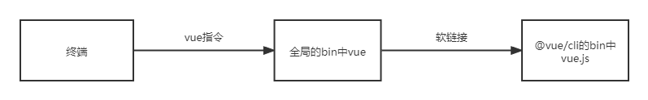

# 脚手架架构设计和框架搭建

## 脚手架核心价值

将研发过程：

- 自动化：项目重复代码拷贝/git 操作/发布上线操作
- 标准化：项目创建/git flow/发布流程/回滚流程
- 数据化：研发过程系统化、数据化、使得研发过程可量化

## 和自动化构建工具区别

问题：jenkins、travis 等自动化构建工具已经比较成熟了，为什么还需要自研脚手架？

- 不满足需求：jenkins、travis 通常再 git hooks 中触发，需要在服务端执行，无法覆盖研发人员本地的功能，如：创建项目自动化、本地 git 操作自动化等
- 定制复杂：jenkins、travis 定制过程需要开发插件，其过程较为复杂，需要使用 Java 语言，对前端不够友好

## 脚手架简介

脚手架本质是一个操作系统的客户端，它通过命令行执行，比如：

```
vue create vue-test-app --force -r https://registry.npm.taobao.org
```

- 主命令：vue
- command：create
- command 的 param：vue-test-app
- options：--force 为配置项，默认参数为 true；-r 也为配置项，并且是--registry 的简写,https:/<span>/registry.npm.taobao.org 为参数，且可以自定义配置项的参数个数

## 脚手架的执行原理



执行顺序

- 在终端输入 vue create vue-test-app
- 终端解析 vue 命令
- 终端在环境变量中找到 vue 命令
- 终端根据 vue 命令链接到实际文件 vue.js
- 终端利用 node 执行 vue.js
- vue.js 解析 command/options
- vue.js 执行 command
- 执行完成，退出执行

## 脚手架实现原理

- 为什么全局安装 @vue/cli 后会添加的命令为 vue？
  根据 @vue/cli 的 package.json 文件中 bin 选项

  ```json
  "bin": {
    "vue": "bin/vue.js"
  },
  ```

  <br>

- 全局安装 @vue/cli 时发生了什么？
  <span>1.npm 将安装包 @vue/cli 下载至全局的 node_modules 中(可通过 npm root -g 查看安装位置) </span>
  <span>2.解析@vue/cli 的 package.json 文件，如果由 bin 选项，就会在 npm 的目录下增加命令 vue 软链接至 "bin/vue.js"文件 </span>

  <br>

- 执行 vue 命令时发生了什么？为什么 vue 指向一个 js 文件，我们却可以直接通过 vue 命令去执行它？
  <span>1.在 npm 的目录下执行 vue，相当于执行软链接的"bin/vue.js"</span>
  <span>2.在"bin/vue.js"文件中第一行代码 #!/usr/bin/env node 会根据当前用户 node 的环境变量，用 node 去执行该 js 文件</span>

##### \*补充

- 给文件添加可执行权限

```
chmod 777 test.js
```

## 脚手架原理进阶

- 为什么说脚手架的本质是操作系统的客户端？它和我们在 PC 上安装应用软件有什么区别？
  因为 node 本身就是操作系统的客户端，和 PC 上安装的应用软件没有本质的区别，只是没有 GUI

- 如何为 node 脚手架命令创建别名
  可以将软链接指向另一个软链接
