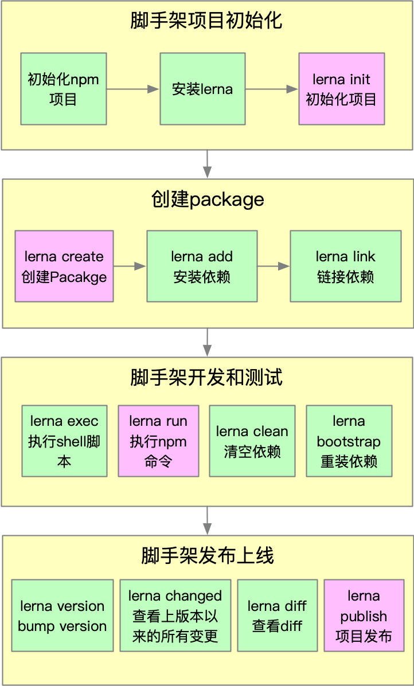

## Lerna 简介

### 原生脚手架开发痛点分析

- 痛点一：重复操作
  - 多 Package 本地 link
  - 多 Package 依赖安装
  - 多 Package 单元测试
  - 多 Package 代码提交
  - 多 Package 代码发布
    <br>
- 痛点二：版本一致性
  - 发布时版本一致性
  - 发布后相互依赖版本升级

##### \*备注

package 越多，管理复杂度越高

### 关于 Lerna

Lerna 是一个优化基于 git+npm 的多 package 项目的管理工具

#### 优势

- 大幅减少重复操作
- 提升操作的标准化

Lerna 是架构优化的产物，它提示一个架构真理：项目复杂度提升后，就需要对项目进行架构优化。架构优化的主要目标往往都是以效能为核心。

官网：https://lerna.js.org/
案例：

- babel：https://github.com/babel/babel
- vue-cli：https://github.com/vuejs/vue-cli
- create-react-app：https://github.com/facebook/create-react-app

#### Lerna 开发脚手架流程



### 基于 Lerna 创建项目

安装 Lerna

```
npm install -g lerna
```

创建项目

```
git init imooc-cli-test && cd imooc-cli-test
```

初始化 Lerna 项目

```
lerna init
```

创建 Package

```
lerna create @imooc-cli/core
```

安装依赖

```
lerna add mocha packages/core --dev
```

删除依赖

```
lerna clean
```

重新安装依赖

```
lerna bootstrap
```

执行 npm 命令（例如：单元测试）

```
lerna run test
```

执行特定包的单元测试

```
lerna run test @imooc-cli-test/core
```

link 项目

```
lerna link
```

发布项目

```
lerna publish
```

### Lerna 使用细节

- lerna init：
  - 会自动完成 git 初始化，但不会创建.gitignore 文件,这个必须要手动添加，否则会将 node_modules 目录都上传到 git，如果 node_modules 已经加入 git stage，可使用：

```
git reset HEAD <filename>
```

执行 unstage 操作，如果文件已经被 git 监听到变更，可使用：

```
git checkout -- <filename>
```

将变更作废，记得在执行操作之前将文件加入.gitignore

- lerna add：
  - 第一个参数：添加 npm 包名
  - 第二个参数：本地 package 的路径
  - 选项：
    - --dev：将依赖安装到 devDependceies，不加时安装到 dependencies

```
lerna add <package> [loc] --dev
```

- lerna link：

  - 如果未发布上线，需要手动将依赖添加到 package.json 再执行 lerna link
    <br>

- lerna clean：

  - 只会删除 node_modules，不会删除 package.json 中的依赖
    <br>

- lerna exec 和 lerna run：

  - --scoped 属性后添加的是包名，而不是 package 的路径，这点和 lerna add 用法不同
    <br>

- lerna publish：

  - 发布时会自动执行：git add package-lock.json,所以 package-lock.json 不要加入.gitignore

  - 先创建远程仓库，并且同步一次 master 分支

  - 执行 lerna publish 前先完成 npm login

  - 如果发布的 npm 包名为：@xxx/yyy 的格式，需要先在 npm 注册名为 xxx 的 organization，否则可能会提交不成功

  - 发布到 npm group 时默认为 private，所以我们需要手动在 package.json 中添加如下配置：

  ```
  "publishConfig":{
    "access": "publish"
  }
  ```
