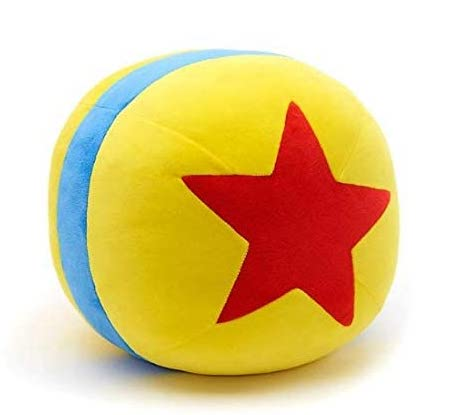

    
    RENDERMAN

# \_

## \_\_

### week01 “永远选择最简单的实现方案” -双越

- [乐高项目的需求分析思考](https://www.yuque.com/qingkooo/notes/vugosy)
- [乐高项目的整体技术方案思考过程](https://www.yuque.com/qingkooo/notes/kmzmy9)
- [乐高项目的整体技术方案文档](https://www.yuque.com/r/doc_versions/359440021)

### week02 “架构优化的目的是效能提升” -Sam

- [脚手架是什么](https://www.yuque.com/qingkooo/notes/itewsx)
- ~~[使用原生方式开发一个分包的脚手架](blank)~~
- [Lerna 是什么](https://www.yuque.com/qingkooo/notes/crde9p)
- [使用 Lerna 开发一个分包的脚手架](https://www.yuque.com/qingkooo/notes/oo9lf9)
- ~~[lerna 的实现原理](blank)~~
