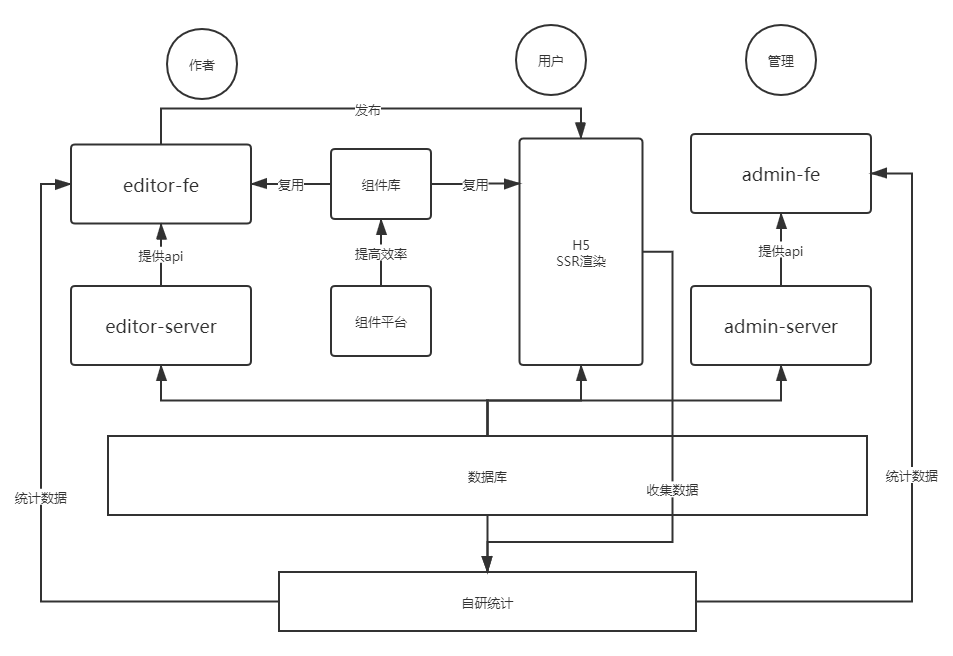

# 慕课乐高架构方案设计文档

## 需求（背景）

[https://www/yuque.com/imooc-lego/zlz87z](https://www/yuque.com/imooc-lego/zlz87z)

## 范围

整体设计，架构设计，没有细节

## 模块设计

模块拆分和关系图（如图）


### 特殊的模块重点说明

- 组件库 ：独立的第三方组件 同事用于H5和B端的编辑器，所见即所得
- 自研统计：有助于自定义事件的统计

## 数据结构

vuex store 的结构

```javascript
{
        work: {
            title: '作品标题',
            setting: {}, // 一些可能的配置项 扩展性保证
            props: {}, // 页面的一些设置 扩展性保证
            components: [
            {
                id: '1',
                name: '文本1',
                tag: 'text',
                attrs: {
                    fontSize: '20px'
                },
                children: ['文本1']
            },
            {
                id: '2',
                name: '图片1',
                tag: 'image',
                attrs: {
                    src: 'xxx.png',
                    width: '120px'
                },
                children: null
            }
        ]
    }
}
```

## 扩展性保证

## 开发提效
- 脚手架
- 组件平台

## 运维保障


