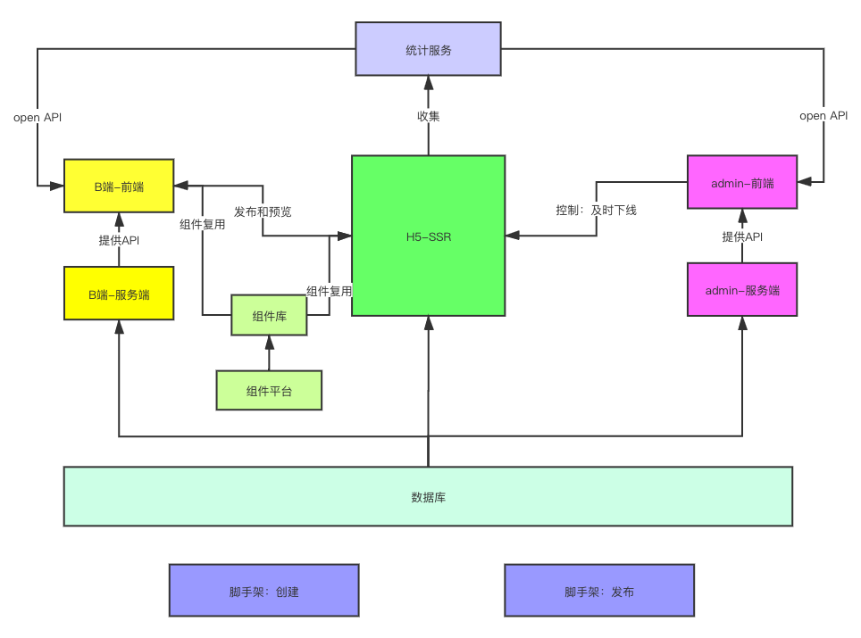
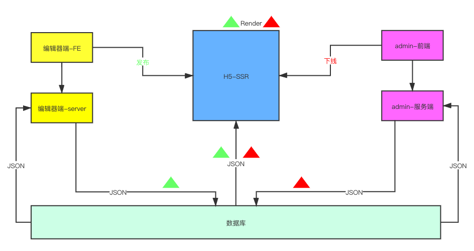

# 第一周架构方案设计文档

## 需求

[https://www.imooc-lego.com/](https://www.imooc-lego.com/)

## 范围（三个方面）

1. 普通用户：就是看到成品的用户，可以对海报作品进行分享，形成自增长，用 H5 SSR 方式开发

2. 企业用户：B端用户可以在此产出自己的海报作品，也就是可以创建、发布、编辑作品。前后端分离：Biz-FE、Biz-server

3. 平台管理员（admin）：项目管理员使用的后台管理系统，可以在此对作品进行管理，如用户管理、模板管理、作品管理以及数据统计。前后端分离： admin-FE + admin-server

## 模块设计



## 数据结构

-   每个组件尽量符合vnode规范
-   用数组组织数据，有序
-   尽量使用引用关系，防止冗余

### 数据结构示例

```javascript
{
        work: {
            title: '作品标题',
            setting: {}, // 一些可能的配置项 扩展性保证
            props: {}, // 页面的一些设置 扩展性保证
            components: [
            {
                id: '1',
                name: '文本1',
                tag: 'text',
                attrs: {
                    fontSize: '20px'
                },
                children: ['文本1']
            },
            {
                id: '2',
                name: '图片1',
                tag: 'image',
                attrs: {
                    src: 'xxx.png',
                    width: '120px'
                },
                children: null
            }
        ]
    }
}
```

### 数据关系流转


- 共用一个数据库
- 创建作品：初始化一个JSON数据
- 发布作品：给后端发请求，对JSON数据修改一个标记
- 保存作品：给后端发请求，保存JSON数据
- C端浏览作品： 获取JSON数据，使用SSR渲染页面
- 屏蔽作品： 给后端发请求，修改一个标记，C端来判断是否显示

## 扩展性保证（组件拓展，功能拓展，数据结构拓展；引导讨论拓展性）

- 扩展组件，数据结构层面扩展
- 扩展编辑器的功能，例如：组件隐藏、锁定等
- 扩展页面的配置

## 开发提效（复用性，易用性）

- 脚手架：创建发布
- 组建平台：减少冗余代码

## 运维保障

- 线上服务和运维服务
- 安全
- 监控和警报
- 服务扩展性：流量大时可随时扩展服务配置
