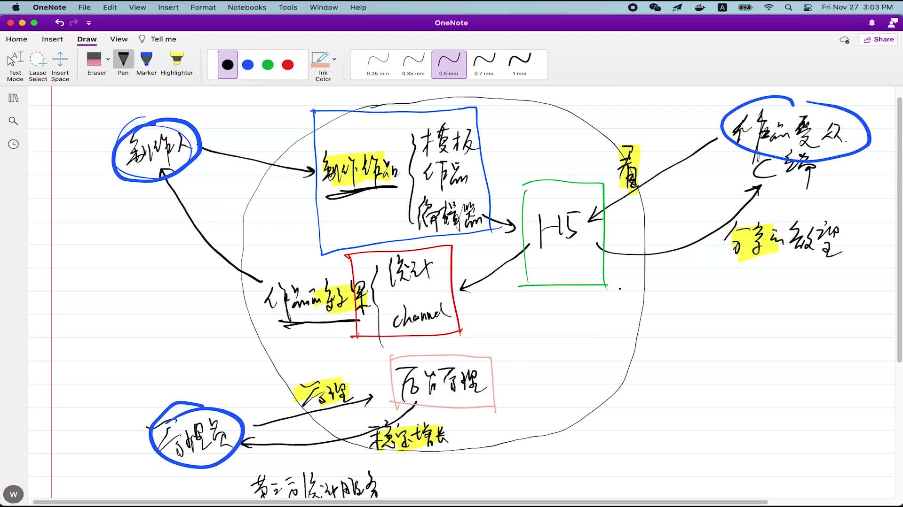
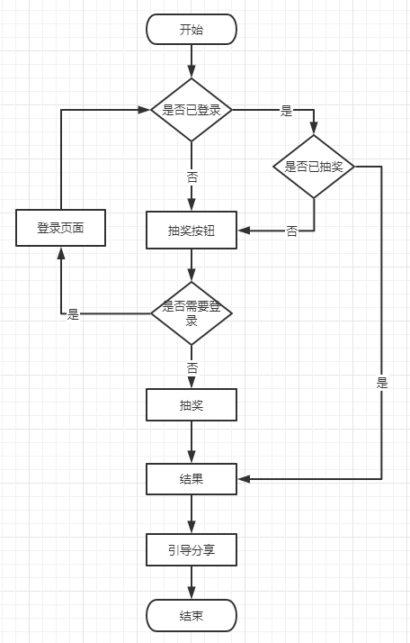

# 第一周学习笔记

## 闭环思维

- 制作人：
   - 输入：制作作品（模板、作品、编辑器）
   - 反馈：作品的效果（统计）
- 作品受众：
   - 输入：看作品
   - 反馈： 分享的欲望
- 管理员：
   - 输入：后台管理
   - 反馈：稳定的增长

## 统计-渠道

架构师需要对业务增长负责

### 作品投放渠道：

- 微信
- 头条
- 支付宝

如果100w的pv，微信60w，头条20w，支付宝20w

可以分析出哪个渠道pv较高，可以决定后续投入方向

### 分渠道实现方式

通过url后面携带参数进行区分

比如：

- url?channel=a

- url?channel=b

- url?channel=c

## 浅层需求和深层需求

### 浅层需求

直接能够看到的需求：如抽奖、抽奖结果

### 深层需求

不容易一眼就看到却很重要的需求：如登录、引导分享