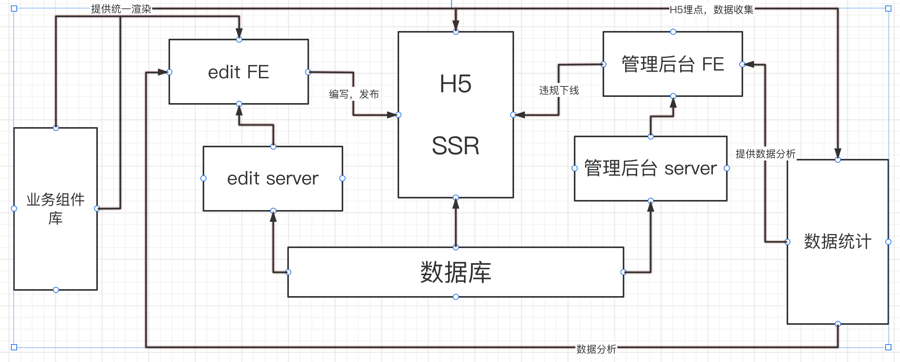

# 需求

乐高编辑器

# 范围

整体设计，架构设计

## C端用户使用的手机端H5

C端用户通过H5端可以通过作品了解详情，并且可以进行转发分享，通过埋点可以了解相关的数据统计。

开发方式：SSR

## B端用户或者个人所使用的PC端编辑器

B端用户或者个人可以通过乐高编辑器编辑、发布自己想要的广告海报和宣传页，生成对应的H5链接供C端用户使用

开发方式：前后端分离，前端：editor-fe，后端：editor-server

## 管理员使用的后台管理系统

B端用户和个人可以在后台管理系统进行作品的管理，如发布、下线、用户权限的管理、相关数据的统计等，

开发方式：前后端分离，前端：admin-fe，后端：admin-server

# 模块设计

## 特殊的模块重点说明：

### 组件库

独立第三方，同时用于编辑和H5的渲染， 提供统一的渲染和逻辑

### 自研统计服务

统计服务，便于业务增长分析和改进

包括：

- 日志收集
- 日志分析
- Open API

# 作品的数据结构

思路： 个人思路和老师的不同

主要没明白老师的vnode结构要干嘛， 走vnode模式， 自己还要做解析吗？

看老师后面的做法就好， 前期主要是思想， 这些就不问了， 后期做的时候就明白了

{
  ...// 全局的一些属性
  components: [
    {
      id: 1, // 数据组件ID， 唯一
      name: 'component name', 组件名
      props: {}, // 外部传递给组件的数据， 来源多数为 数据面板
    }
  ]，
  currentSelect: null, 当前选中的组件数据
}

# 扩展性保证

- 扩展组件，数据结构层面
- 扩展编辑器的功能，例如：组件隐藏、锁定
- 扩展页面配置，如增加多语言、设置背景
- 扩展其他功能，如大数据分析和计算等

# 开发提效

- 脚手架：创建发布
- 组件平台

# 运维保障

- 线上服务和运维服务
- 安全
- 监控和报警
- 服务扩展性： 流量大时，基于云服务，可以随时扩展机器和配置

#  