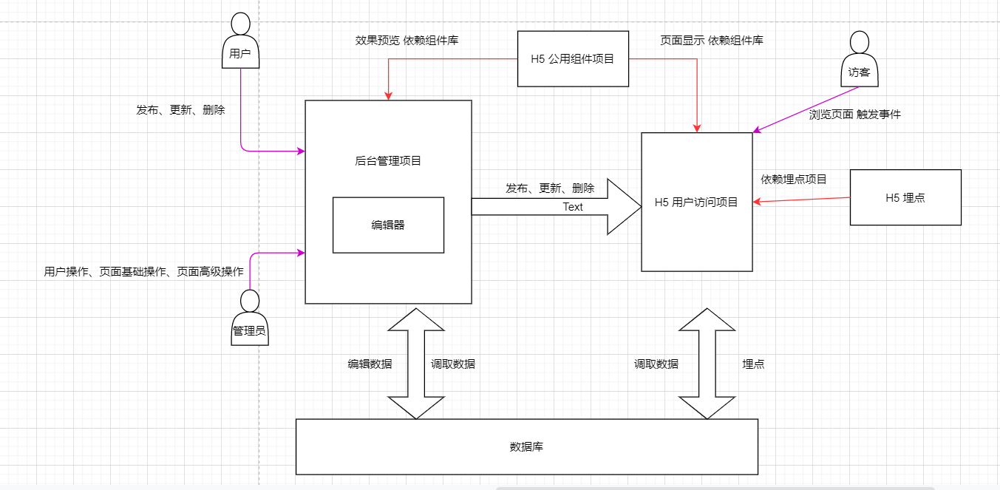
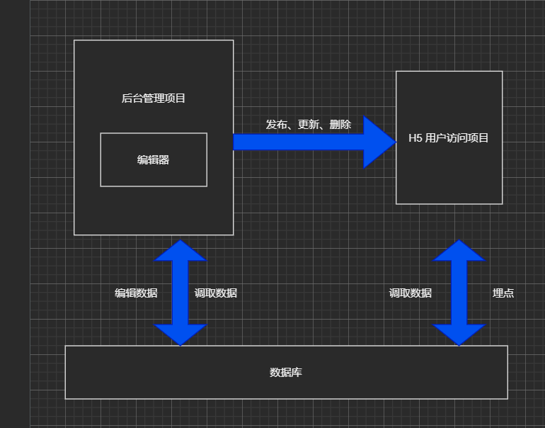

# 幕客乐高技术方案

## 目录

## 需求

### 总体需求

原始需求：用户可按自身需求生成页面，并可分享出去供其他人浏览

## 确定范围

1. 用户可编辑页面（后台编辑）
2. 其他人可浏览（H5页面）
3. 可分享（埋点，数据分析）

## 模块设计

模块拆分和关系图；关键功能职责；特殊模块重点说明

### 模块拆分

- 后台编辑项目
- 后台编辑接口项目
- 后台管理项目
- 后台管理接口项目
- H5 项目 - SSR
- 公用组件库项目
- 公用接口项目
- 埋点项目

### 特殊模块说明

- 后台管理和编辑拆两个项目的原因：管理员可以使用用户的操作，以及用户没有的操作将敏感操作和正常操作，尽量隔离
- 多拆一个公用接口项目：后台管理和编辑，有高度相似接口，例如都支持新增、编辑、删除页面等基础操作
- 公用组件库：后台管理和编辑有相似组件（例如：页面列表），后台和H5有相似组件（例如：后台预览和H5显示）
- H5只拆一个项目：没必要再多拆一个后端接口项目（后端预览可通用过来），且页面数据及渲染在编辑后，页面展示结果唯一，以及可能需要较好的 SEO优化，故此使用 SSR 可提升首屏速度，及SEO

### 关系图



## 数据结构

### 数据结构原则
- 使用 VNode 规范（拓展性好）
- 有序数据使用数组（数组是一组有序的相同类型的数据）
- 尽量使用引用关系，不要冗余（保证数据唯一性）
- 最外层一定要是对象（方便拓展新的顶级参数）

### 数据结构示例
```javaScript
{
    page: {
        // 与H5页面渲染相关的字段
        id: "加密后的用户id-加密后的创建时间-随机标识码"，
        title: "标题",
        setting: {
            // 页面功能性配置
        },
        style: {
            // 页面样式配置
        },
        componets: [
            {
                tag: '组件名',
                id: '加密后的(用户id+随机标识码)',
                flag: '', // 模板类（直接返回子元素），组件类（子元素外层包了一层），内容类（最底层的文本显示）
                data: {
                    // 当前组件的数据
                },
                children: [
                    // 子组件：无限套娃
                    {
                        tag: '组件名',
                        id: '加密后的(用户id+随机标识码)',
                        flag: '', // 模板类（直接返回子元素），组件类（子元素外层包了一层），内容类（最底层的文本显示）
                        data: {
                            // 当前组件的数据
                        },
                        children: [
                            // 子组件
                        ],
                        setting: {
                            // 组件功能性配置
                        },
                        attrs: {
                            style: {
                                // 组件样式
                            }
                            // 标签属性
                        },
                        event: {
                            // 要触发的事件
                        }
                    }
                ],
                setting: {
                    // 组件功能性配置
                },
                attrs: {
                    style: {
                        // 组件样式
                    }
                    // 标签属性
                },
                event: {
                    // 要触发的事件
                }
            }
        ]

    },
    setting: {
        // 设置
    },
    status: {
        currentComponentId: -1 // 当前选中组件，默认整个页面
    }
}
```

### 数据流转关系图


## 拓展性

- 新组件怎么拓展
- 新功能怎么拓展
- 数据结构怎么拓展
- 引导讨论拓展性（大家一起讨论，不是某个人单独就能确定的）

## 开发提效

复用性，易用性

## 运维保障

如何保证系统；线上服务运维，安全，监控，报警，服务拓展性

- 公司有自研运维保障服务，要熟悉自研的
- 公司没有自研运维保障服务，要熟悉常见服务商提供的
