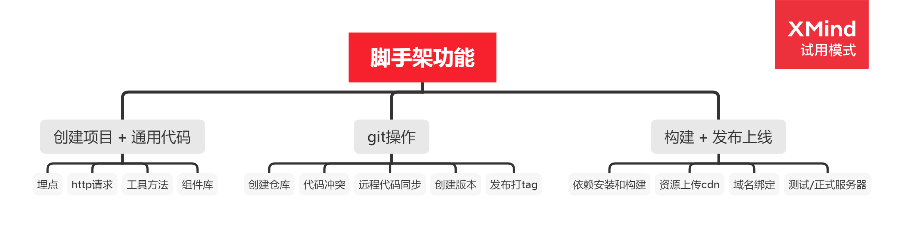
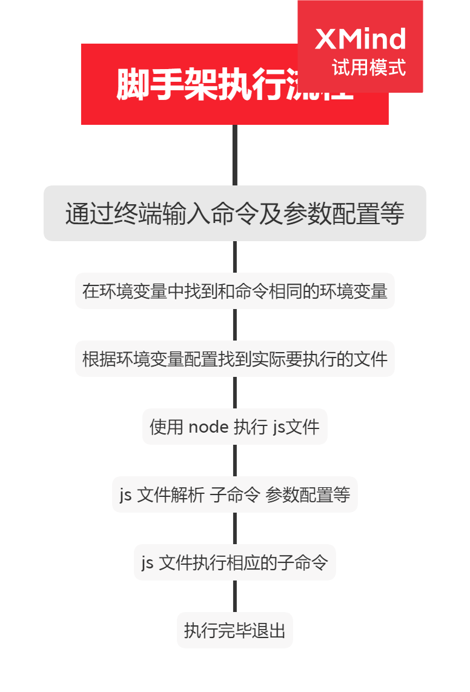

# 笔记

## 内容分享目录格式

- 标题
- 讲师
- 将收获什么
- 主要内容
- 关键词
- 学习方法
- 注意事项

## 脚手架架构设计和框架搭建

### 总体思维导向

需求分析，架构设计，开源项目的深入研究


### 学习方法
1. 掌握原理 独立思考 总结反思
2. 深度剖析优秀开源项目，由表及里，由浅入深
3. 视角切换，多切换架构师视角，全方位思考

## 脚手架开发必要性

1. 提升研发效能
2. 脚手架核心价值 将研发过程 自动化、标准化、数据化  
    1. 自动化： 项目重复性代码复制粘贴/git操作/发布上线
    2. 标准化： 项目创建/git flow/发布流程/回滚流程
    3. 数据化： 研发过程系统化、数据化；使得研发过程可量化
3. 和自动构建工具的区别
    1. 不满足需求：jenkins、travis通常在git hooks中触发，需要在服务端执行，无法覆盖研发人员本地的功能，如：创建项目自动化、本地git操作自动化等
    2. 定制复杂：jenkins、travis定制过程需要开发插件，其过程较为复杂，需要使用Java语言，对前端同学不够友好

## 什么是脚手架
脚手架就是命令行操作系统的客户端，例如：
```
vue create vue-test-app --force -r https://registry.npm.taobao.org

```
### 命令的组成
1. 主命令：vue 
1. 子命令 command: create
1. 子命令参数 command 的 param: vue-test-app
1. 配置 option： -r --force
1. 配置参数 option 的 param：https://registry.npm.taobao.org

### 脚手架执行流程


### 根据流程反推如何开发
1. npm 包项目要有bin 配置指向js文件
2. 项目发布到 npm 官网
3. js 入口文件内指定使用 node 执行自己
    ```
    #!/usr/bin/env node
    ```
4. 安装到 node 目录下的 node_modules
5. 环境变量软连接到  node 目录下的 node_modules/脚手架/入口文件

### 疑问
1. 问： @vue/cli 后为什么使用命令是 vue ？
    答：因为 @vue/cli 只是 npm 包名，实际命令是在 package.json 的 bin 属性配置
2. 问：全局安装 @vue/cli 时发生了什么？
    答：首先 npm 下载包文件到 node 安装目录下的 node_modules，然后将 package.json 文件 bin 属性中的命令配置成环境变量，之后就可以使用相关命令了
3. 问：为什么 vue 命令指向了一个js文件，我们确可以直接运行它？
    答： 因为在 js 文件头部，我们声明了要用 node 去执行当前文件，所以实际上是：系统通过 node 执行 js 文件

## 脚手架开发流程
### 开发流程
1. 创建 npm 项目
```
npm init -y
```
2. 创建入口文件，并在顶部声明执行方式
```
#!/usr/bin/env node
```
3. 配置 bin 属性
4. 编写代码
5. 发布 npm
```
npm publish
```

### 使用流程
1. 安装
```
npm install -g 脚手架
```
2. 使用
```
脚手架 <> []
```
### 脚手架开发难点
- 分包：复杂的系统模块拆分
- 命令注册
- 参数解析
- options 全称
- options 简称
- option 参数 params
- 命令行交互
- 日志打印
- 命令行文字变色
- 网络通信
- 文件处理
- 帮助文档

### npm 本地开发调试
#### npm link
1. 查找环境变量 
```
which 变量名
```

2. 在 npm 包目录下将当前包链向 全局环境变量
```
 npm link
```

3. 将项目 node_modules 目录下指定npm 包链向 全局环境变量 
```
npm lint 要使用的npm包名
```

4. 在全局环境变量中取消 npm 的 link 指向
```
npm unlink // 当前目录
npm unlink 包名 // 当前项目 node_modules 目录下指定包名
```

## lerna 介绍（多 package 项目管理）
[Lerna 是一个用于优化管理基于 git + npm 的多 package 项目的工具](https://lerna.js.org/)

### node原生命令注册 参数解析
1. node 核心库 process
2. argv 属性：所有命令行 命令参数数组

### 原生脚手架开发痛点

#### 痛点一：重复操作
- 多 package 本地 link
- 多 package 依赖
- 多 package 单元测试
- 多 package 代码提交
- 多 package 代码发布

#### 痛点二：版本一致性
- 发布时版本一致性
- 发布后相互版本依赖的升级

package 越多，管理复杂度越高

### lerna 优势
- 大幅减少重复操作
- 提升操作标准化
```
项目复杂度提升后，就需要对项目进行架构优化。架构优化的主要目标往往都是以效能为核心。
```
babel vue-cli create-react-app 都在使用 lerna 管理项目

### lerna 开发流程
1. 项目初始化
    1. 初始化 npm 项目
    1. 安装 lerna
    1. lerna init 初始化项目

1. 创建package
    1. lerna create 创建package
    1. lerna add 安装依赖
    1. lerna link 链接依赖

1. 脚手架开发和测试
    1. lerna exec 执行 shell 脚本
    1. lerna run 执行 npm 命令
    1. lerna clean 清空依赖
    1. lerna bootstrap 重装依赖

1. 脚手架发布上线
    1. lerna version bump version
    1. lerna changed 查看上版本以来的所有变更
    1. lerna diff 查看 diff
    1. lerna publish 项目发布


### 注意事项：
1. lerna publish
    1. 发布时会自动执行： git add package-lock.json ，所以 package-lock.json 不要加入 .gitignore 
    1. 先创建远程仓库，并且同步一次 master 分支 
    1. 执行  lerna publish 前先完成 npm login 
    1. 如果发布的 npm 包名为： @xxx/yyy 的格式，需要先在 npm 注册名为：xxx 的 organization，否则可能会提交不成功 
    1. 发布到 npm group 时默认为 private，所以我们需要手动在  package.json 中添加如下配置:

        ```
        "publishConfig": {
            "access": "public"
        }
        ```
1. lerna exec 和 lerna run
    ```
    --scope 属性后添加的是包名，而不是 package 的路径，这点和  lerna add 用法不同
    ```

1. lerna clean
    ```
    只会删除  node_modules ，不会删除 package.json 中的依赖
    ```

1. lerna link
    ```
    如果未发布上线，需要手动将依赖添加到 package.json 再执行 lerna link
    ```

1. lerna add
    - 第一个参数：添加 npm 包名
    - 第二个参数：本地 package 的路径
    - 选项： --dev：将依赖安装到 devDependencies，不加时安装到 dependencies 
    ```
    lerna add <package> [loc] --dev
    ```
1. lerna init
    ```
    会初始化 git 但是不会创建 .gitignore
    ```
## [VSCode调试技巧](https://www.yuque.com/docs/share/faa9343a-42c7-4493-b2a7-aafd8e369005?#)